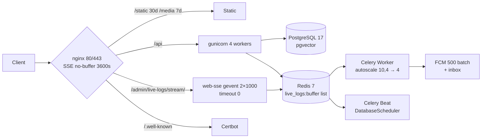

<div align="center">

# Django Rapido V2.0

**The production-ready Django starter that ships like a product, not a prototype.**

*Django 5.2 • Python 3.13 • PostgreSQL 17 + pgvector • Ar/En i18n • Docker + Certbot*

</div>

<div align="center">

[](https://www.djangoproject.com/)
[](https://www.python.org/)
[](https://www.postgresql.org/)
[](https://www.django-rest-framework.org/)
[](https://docs.celeryq.dev/)
[](./docker-compose.yml)
[](./LICENSE)
[](https://github.com)

`django` `django-rest-framework` `postgresql` `redis` `celery` `jwt` `fcm` `i18n` `docker` `nginx` `unfold` `tailwind`

</div>

---

> **Built from a live production app.** Rapido isn't a hello-world — it's extracted from **Ras ElBar GO**, a multi-store delivery platform running Django + FCM + OTP auth in production. Every pattern is battle-tested.

---

## Your Stack, Your Choice — Not Opinionated

**Rapido is a template for *my* projects, not a framework.** These are the tools I use — PostgreSQL, Redis, Celery, FCM, i18n, Live Logs — but nothing is forced.

**There is no CLI.** Every feature is decoupled (no cross-app model imports, `common/` is single source) and you add, delete, or modify by hand — exactly as documented in each guide's `## Removal` section.

- Want PostgreSQL? Keep `docker-compose.yml:21 db pgvector/pg17` + `requirements.txt:67 psycopg` + `base.py:121 DATABASES`. Want SQLite? Follow `guides/Settings guide.md: Drop PostgreSQL` (5 steps: `DATABASES → SQLite`, delete `db` service + volume, `Dockerfile libpq-dev`, `.env DB_*`).
- Want Redis? Keep `base.py:292 CACHES` + `docker-compose.yml:49 redis`. Want `LocMemCache`? Follow `guides/Settings guide.md: Drop Redis`.
- Keep `notifications`? Keep `base.py:62 notifications` + `firebase-admin`. Drop it? `guides/Notifications guide.md: Removal` (8 steps).
- Keep `live-logs`? Keep `dashboard/live_logs.py` + `web-sse:8001 gevent` + `nginx SSE 3600s`. Drop it? `guides/Live Logs guide.md: Removal` (8 steps).

> No generation, no lock-in — copy a module, change the type, ship. Every guide ends with exact code locations (`base.py:line`, `.env:line`, `requirements:line`, `docker-compose:line`) + `make check && docker compose config` verification.



---

## Why Rapido

You clone, you ship. No boilerplate archaeology.

- **Zero to prod in one command** — `make docker-up` gives you API, admin, docs, Flower.
- **Auth that actually works** — OTP + JWT HttpOnly + social login that doesn't break on duplicate `SocialApp`.
- **Push that scales** — Device registry + batched FCM + stale-token cleanup, no WebSockets.
- **Admin people love** — Unfold + badges + Markdown + translation tabs.
- **Deploy without fear** — layered compose, role-aware entrypoint, Let's Encrypt renewal, `.dockerignore` clean.

---

## Features

| Area | What you get |
|------|--------------|
| **Core** | Django 5.2 + Python 3.13, `CONN_MAX_AGE 600`, `TESTING` auto-detection |
| **API** | DRF 3.16 + SimpleJWT (`ACCESS 30m / REFRESH 30d` HttpOnly), `AuthRateThrottle 30/m`, `ENUM_NAME_OVERRIDES` |
| **Auth** | `OTPRecord` 6 digits 10m + `PasswordResetToken` 15m (`F()` guard, anti-enumeration), `SocialAccountAdapter` dedupe |
| **Push** | `notifications` — `Device` (`unique user+device_uuid`) + `Notification`, `should_notify` guard, multicast 500 |
| **CMS** | `compliance` (FAQ + legal docs, `TranslationBaseAdmin` + `MarkdownAdminMixin`) + `contacts` (`is_ordering_open()` via `BUSINESS_TIME_ZONE`) |
| **i18n** | `modeltranslation` en/ar + `TranslationBaseAdmin`, `LocaleMiddleware`, `BUSINESS_TIME_ZONE` |
| **Tasks** | Celery 5.4 + Beat + Flower, `CELERY_BEAT_SCHEDULE` example, Flower `:5555` |
| **Ops** | `docker-compose.yml` (dev) + `docker-compose.prod.yml` (`!reset []`, `gunicorn 4`, `443` + certbot `12h`), `nginx.prod.conf` (`ACME`), `.dockerignore` |
| **Live Logs** | Staff-only `/admin/live-logs/` — Redis list `live_logs:buffer` (fallback `deque 500`), `web-sse` gevent `2×1000` timeout 0, SSE `retry:3000` + heartbeat, `LiveLogsMiddleware` JWT diagnostics, `JetBrains Mono` 92KB |
| **Quality** | Black, isort, Flake8, Mypy, Pytest, `SENSITIVE_LOG_KEYS` scrubbing, `AGENTS.md` conventions |

---

## Well Documented

Rapido is **documented like a product**, not a gist. Every reusable module has a `REUSE:` comment pointing to its source and a guide explaining how to adapt it.

**19 guides** cover the entire codebase — read the one you need, skip the rest:

| Guide | Covers |
|-------|--------|
| `guides/Settings guide.md` | `base/local/production`, `TESTING` flag, `SECRET_KEY` guard, `BUSINESS_TIME_ZONE`, `JWT` fallback |
| `guides/Authentication guide.md` | OTP engine, `validate_credentials`, 3 view actions, social adapter |
| `guides/Notifications guide.md` | `Device` registry, `should_notify`, multicast 500, inbox cache |
| `guides/Compliance and Contacts guide.md` | FAQ/legal Markdown, `ContactInfo` singleton, hours gate |
| `guides/Celery guide.md` | Task structure `bind+retry`, Beat, Flower, `idempotent` rule |
| `guides/Docker guide.md` | Layered compose (`web-sse` gevent), `entrypoint.sh` roles, `nginx` SSE `3600s` no-buffer |
| `guides/i18n guide.md` | `modeltranslation` setup, `TranslationOptions`, `TranslationBaseAdmin` |
| `guides/Live Logs guide.md` | **Latest** Redis `live_logs:buffer` shared, `web-sse` gevent `1000`, `nginx` SSE `HTTP/1.1 keep-alive`, tabs/stats/insights/terminal + 4-fix changelog |
| `guides/common/*.md` (11) | `Models`, `BaseViewSet`, `Permissions` (`create_role_permission` factory), `Middleware` (13 classes), `Pagination`, `Filters`, `Serializers`, `Helpers`, `Exceptions`, `Constants`, `Unfoldadmin` |

Plus **`AGENTS.md`** — single source of truth for conventions (service layer, `select_for_update`, `F()` expressions, `FilterSet` discipline).  
Plus **`docs/examples/`** — `state_machine.md` & `pricing.md` copy-paste patterns from production.

> Every file that matters starts with `REUSE: from ras-elbar-go/... — project-agnostic, no delivery domain hardcoding.` Clone a module, change the type, ship.

---

## Prerequisites

- **Python** 3.13+ (local)
- **Node.js** (Tailwind)
- **Docker & Compose** (recommended)
- **PostgreSQL + Redis** (if no Docker)

---

## Quick Start

### Docker (recommended)

```bash
git clone <repository-url> my-project
cd my-project
cp .env.example .env        # set SECRET_KEY, DOMAIN if prod
make docker-up              # docker compose up -d --build (dev)
make docker-logs
```

**URLs:**
- API `http://localhost:8000` · Admin `http://localhost:8000/admin` · Docs `http://localhost:8000/api/schema/swagger-ui/` · Flower `http://localhost:5555`

### Local

```bash
git clone <repository-url> my-project
cd my-project
# set DB_HOST=localhost if PostgreSQL/Redis are local
make init   # deps, .env, SECRET_KEY, migrate, collectstatic, superuser admin/admin123
make run    # http://localhost:8000
```

---

## Project Structure

```text
project-root/
├── project/                    # Django project
│   ├── settings/               # base.py + local.py + production.py + unfold_config.py
│   ├── urls.py                 # SchemaView(exclude=True), HomeView, users/notifications/contacts/compliance
│   └── celery.py, asgi.py, wsgi.py, routing.py
│
├── accounts/                   # OTP (OTPRecord/PasswordResetToken) + JWT + SocialAccountAdapter
├── notifications/              # Device (user+device_uuid) + Notification, should_notify, batch 500
├── compliance/                 # FAQ + ComplianceDocument (TranslationBaseAdmin + Markdown)
├── contacts/                   # ContactMessage + ContactInfo (is_ordering_open via BUSINESS_TIME_ZONE)
│
├── common/                     # Shared infra — UUIDModel, BaseViewSetMixin (scrubbing), AuthRateThrottle, TranslationBaseAdmin
├── dashboard/                  # Unfold + Live Logs (live_logs.py: Redis list + fallback deque, middleware + SSE gevent, tabs/stats/insights, JetBrains Mono 92KB)
├── guides/                     # 18 docs — Settings, Auth, Notifications, Celery, Docker, i18n, common/*
│
├── docker-compose.yml          # Dev (runserver, ports open, nginx SSE no-buffer 3600s)
├── docker-compose.prod.yml     # Prod (gunicorn 4, web-sse gevent 2×1000 timeout 0, !reset ports, 443 + certbot)
├── Dockerfile / entrypoint.sh  # role-aware (CONTAINER_ROLE=web only migrates, gevent for SSE)
├── nginx.conf / nginx.prod.conf  # SSE `~ ^/(en|ar)?/?admin/live-logs/stream/` → django_sse:8001, HTTP/1.1 keep-alive
├── locale/ / docs/examples/
└── .env.example                # REUSE-commented envs (OAuth, FCM, DOMAIN)
```

---

## Environment

`DJANGO_ENVIRONMENT=local` → `local.py` + `base.py`.  
`production` → `production.py` (HSTS ramp, `SECURE_PROXY_SSL_HEADER`).  
`TESTING=True` or `python manage.py test` → SQLite + `CELERY_ALWAYS_EAGER`.

| Var | Purpose |
|-----|---------|
| `SECRET_KEY` | Fail-fast `ImproperlyConfigured` if missing |
| `BUSINESS_TIME_ZONE` | `Africa/Cairo` for `is_ordering_open()` |
| `JWT_SECRET_KEY` | `or SECRET_KEY` fallback |
| `GOOGLE_OAUTH_*` / `FACEBOOK_*` | Opt-in allauth `ADAPTER` |
| `GOOGLE_APPLICATION_CREDENTIALS` | `./firebase-adminsdk.json` for FCM |
| `DOMAIN` | Prod `nginx.prod.conf` + certbot |
| `TESTING` | `env or "test" in sys.argv` |

Never commit `.env`.

---

## Production Deployment

```bash
# Dev
docker compose up -d --build
# Prod (layered override)
docker compose -f docker-compose.yml -f docker-compose.prod.yml up -d --build
```

**First certs:**
```bash
docker compose run --rm certbot certbot certonly --webroot -w /var/www/certbot \
  -d example.com -d www.example.com -d api.example.com
```

Then set `DJANGO_ENVIRONMENT=production`, `DEBUG=False`, `ALLOWED_HOSTS`, strong `DB/REDIS_PASSWORD`, `make secret-key`.

---

## Live Logs — Does the Terminal Show Problems?

**Yes — that's the point.** Every `4XX/5XX` renders with its `cause` expanded in amber below the line, plus JWT-specific diagnostics:

```text
10:12:07  POST  /api/orders/checkout/  400  amber  15ms  ValidationError: address_id missing — cause: detail=address_id is required
10:12:08  POST  /api/users/login/      401  amber  8ms   Missing Authorization (expected 'Bearer <access>') | code=not_authenticated
10:12:09  POST  /api/users/token/refresh/ 401 amber  Malformed JWT: 2 parts (expected 3 header.payload.signature)
10:12:10  POST  /auth/social/google/   401  amber  Wrong scheme 'bearer' (must be 'Bearer' capital B) — got 'bearer eyJ...' | OAuth path /auth/social/google/ failed
10:12:11  GET   /api/orders/history/  500  red    30ms  IntegrityError: null value in column "address_id" | Trace: orders/views.py:88
```

- **Colors:** `2XX green` `3XX blue` `4XX amber` `5XX red` (text-only, oklch palette)
- **Stats & insights** derive live from Redis `live_logs:buffer` (fallback `deque 500` if Redis down) — `Total/2XX...5XX` counts + `Error Rate 4XX+5XX/Total`, `Top Error Path`, `Busiest Method`, `Success Rate`, shared across `web` + `web-sse`
- **Tabs** (`All/2XX/3XX/4XX/5XX`) filter without fetch — buffer holds all families, tabs are frontend filters
- Open `/admin/live-logs/` as `is_staff` → `Pause/Clear` + `auto-scroll` + live `Error Rate` — no DB, no files.

See `guides/Live Logs guide.md` for architecture, wiring, and tradeoffs.

---

## Testing

```bash
make test           # pytest (auto SQLite via TESTING flag)
make test-coverage
```

No `testing.py` — `base.py:24` detects `test` in `sys.argv`.

---

## Security Checklist

- [ ] `DEBUG=False`, `DJANGO_ENVIRONMENT=production`
- [ ] `SECRET_KEY` via `make secret-key`, optional `JWT_SECRET_KEY`
- [ ] `ALLOWED_HOSTS` exact (fail-fast), `CORS_ALLOWED_ORIGINS` no `*`
- [ ] `DB_PASSWORD`, `REDIS_PASSWORD`, `FLOWER_USER/PASSWORD` strong
- [ ] `SECURE_PROXY_SSL_HEADER` behind nginx, `SECURE_SSL_REDIRECT`, HSTS ramp `0→31536000`, `X_FRAME_OPTIONS DENY`
- [ ] `CORS_ALLOWED_HEADERS` explicit if not `*`
- [ ] `python manage.py check --deploy` green
- [ ] OAuth/FCM secrets + `DOMAIN` set, certs issued

---

<div align="center">

**Django Rapido V2.0** — Build faster, scale beautifully.

*Fork it. Fill your domain. Ship.*

</div>
