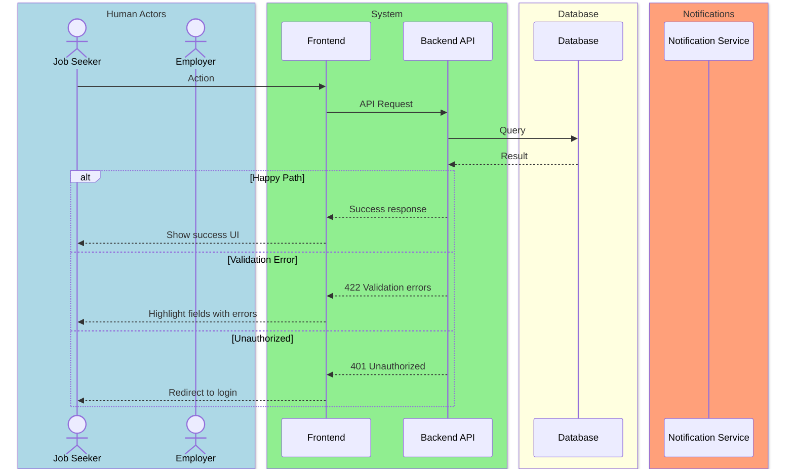
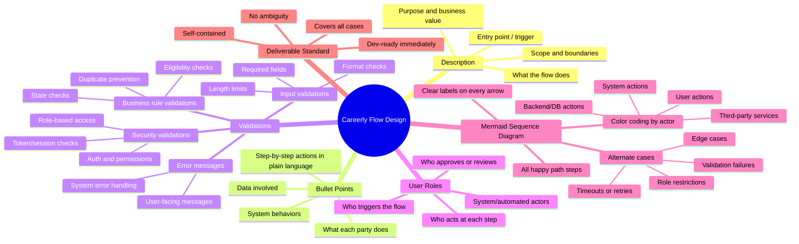

# Careerly Flow Design — Reference Guide

> This guide defines the exact structure, standards, and rules to follow every time a new flow is designed for the Careerly system. Follow this consistently across all flows.

---

## 1. Flow Document Structure

Every flow must be delivered as a single, self-contained document with these sections **in order**:

```
1. Flow Title & Metadata
2. Description
3. Actors / User Roles
4. Step-by-Step Bullet Points
5. Validations
6. Mermaid Sequence Diagram
```

---

## 2. Section Breakdown

### 2.1 Flow Title & Metadata

```
Flow Name:     [Name of the flow]
Flow ID:       [e.g., FLOW-001]
Trigger:       [What starts this flow — user action, system event, schedule, etc.]
Entry Point:   [Where the user/system is when the flow begins]
Exit Point:    [What state everything is in when the flow ends successfully]
Related Flows: [Any flows that precede or follow this one]
```

---

### 2.2 Description

- 3–6 sentences maximum.
- Explain **what** the flow does and **why** it exists.
- State the **business value** (what problem it solves).
- Define the **scope** — what is and isn't included.
- State the **trigger** (what kicks it off).

---

### 2.3 Actors / User Roles

List every actor involved in the flow using this format:

| Role | Type | Responsibilities in this flow |
|------|------|-------------------------------|
| e.g. Job Seeker | Human | Initiates, submits, receives feedback |
| e.g. Employer | Human | Reviews, approves, rejects |
| e.g. System | Automated | Validates, sends notifications, logs |
| e.g. Admin | Human | Overrides, monitors |

**Actor Types:** Human · Automated · Third-Party

---

### 2.4 Step-by-Step Bullet Points

- Written in plain language — no technical jargon.
- Each bullet = one discrete action or system response.
- Format: `[Actor] — action description`
- Cover the **happy path first**, then note branches inline with `↳ if [condition]: ...`
- Every step must be unambiguous — a dev should know exactly what to build.

**Example format:**
```
- Job Seeker — fills in the application form and submits
- System — validates all required fields
  ↳ if validation fails: highlights errors, does not proceed
- System — checks if the seeker has already applied to this job
  ↳ if duplicate: shows "You have already applied" message, blocks submission
- System — saves application with status = PENDING
- System — sends confirmation email to Job Seeker
- Employer — receives in-app notification of new application
```

---

### 2.5 Validations

Organize into 4 categories:

#### Input Validations
| Field | Rule | Error Message |
|-------|------|---------------|
| Email | Valid format, required | "Please enter a valid email address" |
| Password | Min 8 chars, 1 uppercase, 1 number | "Password must be at least 8 characters..." |

#### Business Rule Validations
| Rule | Condition | Behavior |
|------|-----------|----------|
| No duplicate applications | Seeker already applied to this job | Block + show message |
| Profile completeness | Must be >70% complete to apply | Prompt to complete profile first |

#### Security Validations
| Check | Details |
|-------|---------|
| Authentication | User must be logged in |
| Role-based access | Only Job Seekers can apply; Employers cannot |
| CSRF / Token | Valid session token required on form submission |

#### Error Handling
| Scenario | System Response |
|----------|----------------|
| Server error on submit | Show generic error, preserve form data, allow retry |
| Timeout | Warn user, auto-save draft if possible |
| Unauthorized access | Redirect to login with return URL |

---

### 2.6 Mermaid Sequence Diagram

#### Rules:
- Use `sequenceDiagram` type.
- **Color-code participants** using `box` groupings by role type.
- Label every single arrow — no unlabeled interactions.
- Show **happy path** first, then **alternate/error paths** using `alt`, `opt`, `loop` blocks.
- Every `alt` block must have an `else` or cover all branches.
- Use `Note` annotations to highlight important business rules or states.
- Keep it readable — split into sub-diagrams if the flow is very long.

#### Color Conventions:
```
box LightBlue    → Human actors (users)
box LightGreen   → System / Backend
box LightYellow  → Database
box LightSalmon  → Third-party services / Email / Notifications
box Lavender     → Admin actors
```

#### Diagram Template:


---

## 3. Quality Checklist

Before finalizing any flow, verify:

- [ ] All 6 sections are present and complete
- [ ] Every actor is defined in the Roles table
- [ ] Every step has a clear owner (actor)
- [ ] All alternate cases are covered (not just happy path)
- [ ] All validations have error messages
- [ ] Mermaid diagram matches the bullet points exactly
- [ ] Diagram has colored boxes per convention
- [ ] Every arrow in the diagram is labeled
- [ ] A developer can read this and build it with no follow-up questions
- [ ] No ambiguous language ("somehow", "etc.", "and so on")

---

## 4. Naming & ID Conventions

| Item | Convention | Example |
|------|------------|---------|
| Flow ID | FLOW-### | FLOW-001 |
| File name | careerly-flow-###-name.md | careerly-flow-001-job-application.md |
| Status values | SCREAMING_SNAKE_CASE | PENDING, IN_REVIEW, APPROVED |
| API endpoints | REST convention | POST /applications, GET /jobs/:id |
| Actor names in diagram | Short alias | JS = Job Seeker, EM = Employer |

---

## 5. Tone & Language Rules

- Write for **developers and designers** — precise, not vague.
- Use **present tense**: "System sends" not "System will send".
- Use **active voice**: "Employer reviews" not "Application is reviewed".
- Avoid filler words: no "basically", "simply", "just", "obviously".
- When in doubt, **over-specify** rather than under-specify.

---

## 6. Alternate Case Coverage — Minimum Required

Every flow must address at minimum:

1. **Validation failure** — what happens when inputs are wrong
2. **Unauthorized access** — unauthenticated or wrong role
3. **Duplicate/conflict** — what if the action was already performed
4. **Server/network error** — graceful failure
5. **Empty state** — what if there's no data to show

Add more alternates based on the specific flow's complexity.

---

## Mindmap


---

*Reference this guide at the start of every flow. Consistency across all flows is the goal.*