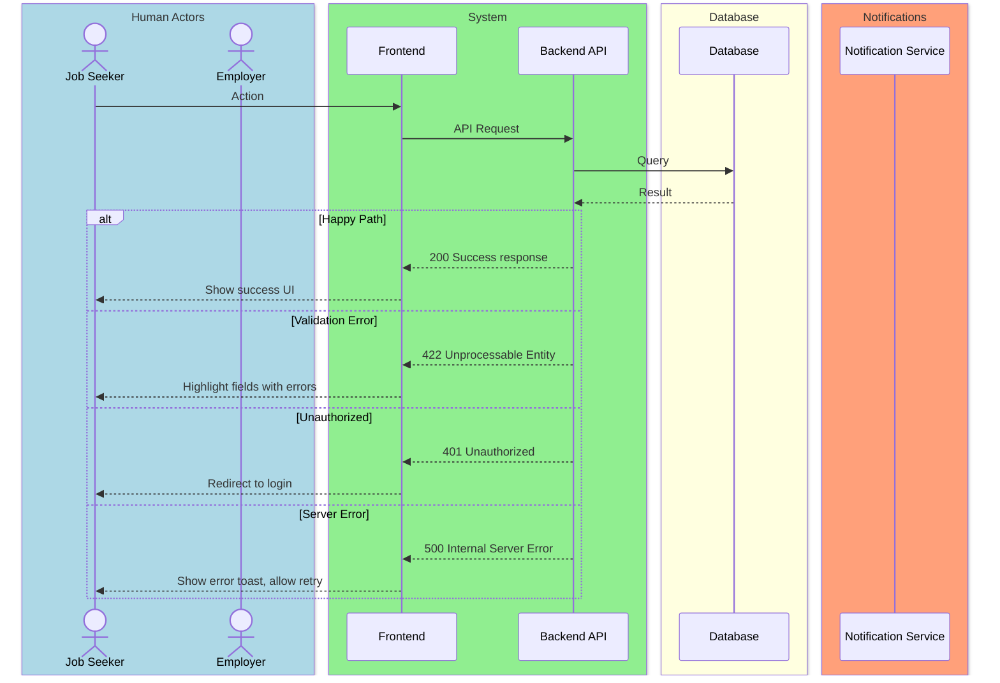
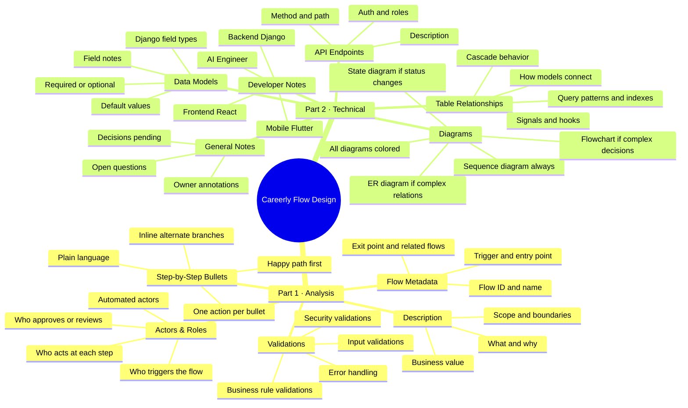

# Careerly Flow Design — Reference Guide v2

> This guide defines the exact structure, standards, and rules to follow every time a new flow is designed for the Careerly system. Every flow is delivered in **two parts**: a Product/Analysis Part and a Technical Part. Follow this consistently across all flows.

#### Important

---

## OVERVIEW: Two-Part Structure

```
┌─────────────────────────────────────────────────────┐
│               PART 1 — ANALYSIS                     │
│  What the flow does, who does it, and how it works  │
│  Written for: PMs, Designers, Developers (all)      │
├─────────────────────────────────────────────────────┤
│               PART 2 — TECHNICAL                    │
│  How to build it — models, diagrams, dev notes      │
│  Written for: Backend, Frontend, Mobile, AI Devs    │
└─────────────────────────────────────────────────────┘
```

---

# PART 1 — ANALYSIS

> Covers: what the flow does, who is involved, step-by-step behavior, and validations.

---

## 1.1 Flow Title & Metadata

```
Flow Name:     [Name of the flow]
Flow ID:       [e.g., FLOW-001]
Trigger:       [What starts this flow — user action, system event, schedule, etc.]
Entry Point:   [Where the user/system is when the flow begins]
Exit Point:    [What state everything is in when the flow ends successfully]
Related Flows: [Any flows that precede or follow this one]
```

---

## 1.2 Description

- 3–6 sentences maximum.
- Explain **what** the flow does and **why** it exists.
- State the **business value** — what problem it solves.
- Define the **scope** — what is and isn't included.
- State the **trigger** — what kicks it off.

---

## 1.3 Actors / User Roles

List every actor involved in the flow:

| Role | Type | Responsibilities in this flow |
|------|------|-------------------------------|
| e.g. Job Seeker | Human | creates their profile and adds their info and views jobs |
| e.g. Admin | Human | sees the admin dashboard and is responsible for everything in the platform |

**Actor Types:** Human · Automated · Third-Party

---

## 1.4 Step-by-Step Bullet Points

- Written in plain language — no technical jargon.
- Each bullet = one discrete action or system response.
- Format: `[Actor] — action description`
- Cover the **happy path first**, then branches inline with `↳ if [condition]: ...`
- Every step must be unambiguous — a dev should know exactly what to build.

**Example format:**
```
- Job Seeker — fills in the application form and submits
- System — validates all required fields
  ↳ if validation fails: highlights errors, does not proceed
- System — checks if the seeker has already applied to this job
  ↳ if duplicate: shows "You have already applied" message, blocks submission
- System — saves application with status = PENDING
- System — sends confirmation email to Job Seeker
- Employer — receives in-app notification of new application
```

---

## 1.5 Validations

Organized into 4 categories:

### Input Validations
| Field | Rule | Error Message |
|-------|------|---------------|
| Email | Valid format, required | "Please enter a valid email address" |
| Password | Min 8 chars, 1 uppercase, 1 number | "Password must be at least 8 characters..." |

### Business Rule Validations
| Rule | Condition | Behavior |
|------|-----------|----------|
| No duplicate applications | Seeker already applied to this job | Block + show message |
| Profile completeness | Must be >70% complete to apply | Prompt to complete profile first |

### Security Validations
| Check | Details |
|-------|---------|
| Authentication | User must be logged in |
| Role-based access | Only Job Seekers can apply; Employers cannot |
| CSRF / Token | Valid session token required on form submission |

### Error Handling
| Scenario | System Response |
|----------|----------------|
| Server error on submit | Show generic error, preserve form data, allow retry |
| Timeout | Warn user, auto-save draft if possible |
| Unauthorized access | Redirect to login with return URL |

---

---

# PART 2 — TECHNICAL

> Covers: diagrams, data models, table relationships, validations logic, and role-specific dev notes.

---

## 2.1 Diagrams

### Rules — apply to ALL diagrams:
- Every diagram must be **colored** — no monochrome diagrams, ever.
- Every arrow must be **labeled** — no unlabeled interactions.
- Always include a **Sequence Diagram** as the primary diagram.
- Add any **additional diagrams** that improve understanding (state, ER, flowchart, etc.) when needed.
- Use `Note` annotations to highlight important business rules or state transitions.
- Split into sub-diagrams if a flow is too long to read comfortably.

### Always Include: Sequence Diagram

Use `sequenceDiagram` type with colored participant boxes.

#### Color Conventions:
```
box LightBlue    → Human actors (users)
box LightGreen   → System / Backend
box LightYellow  → Database
box LightSalmon  → Third-party services / Email / Notifications
box Lavender     → Admin actors
```

#### Sequence Diagram Template:


### Add When Relevant: Additional Diagrams

| Diagram Type | When to Add |
|---|---|
| **State Diagram** | When an entity changes status (e.g. application status lifecycle) |
| **ER Diagram** | When multiple models relate to each other in a non-obvious way |
| **Flowchart** | When decision logic is complex and branchy |
| **Class Diagram** | When inheritance or abstract models are involved |

All additional diagrams must also follow color conventions.

---

## 2.2 Data Models

For each model involved in the flow, provide a table:

### Model: `[ModelName]`

| Field | Django Field Type | Required | Default | Notes |
|-------|------------------|----------|---------|-------|
| `id` | `UUIDField` | Auto | `uuid4` | Primary key, auto-generated |
| `status` | `CharField(choices=...)` | Yes | `PENDING` | Enum: PENDING, IN_REVIEW, APPROVED, REJECTED |
| `created_at` | `DateTimeField` | Auto | `now` | Set on creation, not editable |
| `updated_at` | `DateTimeField` | Auto | `now` | Auto-updated on save |

- Use Django field types explicitly: `CharField`, `TextField`, `IntegerField`, `ForeignKey`, `ManyToManyField`, `JSONField`, `BooleanField`, `DateTimeField`, `UUIDField`, etc.
- Always note `on_delete` behavior for `ForeignKey` fields.
- Always specify `choices` for `CharField` used as enums.
- Mark fields that need a **database index** with a note.

---

## 2.3 Table Relationships & Logic

- Explain in plain prose how the models relate to each other.
- Describe the **cascade behavior** — what happens when a parent record is deleted.
- Describe **computed fields** or **properties** that derive from other fields.
- Describe any **signals** or **hooks** (e.g. `post_save`) that need to fire.
- Describe **query patterns** — what the most common lookups will be and whether indexes are needed.
- Describe **constraints** — unique together, check constraints, or custom validators.

---

## 2.4 API Endpoints

| Method | Endpoint | Auth Required | Role | Description |
|--------|----------|---------------|------|-------------|
| `POST` | `/api/v1/applications/` | Yes | Job Seeker | Submit a new application |
| `GET` | `/api/v1/applications/:id/` | Yes | Job Seeker, Employer | Get application details |
| `PATCH` | `/api/v1/applications/:id/status/` | Yes | Employer | Update application status |

- Follow REST conventions.
- Always specify auth requirement and allowed roles.
- Version all endpoints: `/api/v1/...`

---

## 2.5 Developer Notes

Each note section is targeted — devs only read their section.

---

### 🔵 Backend Developer (Django)

- Which models to create or modify.
- Serializer requirements (read vs write serializers if different).
- Which signals/hooks to implement.
- Custom validators or model methods to write.
- Celery tasks if async processing is needed.
- Any third-party Django packages relevant to this flow.
- Performance considerations (N+1 queries, select_related, prefetch_related).

---

### 🟢 Frontend Developer (React)

- Which pages/components are involved.
- Form fields, their types, and client-side validation rules.
- API calls to make and when to make them.
- Loading, success, and error states to handle.
- Any real-time behavior (WebSockets, polling).
- State management notes (what goes in global state vs local).
- UX behavior: redirects, toasts, modals, disabled states.

---

### 🟡 Mobile Developer (Flutter)

- Which screens are involved.
- Navigation flow (push, replace, pop).
- Form fields and mobile-specific UX considerations (keyboard types, autofill).
- API integration notes specific to mobile.
- Offline handling — what works offline, what requires connection.
- Platform-specific considerations (iOS vs Android if any).
- Deep link behavior if applicable.

---

### 🟣 AI Engineer

- Where AI is involved in this flow (if at all).
- What input data the AI model receives.
- What output is expected and how it's consumed.
- Latency expectations — sync or async AI call.
- Fallback behavior if AI is unavailable or returns low confidence.
- Model versioning notes if relevant.
- Any fine-tuning data this flow should contribute to.

---

## 2.6 General Notes

> _This section is reserved for the product owner / team to add notes, open questions, decisions pending, or anything that doesn't fit above._

```
[ Add notes here ]
```

---

---

# Conventions & Standards

## Flow Naming & IDs

| Item | Convention | Example |
|------|------------|---------|
| Flow ID | FLOW-### | FLOW-001 |
| File name | careerly-flow-###-name.md | careerly-flow-001-job-application.md |
| Status values | SCREAMING_SNAKE_CASE | PENDING, IN_REVIEW, APPROVED |
| API endpoints | REST convention | POST /api/v1/applications/ |
| Actor aliases in diagrams | Short uppercase | JS = Job Seeker, EM = Employer |
| Model names | PascalCase | JobApplication, UserProfile |
| Field names | snake_case | created_at, job_seeker_id |

---

## Tone & Language Rules

- Write for **developers and designers** — precise, not vague.
- Use **present tense**: "System sends" not "System will send".
- Use **active voice**: "Employer reviews" not "Application is reviewed".
- Avoid filler words: no "basically", "simply", "just", "obviously".
- When in doubt, **over-specify** rather than under-specify.
- No ambiguous language: no "somehow", "etc.", "and so on".

---

## Quality Checklist

Run this before finalizing any flow:

### Part 1
- [ ] All metadata fields filled (Flow ID, trigger, entry/exit points, related flows)
- [ ] Description is 3–6 sentences covering what, why, scope, and trigger
- [ ] All actors defined with role, type, and responsibilities
- [ ] Bullet points cover the full happy path
- [ ] All alternate/edge cases covered inline with ↳
- [ ] All 4 validation categories present with error messages

### Part 2
- [ ] Sequence diagram present and colored
- [ ] Every arrow in every diagram is labeled
- [ ] Additional diagrams added where needed (state, ER, flowchart)
- [ ] All models documented with Django field types, required flag, and notes
- [ ] Table relationships and cascade behavior explained
- [ ] API endpoints table complete with auth and roles
- [ ] All 4 dev note sections filled (Backend, Frontend, Mobile, AI)
- [ ] General Notes section present (even if empty)
- [ ] A developer can read this and build it with zero follow-up questions

---

## Minimum Alternate Cases (Every Flow Must Cover)

1. **Validation failure** — inputs are wrong or incomplete
2. **Unauthorized access** — unauthenticated or wrong role
3. **Duplicate / conflict** — action was already performed
4. **Server / network error** — graceful failure with retry
5. **Empty state** — no data exists to display or act on

Add more based on the specific flow's complexity.

---

## Mindmap



---

*Reference this guide at the start of every flow. Consistency across all flows is the goal.*