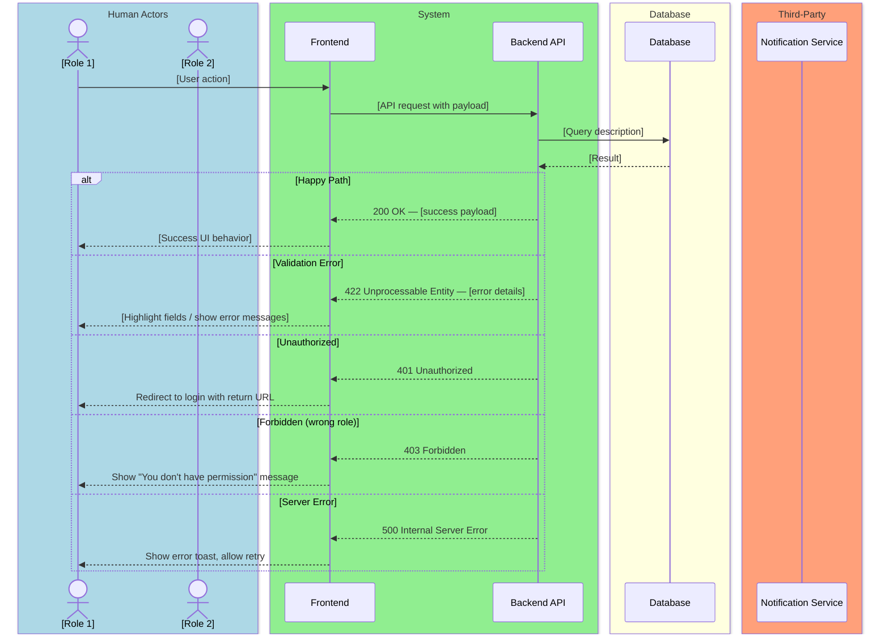
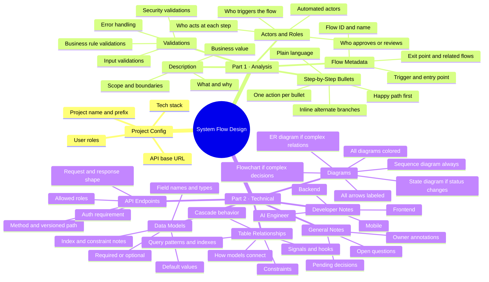

# System Flow Design — Reference Guide v3
### Universal Edition · Works for Any Project

> This guide defines the exact structure, standards, and rules to follow every time a new flow is designed for any system. Every flow is delivered in **two parts**: an Analysis Part and a Technical Part. The project name, actors, tech stack, and conventions are adapted per project at the top of each session.

---

## HOW TO USE THIS GUIDE

At the start of every new project, define the **Project Config** block below. This replaces all project-specific references throughout the guide. Once set, every flow follows the same structure automatically.

---

## PROJECT CONFIG
> Fill this in once per project. Reference it throughout all flows.

```
Project Name:      [e.g. Careerly, ShopEase, MedTrack]
Project ID Prefix: [e.g. CAREERLY, SHOP, MED — used in Flow IDs]
Tech Stack:
  Backend:         [e.g. Django, Node/Express, Laravel]
  Frontend:        [e.g. React, Vue, Next.js]
  Mobile:          [e.g. Flutter, React Native, Swift/Kotlin]
  AI/ML:           [e.g. OpenAI, custom model, n/a]
  Database:        [e.g. PostgreSQL, MySQL, MongoDB]
  Notifications:   [e.g. Firebase, OneSignal, SendGrid, n/a]
User Roles:        [List all roles in this system, e.g. Job Seeker, Employer, Admin]
API Base URL:      [e.g. /api/v1]
Flow Counter:      [Start at 001, increment per flow]
```

---

---

## OVERVIEW: Two-Part Structure

```
┌─────────────────────────────────────────────────────┐
│               PART 1 — ANALYSIS                     │
│  What the flow does, who does it, and how it works  │
│  Written for: PMs, Designers, Developers (all)      │
├─────────────────────────────────────────────────────┤
│               PART 2 — TECHNICAL                    │
│  How to build it — models, diagrams, dev notes      │
│  Written for: Backend, Frontend, Mobile, AI Devs    │
└─────────────────────────────────────────────────────┘
```

---

---

# PART 1 — ANALYSIS

> Covers: what the flow does, who is involved, step-by-step behavior, and validations.

---

## 1.1 Flow Title & Metadata

```
Flow Name:     [Descriptive name of the flow]
Flow ID:       [PREFIX-###  e.g. CAREERLY-001, SHOP-003]
Trigger:       [What starts this flow — user action, system event, schedule, webhook, etc.]
Entry Point:   [Where the user/system is when the flow begins]
Exit Point:    [What state everything is in when the flow ends successfully]
Related Flows: [Any flows that precede or follow this one — use Flow IDs]
```

---

## 1.2 Description

- 3–6 sentences maximum.
- Explain **what** the flow does and **why** it exists.
- State the **business value** — what problem it solves.
- Define the **scope** — what is and isn't included in this flow.
- State the **trigger** — what kicks it off.

---

## 1.3 Actors / User Roles

List every actor involved in this flow. Use the roles defined in the Project Config.

| Role | Type | Responsibilities in this flow |
|------|------|-------------------------------|
| [Role from config] | Human / Automated / Third-Party | [What they do in this specific flow] |
| System | Automated | Validates inputs, processes logic, sends notifications, logs events |

**Actor Types:** Human · Automated · Third-Party

> Only list actors that are actually involved in this flow — not all system roles.

---

## 1.4 Step-by-Step Bullet Points

- Written in plain language — no technical jargon.
- Each bullet = one discrete action or system response.
- Format: `[Actor] — action description`
- Cover the **happy path first**, then note branches inline with `↳ if [condition]: ...`
- Every step must be unambiguous — a dev should know exactly what to build.

**Format:**
```
- [Actor] — [action]
- System — [validates / processes / responds]
  ↳ if [condition]: [what happens instead]
  ↳ if [condition]: [what happens instead]
- [Actor] — [next action]
```

---

## 1.5 Validations

Organized into 4 categories. Always cover all 4.

### Input Validations
| Field | Rule | Error Message |
|-------|------|---------------|
| [field name] | [rule: required, format, min/max length, type] | "[User-facing error message]" |

### Business Rule Validations
| Rule | Condition | Behavior |
|------|-----------|----------|
| [Rule name] | [When this condition is true] | [What the system does] |

### Security Validations
| Check | Details |
|-------|---------|
| Authentication | [Required / not required — and what type] |
| Role-based access | [Which roles can perform this action; which cannot] |
| Token / Session | [What token or session validation is needed] |

### Error Handling
| Scenario | System Response |
|----------|----------------|
| Server error | Show generic error message, preserve user input, allow retry |
| Timeout | Warn user, auto-save draft if applicable |
| Unauthorized access | Redirect to login with return URL preserved |
| Network failure | Show offline message, queue action for retry if applicable |

---

---

# PART 2 — TECHNICAL

> Covers: diagrams, data models, table relationships, API endpoints, and role-specific dev notes.

---

## 2.1 Diagrams

### Rules — apply to ALL diagrams, always:
- Every diagram must be **colored** — no monochrome diagrams, ever.
- Every arrow must be **labeled** — no unlabeled interactions.
- Always include a **Sequence Diagram** as the primary diagram.
- Add **additional diagrams** whenever they improve understanding.
- Use `Note` annotations to highlight important business rules or state changes.
- Split into sub-diagrams if a single diagram becomes unreadable.

---

### Always Include: Sequence Diagram

Use `sequenceDiagram` with colored `box` groupings per actor type.

#### Color Conventions (universal):
```
box LightBlue    → Human actors (end users)
box LightGreen   → System / Backend / API
box LightYellow  → Database
box LightSalmon  → Third-party services (email, push, SMS, payment, etc.)
box Lavender     → Admin / internal staff actors
box MistyRose    → AI / ML services
```

#### Sequence Diagram Template:


---

### Add When Relevant: Additional Diagrams

| Diagram Type | When to Add | Mermaid Type |
|---|---|---|
| **State Diagram** | When an entity changes status/state | `stateDiagram-v2` |
| **ER Diagram** | When models relate in a non-obvious way | `erDiagram` |
| **Flowchart** | When decision logic is complex and branchy | `flowchart TD` |
| **Class Diagram** | When inheritance or abstract models are used | `classDiagram` |
| **Timeline** | When a flow is time-dependent or scheduled | `timeline` |

All additional diagrams must follow color conventions.

---

## 2.2 Data Models

For each model involved in this flow, provide a complete table.

### Model: `[ModelName]`
**Purpose:** [One sentence — what this model represents]
**Django app:** `[app_name]`

| Field | Django Field Type | Required | Default | Notes |
|-------|------------------|----------|---------|-------|
| `id` | `UUIDField(primary_key=True)` | Auto | `uuid4` | Primary key, auto-generated |
| `[field]` | `[FieldType]` | Yes / No | `[value or —]` | [Notes: index needed? choices? FK behavior?] |
| `created_at` | `DateTimeField(auto_now_add=True)` | Auto | `now` | Set on creation, not editable |
| `updated_at` | `DateTimeField(auto_now=True)` | Auto | `now` | Auto-updated on every save |

**Field type reference:**
- Strings: `CharField(max_length=)`, `TextField`, `SlugField`, `EmailField`, `URLField`
- Numbers: `IntegerField`, `PositiveIntegerField`, `DecimalField`, `FloatField`
- Booleans: `BooleanField`, `NullBooleanField`
- Dates: `DateField`, `TimeField`, `DateTimeField`
- Files: `FileField`, `ImageField`
- Relations: `ForeignKey(Model, on_delete=)`, `ManyToManyField`, `OneToOneField`
- Other: `UUIDField`, `JSONField`, `ArrayField` (Postgres), `ChoiceField`

> Always specify `on_delete` for every `ForeignKey`.
> Always specify `choices=` for `CharField` used as an enum.
> Always flag fields that need a **database index** in the Notes column.

---

## 2.3 Table Relationships & Logic

Write this section in **plain prose**. Cover all of the following:

- **How models connect** — which model has the FK, which is the parent, which is the child.
- **Cascade behavior** — what happens to child records when a parent is deleted.
- **Computed fields / properties** — any fields or `@property` methods that derive from other data.
- **Signals / hooks** — any `post_save`, `pre_delete`, or other Django signals that must fire.
- **Query patterns** — the most common lookups this flow requires and whether indexes are needed.
- **Constraints** — `unique_together`, `UniqueConstraint`, `CheckConstraint`, or custom `clean()` validators.

---

## 2.4 API Endpoints

| Method | Endpoint | Auth | Role(s) | Request Body / Params | Response | Description |
|--------|----------|------|---------|----------------------|----------|-------------|
| `POST` | `/api/v1/[resource]/` | Yes | [Role] | `{field: type, ...}` | `201 Created` | [What it does] |
| `GET` | `/api/v1/[resource]/:id/` | Yes | [Role] | — | `200 OK` | [What it returns] |
| `PATCH` | `/api/v1/[resource]/:id/` | Yes | [Role] | `{field: type}` | `200 OK` | [What it updates] |
| `DELETE` | `/api/v1/[resource]/:id/` | Yes | [Role] | — | `204 No Content` | [What it removes] |

- All endpoints versioned: `/api/v1/...`
- Always specify auth requirement and allowed roles per endpoint.
- Always specify the HTTP method precisely — do not use PUT unless full replacement is intended.

---

## 2.5 Developer Notes

Each section is targeted — devs read only their section.

---

### 🔵 Backend Developer

> Adapt stack label to match project config (e.g. Django, Node/Express, Laravel)

- Which models to create or modify, and in which app/module.
- Serializer / DTO requirements (separate read vs write serializers if shapes differ).
- Signals, hooks, or lifecycle methods to implement.
- Custom validators or model methods to write.
- Async tasks (Celery, BullMQ, queues) if processing is not synchronous.
- Any third-party packages or libraries relevant to this flow.
- Performance considerations: N+1 queries, `select_related`, `prefetch_related`, pagination.
- Caching strategy if applicable.

---

### 🟢 Frontend Developer

> Adapt stack label to match project config (e.g. React, Vue, Next.js)

- Which pages and components are involved.
- Form fields, their input types, and client-side validation rules.
- API calls: which endpoints, when to call them, what to do with the response.
- Loading, success, empty, and error states to handle.
- Real-time behavior if applicable (WebSockets, SSE, polling interval).
- State management: what belongs in global state vs local component state.
- UX behavior: redirects, toasts, modals, skeleton screens, disabled states.
- Accessibility notes if relevant.

---

### 🟡 Mobile Developer

> Adapt stack label to match project config (e.g. Flutter, React Native, Swift/Kotlin)

- Which screens are involved and their names.
- Navigation flow: push, replace, pop, deep link behavior.
- Form fields with mobile-specific UX: keyboard types (`emailAddress`, `number`), autofill hints.
- API integration: same endpoints as web unless mobile-specific endpoints exist.
- Offline handling: what works offline, what requires a connection, what to queue.
- Platform-specific considerations (iOS vs Android) if any.
- Push notification handling if this flow triggers one.

---

### 🟣 AI / ML Engineer

> Skip this section if AI is not involved in this flow — mark it: `N/A for this flow.`

- Where in this flow AI is involved and what it does.
- Input: what data the model receives (format, source, preprocessing needed).
- Output: what the model returns and how it is consumed by the system.
- Latency expectations: synchronous (blocks response) or asynchronous (background job).
- Confidence threshold: what happens if the model returns low-confidence output.
- Fallback behavior: what the system does if the AI service is unavailable.
- Model versioning: which model version this flow depends on.
- Training contribution: whether interactions in this flow generate training data.

---

## 2.6 General Notes

> Reserved for the product owner, team lead, or anyone reviewing this flow. Add open questions, pending decisions, known edge cases not yet handled, links to designs, or any other context.

```
[ Add notes here ]
```

---

---

# CONVENTIONS & STANDARDS

## Flow Naming & IDs

| Item | Convention | Example |
|------|------------|---------|
| Flow ID | `[PREFIX]-###` | `CAREERLY-001`, `SHOP-003` |
| File name | `[prefix]-flow-###-[name].md` | `careerly-flow-001-job-application.md` |
| Status / enum values | `SCREAMING_SNAKE_CASE` | `PENDING`, `IN_REVIEW`, `APPROVED` |
| API endpoints | REST convention, versioned | `POST /api/v1/applications/` |
| Actor aliases in diagrams | Short uppercase initials | `JS` = Job Seeker, `EM` = Employer |
| Model names | `PascalCase` | `JobApplication`, `UserProfile` |
| Field names | `snake_case` | `created_at`, `job_seeker_id` |
| App/module names | `snake_case` | `accounts`, `jobs`, `notifications` |

---

## Tone & Language Rules

- Write for **developers and designers** — precise, not vague.
- Use **present tense**: "System sends" not "System will send".
- Use **active voice**: "Employer reviews" not "Application is reviewed".
- Avoid filler: no "basically", "simply", "just", "obviously".
- When in doubt, **over-specify** rather than under-specify.
- No ambiguous language: no "somehow", "etc.", "and so on", "as needed".

---

## Quality Checklist

Run this before finalizing any flow:

### Part 1 — Analysis
- [ ] Flow ID follows naming convention
- [ ] All metadata fields filled (trigger, entry point, exit point, related flows)
- [ ] Description covers: what, why, business value, scope, trigger
- [ ] All actors defined — role, type, responsibilities in this flow only
- [ ] Bullet points cover the complete happy path
- [ ] All alternate/edge cases covered inline with ↳
- [ ] All 4 validation categories present with field-level error messages

### Part 2 — Technical
- [ ] Sequence diagram present, colored, every arrow labeled
- [ ] All alternate cases shown in diagram with `alt/else` blocks
- [ ] Additional diagrams added where they improve understanding
- [ ] All models documented — field name, type, required, default, notes
- [ ] `on_delete` specified for every ForeignKey
- [ ] `choices` specified for every enum CharField
- [ ] Table relationships explained in prose (cascade, signals, constraints)
- [ ] API endpoints table complete — method, path, auth, roles, body, response
- [ ] All 4 developer note sections present (or explicitly marked N/A)
- [ ] General Notes section present (even if empty)
- [ ] A developer can read this and build with zero follow-up questions

---

## Minimum Alternate Cases (Every Flow Must Cover)

1. **Validation failure** — inputs are wrong or incomplete
2. **Unauthorized access** — unauthenticated user
3. **Forbidden access** — authenticated but wrong role
4. **Duplicate / conflict** — the action was already performed
5. **Server / network error** — graceful failure with retry option
6. **Empty state** — no data exists to display or act on

Add more based on the specific flow's complexity and domain.

---

## Mindmap



---

*Set the Project Config at the start of each project. Then follow this guide for every flow. Consistency is the goal.*