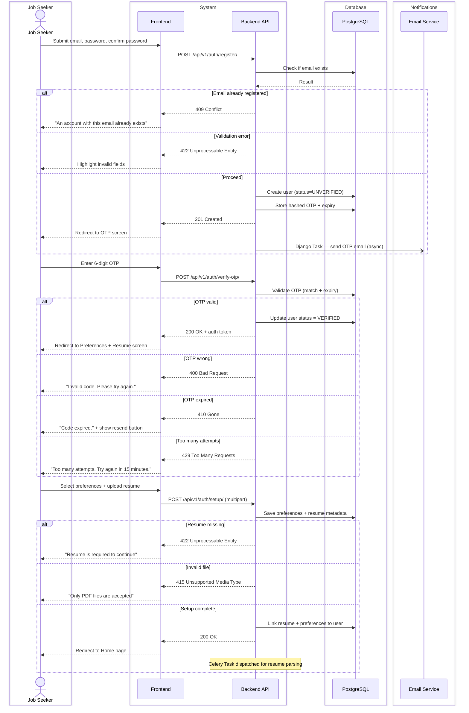
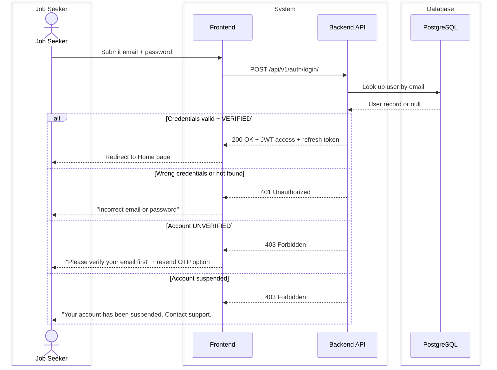
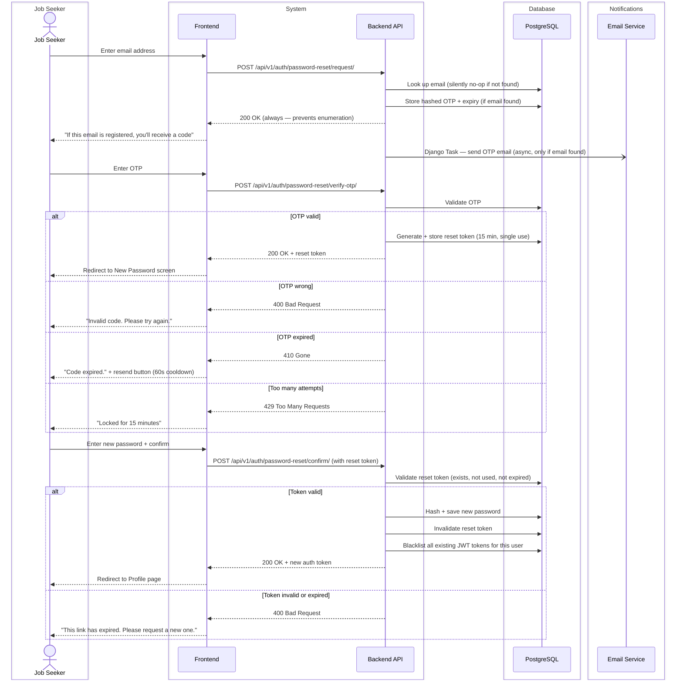
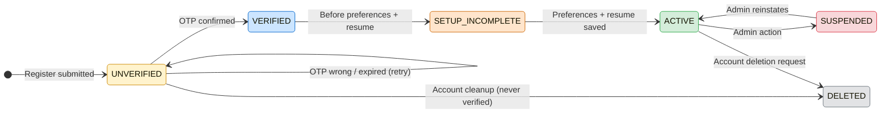

# CAREERLY-001 — Authentication Flow

# PART 1 — ANALYSIS

## 1.1 Flow Title & Metadata

```
Flow Name:     Authentication (Register, Login, Password Reset)
Flow ID:       CAREERLY-001
Trigger:       User visits the platform for the first time, or returns to log in, or requests a password reset
Entry Point:   Landing page / Auth screen
Exit Point:    
  Register     → Home page (profile + resume set up)
  Login        → Home page
  Password     → Profile page
Related Flows: CAREERLY-005 (Profile), CAREERLY-002 (Home Page)
```

## 1.2 Description

This flow covers all three authentication routes for Careerly: registration, login, and password reset. It exists to securely onboard new job seekers and return authenticated users to the platform. The business value is establishing a verified user identity tied to a resume and preferences, which every other feature in the platform depends on. Registration is the critical path — it is not complete until the user uploads a resume and sets their preferences, as these are required for job recommendations to function. Login and password reset are standard credential flows with OTP-based email verification.

## 1.3 Actors / User Roles

| Role | Type | Responsibilities in this flow |
|------|------|-------------------------------|
| Job Seeker | Human | Provides credentials, verifies OTP, uploads resume, sets preferences |
| System | Automated | Validates inputs, generates and sends OTP, creates user record, issues auth token |
| Email Service | Third-Party | Delivers OTP emails |

## 1.4 Step-by-Step Bullet Points

### Route 1 — Register

- Job Seeker — navigates to the Register screen and enters email, password, and confirm password
- System — validates all fields (format, strength, match)
  ↳ if validation fails: highlights invalid fields with error messages, does not proceed
- System — checks if email is already registered
  ↳ if duplicate: shows "An account with this email already exists" message, does not proceed
- System — creates a user record with status = `UNVERIFIED`
- System — generates a 6-digit OTP, stores it with a 10-minute expiry, and dispatches a Django Task to send the OTP email
- Job Seeker — is redirected to the OTP verification screen
- Job Seeker — enters the 6-digit OTP
- System — validates the OTP (correct, not expired)
  ↳ if OTP is wrong: shows "Invalid code. Please try again." — allows retry
  ↳ if OTP is expired: shows "Code expired. Request a new one." — shows resend button
  ↳ if OTP attempts exceed 5: locks OTP entry for 15 minutes
- System — marks user status = `VERIFIED`, generates auth token
- Job Seeker — is redirected to the Preferences + Resume setup screen
- Job Seeker — selects job preferences (job titles of interest, locations, job types)
- Job Seeker — uploads their resume (PDF, required — cannot skip)
  ↳ if user tries to skip resume: shows "Resume is required to continue" — blocks navigation
- System — validates resume file (type, size)
  ↳ if invalid file type: shows "Only PDF files are accepted"
  ↳ if file too large: shows "File size must be under 5MB"
- System — saves preferences and resume, links them to the user profile
- System — dispatches Celery Task to parse resume in background (AI extraction of skills, titles, etc.)
- Job Seeker — is redirected to the Home page
- System — issues JWT access token + refresh token, stored client-side

### Route 2 — Login

- Job Seeker — navigates to the Login screen and enters email and password
- System — validates fields (both required, non-empty)
  ↳ if fields are empty: shows "Please fill in all fields"
- System — looks up email, verifies password hash
  ↳ if email not found or password wrong: shows "Incorrect email or password" (intentionally vague — no account enumeration)
  ↳ if user status = `UNVERIFIED`: shows "Please verify your email first" — offers resend OTP
  ↳ if account is suspended: shows "Your account has been suspended. Contact support."
- System — issues JWT access token + refresh token
- Job Seeker — is redirected to the Home page

### Route 3 — Password Reset

- Job Seeker — navigates to the Forgot Password screen and enters their email
- System — validates email format
  ↳ if invalid format: shows "Please enter a valid email address"
- System — checks if email exists
  ↳ if email not found: shows the same success message anyway (prevents account enumeration)
- System — generates a 6-digit OTP, stores it with a 10-minute expiry, dispatches Django Task to send email
- Job Seeker — is redirected to OTP verification screen
- Job Seeker — enters the OTP
- System — validates OTP (correct, not expired)
  ↳ if wrong: shows "Invalid code. Please try again."
  ↳ if expired: shows "Code expired." — shows resend button (disabled for 60 seconds after each send)
  ↳ if attempts exceed 5: locks for 15 minutes
- System — issues a short-lived password reset token (valid 15 minutes, single use)
- Job Seeker — is redirected to the New Password screen (2 inputs: new password, confirm password)
- Job Seeker — enters and confirms new password
- System — validates password strength and match
  ↳ if mismatch: shows "Passwords do not match"
  ↳ if weak: shows strength requirements
- System — hashes and saves the new password, invalidates the reset token, invalidates all existing sessions
- Job Seeker — is redirected to the Profile page (logged in automatically)

## 1.5 Validations

### Input Validations

| Field | Rule | Error Message |
|-------|------|---------------|
| Email | Required, valid email format | "Please enter a valid email address" |
| Password (Register) | Required, min 8 chars, at least 1 uppercase, 1 number, 1 special character | "Password must be at least 8 characters and include an uppercase letter, a number, and a special character" |
| Confirm Password | Must match password field exactly | "Passwords do not match" |
| OTP | Required, exactly 6 digits, numeric only | "Please enter the 6-digit code" |
| Resume | Required, PDF only, max 5MB | "Only PDF files are accepted" / "File size must be under 5MB" |
| New Password | Same rules as registration password | Same message |
| Job Preferences | At least 1 job title required | "Please select at least one job preference to continue" |

### Business Rule Validations

| Rule | Condition | Behavior |
|------|-----------|----------|
| No duplicate accounts | Email already registered | Block + "An account with this email already exists" |
| Resume is mandatory | User tries to proceed without uploading | Block navigation + show message |
| OTP expiry | OTP older than 10 minutes | Invalidate + prompt resend |
| OTP attempt limit | More than 5 wrong attempts | Lock entry for 15 minutes |
| Resend cooldown | OTP resend requested | Disable resend button for 60 seconds |
| Reset token single-use | Token already used | Reject + redirect to forgot password |
| Session invalidation on reset | Password changed | All existing JWT tokens are blacklisted |
| Unverified login | User logs in before verifying email | Block + offer resend OTP |

### Security Validations

| Check | Details |
|-------|---------|
| Authentication | Not required for register/login/reset — these are public endpoints |
| Account enumeration prevention | "Email not found" and "Wrong password" return the same error message |
| Password hashing | bcrypt via Django's default hasher — never store plain text |
| OTP storage | Stored hashed, not plain text, with expiry timestamp |
| JWT | Access token: 15 min expiry. Refresh token: 30 days. Stored in HttpOnly cookies or secure storage |
| Reset token | Single-use, 15-minute expiry, invalidated on use or on new request |
| HTTPS | All auth endpoints must be HTTPS only |

### Error Handling

| Scenario | System Response |
|----------|----------------|
| Email service fails (OTP not sent) | Show "We couldn't send the code. Please try again." — do not create user record yet |
| Server error on register submit | Show generic error, preserve form data, allow retry |
| Resume upload network failure | Show "Upload failed. Please try again." — preserve other form data |
| Token refresh fails | Force logout, redirect to login with "Session expired" message |
| Timeout on OTP verification screen | Keep screen alive — OTP expiry is time-based, not session-based |

# PART 2 — TECHNICAL

## 2.1 Diagrams

### Sequence Diagram — Register



### Sequence Diagram — Login



### Sequence Diagram — Password Reset



### State Diagram — User Account Status



## 2.2 Data Models

### Model: `User`

**Purpose:** Core user account — authentication identity and status  
**Django app:** `accounts`

| Field | Django Field Type | Required | Default | Notes |
|-------|------------------|----------|---------|-------|
| `id` | `UUIDField(primary_key=True)` | Auto | `uuid4` | PK, auto-generated |
| `email` | `EmailField(unique=True)` | Yes | — | Unique, indexed — primary login identifier |
| `password` | `CharField(max_length=128)` | Yes | — | Django hashed password field — use `set_password()` |
| `status` | `CharField(choices=ACCOUNT_STATUS, max_length=20)` | Yes | `UNVERIFIED` | Enum: UNVERIFIED, VERIFIED, SETUP_INCOMPLETE, ACTIVE, SUSPENDED, DELETED |
| `is_admin` | `BooleanField` | No | `False` | True for admin users — controls admin dashboard access |
| `created_at` | `DateTimeField(auto_now_add=True)` | Auto | `now` | Immutable creation timestamp |
| `updated_at` | `DateTimeField(auto_now=True)` | Auto | `now` | Auto-updated on save |
| `last_login` | `DateTimeField(null=True, blank=True)` | No | `None` | Updated on successful login |

### Model: `OTPRecord`

**Purpose:** Stores OTP codes for email verification and password reset  
**Django app:** `accounts`

| Field | Django Field Type | Required | Default | Notes |
|-------|------------------|----------|---------|-------|
| `id` | `UUIDField(primary_key=True)` | Auto | `uuid4` | PK |
| `user` | `ForeignKey(User, on_delete=CASCADE)` | Yes | — | Owning user — delete OTPs when user deleted |
| `otp_hash` | `CharField(max_length=128)` | Yes | — | SHA-256 hash of the 6-digit OTP — never store plain |
| `purpose` | `CharField(choices=OTP_PURPOSE, max_length=20)` | Yes | — | Enum: EMAIL_VERIFICATION, PASSWORD_RESET |
| `expires_at` | `DateTimeField` | Yes | — | Set to `now + 10 minutes` on creation. Indexed. |
| `attempts` | `PositiveIntegerField` | No | `0` | Incremented on each wrong guess |
| `is_used` | `BooleanField` | No | `False` | Marked True after successful verification |
| `created_at` | `DateTimeField(auto_now_add=True)` | Auto | `now` | — |

### Model: `PasswordResetToken`

**Purpose:** Short-lived single-use token issued after OTP verification, used to authorize the actual password change  
**Django app:** `accounts`

| Field | Django Field Type | Required | Default | Notes |
|-------|------------------|----------|---------|-------|
| `id` | `UUIDField(primary_key=True)` | Auto | `uuid4` | PK — also used as the token value |
| `user` | `ForeignKey(User, on_delete=CASCADE)` | Yes | — | Cascade delete with user |
| `expires_at` | `DateTimeField` | Yes | — | `now + 15 minutes` |
| `is_used` | `BooleanField` | No | `False` | Invalidated on first use |
| `created_at` | `DateTimeField(auto_now_add=True)` | Auto | `now` | — |

### Model: `UserPreferences`

**Purpose:** Job seeker preferences set during onboarding, used for recommendations  
**Django app:** `accounts`

| Field | Django Field Type | Required | Default | Notes |
|-------|------------------|----------|---------|-------|
| `id` | `UUIDField(primary_key=True)` | Auto | `uuid4` | PK |
| `user` | `OneToOneField(User, on_delete=CASCADE)` | Yes | — | One preferences record per user |
| `job_titles` | `ArrayField(CharField(max_length=100))` | Yes | — | At least 1 required. Postgres ArrayField. |
| `locations` | `ArrayField(CharField(max_length=100))` | No | `[]` | Preferred job locations |
| `job_types` | `ArrayField(CharField(max_length=50))` | No | `[]` | Enum values: FULL_TIME, PART_TIME, REMOTE, CONTRACT, INTERNSHIP |
| `updated_at` | `DateTimeField(auto_now=True)` | Auto | `now` | — |

## 2.3 Table Relationships & Logic

`User` is the root entity. Every other model in this flow hangs off it. When a `User` is deleted, all related `OTPRecord`, `PasswordResetToken`, and `UserPreferences` records are cascade-deleted.

`OTPRecord` can have multiple records per user over time (one per request). Before creating a new OTP, the system should mark all previous OTPs of the same `purpose` as `is_used=True` to prevent old codes from being valid. Query pattern: `OTPRecord.objects.filter(user=user, purpose=purpose, is_used=False).order_by('-created_at').first()`.

`PasswordResetToken` is a separate model from OTP intentionally — it has a different lifecycle. It is issued only after OTP verification succeeds, so there is no risk of someone using just an email to get a reset token. It is single-use and expires in 15 minutes.

`UserPreferences` is a `OneToOneField` — there is exactly one preferences record per user. It is created during the setup step, not at registration. A `post_save` signal on `UserPreferences` should update the user's `status` to `ACTIVE` once preferences and a resume both exist.

**Status transition logic** — the `User.status` field is the canonical source of truth for what the user is allowed to do:
- `UNVERIFIED` → cannot log in
- `VERIFIED` → can log in but will be redirected to setup if `UserPreferences` or resume is missing
- `SETUP_INCOMPLETE` → logged in but gated — only setup screen accessible
- `ACTIVE` → full access
- `SUSPENDED` → read-only or full block depending on admin decision

**OTP rate limiting** — `attempts` on `OTPRecord` is checked before validating. If `attempts >= 5`, return 429 without checking the code. On each wrong guess, increment `attempts`. On success, set `is_used=True`.

**Resend cooldown** — enforced by checking `created_at` of the most recent OTP. If `now - created_at < 60 seconds`, reject the resend request with 429.

## 2.4 API Endpoints

| Method | Endpoint | Auth | Role | Request Body | Response | Description |
|--------|----------|------|------|--------------|----------|-------------|
| `POST` | `/api/v1/auth/register/` | No | — | `{email, password, confirm_password}` | `201` | Create unverified user, send OTP |
| `POST` | `/api/v1/auth/verify-otp/` | No | — | `{email, otp, purpose}` | `200 + token` | Verify OTP, mark user verified |
| `POST` | `/api/v1/auth/resend-otp/` | No | — | `{email, purpose}` | `200` | Resend OTP (60s cooldown) |
| `POST` | `/api/v1/auth/setup/` | Yes | Job Seeker | `multipart: {job_titles, locations, job_types, resume_file}` | `200` | Save preferences + resume |
| `POST` | `/api/v1/auth/login/` | No | — | `{email, password}` | `200 + JWT` | Authenticate user |
| `POST` | `/api/v1/auth/logout/` | Yes | Any | `{refresh_token}` | `204` | Blacklist refresh token |
| `POST` | `/api/v1/auth/token/refresh/` | No | — | `{refresh_token}` | `200 + new access token` | Refresh JWT access token |
| `POST` | `/api/v1/auth/password-reset/request/` | No | — | `{email}` | `200` | Send password reset OTP |
| `POST` | `/api/v1/auth/password-reset/verify-otp/` | No | — | `{email, otp}` | `200 + reset_token` | Verify reset OTP, issue reset token |
| `POST` | `/api/v1/auth/password-reset/confirm/` | No | — | `{reset_token, new_password, confirm_password}` | `200 + JWT` | Set new password |

## 2.5 Developer Notes

### 🔵 Backend Developer (Django)

- Use `AbstractBaseUser` + `BaseUserManager` for the custom `User` model — do not use Django's default `User` since we need `email` as the login field instead of `username`.
- Use `djangorestframework-simplejwt` for JWT — configure `ACCESS_TOKEN_LIFETIME = timedelta(minutes=15)` and `REFRESH_TOKEN_LIFETIME = timedelta(days=30)`.
- Blacklist refresh tokens on logout and on password reset using simplejwt's token blacklist app — add `rest_framework_simplejwt.token_blacklist` to `INSTALLED_APPS`.
- OTP generation: use `secrets.randbelow(1000000)` zero-padded to 6 digits. Hash with `hashlib.sha256` before storing.
- Resume file upload: use `django-storages` with S3 (or local `FileField` for development). Store file path in the `Resume` model (defined in CAREERLY-005 Profile flow).
- `post_save` signal on `UserPreferences`: check if user also has at least one resume — if yes, set `user.status = ACTIVE`.
- Use `transaction.on_commit()` before dispatching Django Task for OTP email.
- Rate limiting on OTP endpoints: enforce at the model level (attempts counter) AND at the API level with `django-ratelimit`.
- For the setup endpoint, handle `multipart/form-data` — use DRF's `MultiPartParser`.
- Password reset token: use the record's UUID as the token. No need for a separate token string.

### 🟢 Frontend Developer (React)

- **Register screen**: email, password, confirm password fields. Show password strength indicator. Disable submit button until all fields pass client-side validation.
- **OTP screen**: 6 individual digit input boxes (auto-advance on each digit entry). Show countdown timer for expiry (10 min). Show resend button — disable it for 60 seconds after each send, display countdown.
- **Preferences + Resume screen**: multi-select for job titles and locations (searchable dropdown), checkbox group for job types. File upload zone for resume (drag-and-drop + click). Show file name after upload. Disable "Continue" button until resume is attached.
- **Login screen**: email + password. "Forgot password?" link routes to reset flow.
- **Password reset — New Password screen**: 2 fields (new password, confirm). Show same strength indicator as register.
- Store JWT access token in memory (not localStorage). Store refresh token in HttpOnly cookie or secure storage.
- On 401 responses: attempt silent refresh via `/api/v1/auth/token/refresh/`. If refresh fails, force logout.
- Redirect logic after login: check user `status` from the profile API — if `SETUP_INCOMPLETE`, redirect to setup screen instead of home.

### 🟡 Mobile Developer (Flutter)

- **OTP input**: use a `Row` of 6 `TextField` widgets with `maxLength=1`, `keyboardType=TextInputType.number`. Auto-focus next field on entry, auto-submit when 6th digit entered.
- **Resume upload**: use `file_picker` package — filter to `.pdf` and `.docx` only. Show file name and size after selection.
- **Token storage**: use `flutter_secure_storage` for both access and refresh tokens — never use `SharedPreferences` for tokens.
- **Silent refresh**: implement an HTTP interceptor (using `dio` interceptors) that catches 401 responses, attempts token refresh, then retries the original request.
- **Deep links**: register `careerly://auth/verify-otp` deep link so that if the user opens the OTP email on mobile, they are taken directly to the OTP screen.
- **Keyboard types**: email fields use `TextInputType.emailAddress`, password fields use `obscureText: true` with a visibility toggle.
- **Navigation**: use `pushReplacement` after login and after setup completion — user should not be able to navigate back to auth screens using the back button.

### 🟣 AI Engineer

- On successful setup (resume uploaded + preferences saved), a Celery task is dispatched to parse the resume.
- Input: resume file (PDF), user ID.
- Output: extracted fields — job titles, skills, years of experience, education level. Store as structured JSON on the `Resume` model.
- This parsed data is used in CAREERLY-002 (Home Page) for job recommendations.
- Latency: async — user does not wait for this. Show "We're setting up your recommendations" on first home page visit if parsing is still in progress.
- Fallback: if parsing fails or times out, keep the resume on file and retry once. If retry fails, flag the resume as `parse_status=FAILED` — recommendations will fall back to preferences-only matching until re-parsed.
- No fine-tuning data generated from this flow.