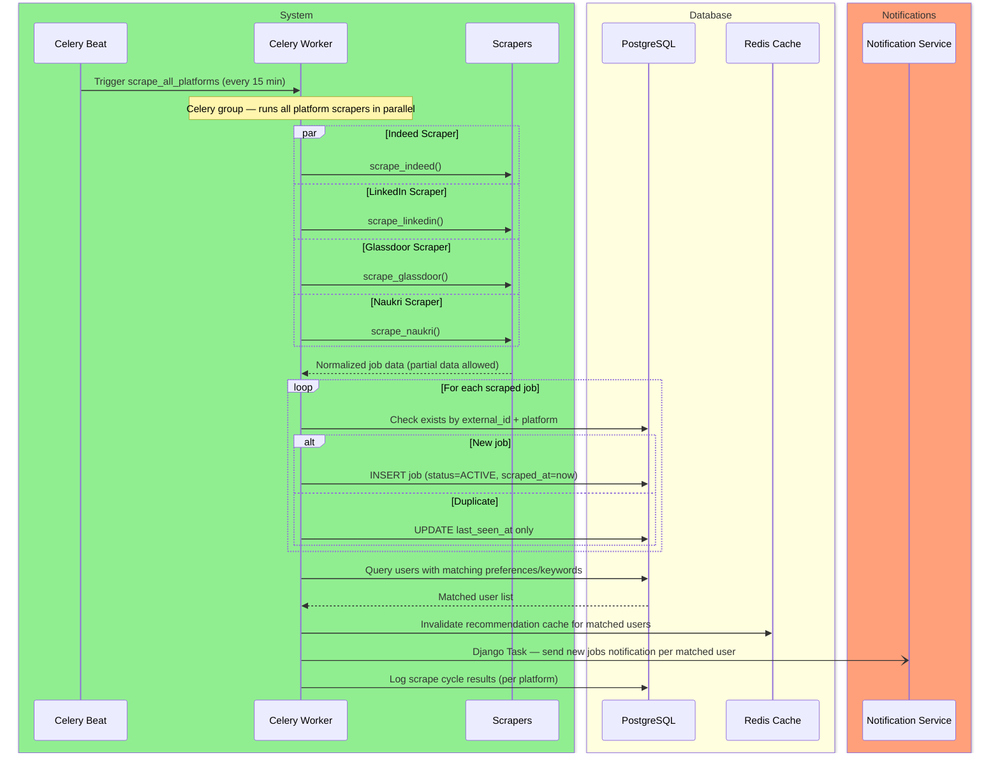
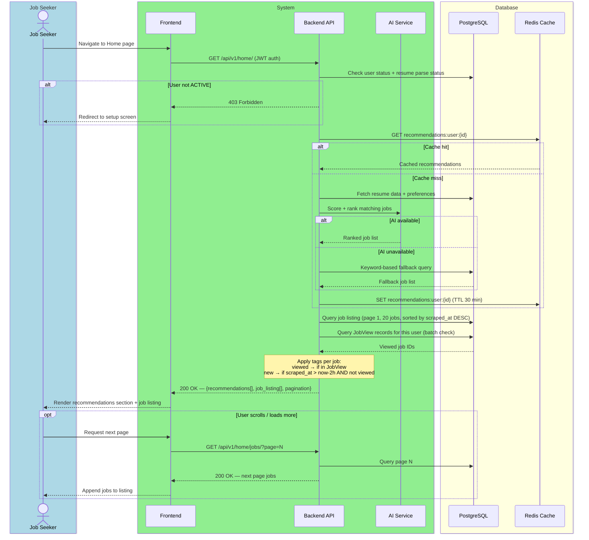
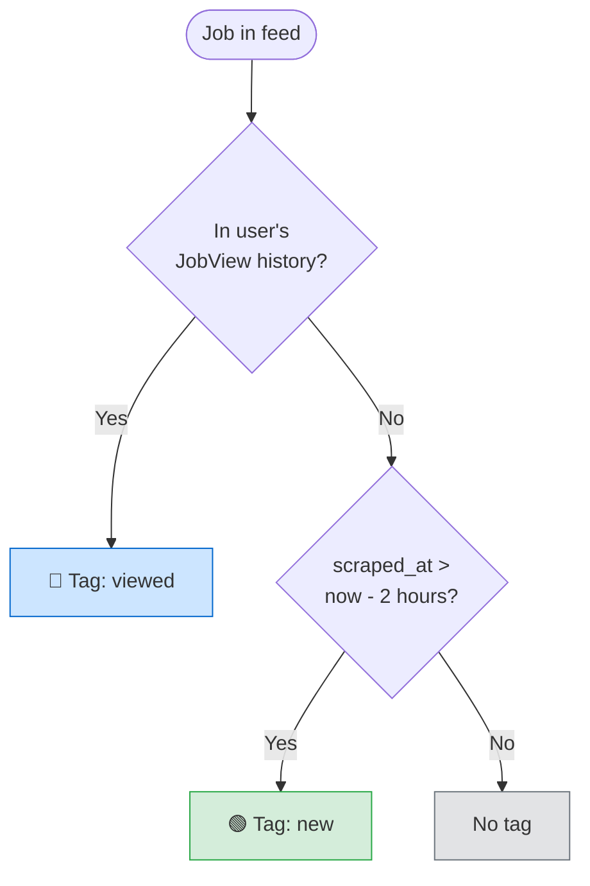
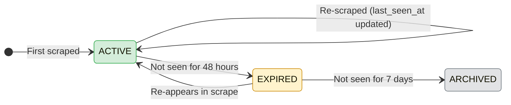

# CAREERLY-002 — Home Page Flow

# PART 1 — ANALYSIS

## 1.1 Flow Title & Metadata

```
Flow Name:     Home Page — Job Feed & Recommendations
Flow ID:       CAREERLY-002
Trigger:       Authenticated user lands on the home page
Entry Point:   Home screen (post-login or post-setup)
Exit Point:    User views a job detail, or remains browsing the feed
Related Flows: CAREERLY-001 (Auth), CAREERLY-003 (Jobs), CAREERLY-004 (Notifications)
```

## 1.2 Description

The home page is the core discovery surface of Careerly. It serves two sections: a personalized recommendations section (driven by the user's resume and preferences) and a general job listing section (all scraped jobs, paginated). Jobs are scraped every 15 minutes via a Celery Beat task that pulls from Indeed, LinkedIn, Glassdoor, and Naukri. Each job in the feed is tagged as "new" if it was added in the last 2 hours, or "viewed" if the user has previously opened that job's detail page. The scope of this flow covers the scraping pipeline, the recommendation engine trigger, and the home page rendering — it does not cover the job detail view, which is CAREERLY-003.

## 1.3 Actors / User Roles

| Role | Type | Responsibilities in this flow |
|------|------|-------------------------------|
| Job Seeker | Human | Views home feed, scrolls recommendations and listings |
| System | Automated | Serves recommendations and job listing, applies "viewed"/"new" tags |
| Scraper | Automated | Periodically fetches jobs from external platforms |
| Celery Beat | Automated | Triggers the scraper task every 15 minutes |
| AI/ML Service | Automated | Generates job recommendations based on resume + preferences |

## 1.4 Step-by-Step Bullet Points

### Sub-flow A — Scraper Pipeline (background, runs every 15 minutes)

- Celery Beat — triggers `scrape_all_platforms` task every 15 minutes
- Celery Task — runs scrapers for Indeed, LinkedIn, Glassdoor, and Naukri in parallel (as a Celery group)
- Scraper (per platform) — fetches latest job listings, normalizes data into the common job schema
  ↳ if platform is unreachable or returns an error: logs the failure, marks that platform's scrape as `FAILED` for this cycle, continues with other platforms
  ↳ if partial data (no description, no skills): saves what is available, marks missing fields as `null` — does not discard the job
- System — for each scraped job, checks if it already exists in the DB (by `external_id` + `platform`)
  ↳ if duplicate: skips insertion, updates `last_seen_at` timestamp on the existing record
  ↳ if new: inserts the job with `status=ACTIVE`, `scraped_at=now`
- System — after all platform scrapers complete, dispatches a notification check:
  - identifies users whose preferences or resume keywords match newly added jobs
  - dispatches Django Task per matched user to send a "new jobs available" notification
- System — logs scrape cycle results (per platform: jobs found, new inserted, duplicates skipped, errors)

### Sub-flow B — Home Page Load (user-triggered)

- Job Seeker — lands on the home page (authenticated)
- System — checks if the user has a parsed resume and preferences
  ↳ if resume parsing is still in progress: shows a loading state in the recommendations section with message "Setting up your recommendations..."
  ↳ if resume parsing failed: shows fallback recommendations based on preferences only
- System — checks Redis cache for this user's recommendations (`recommendations:user:{id}`)
  ↳ if cache hit: returns cached recommendations immediately
  ↳ if cache miss: triggers recommendation generation (see Sub-flow C), returns loading state until ready
- System — returns the first page of the general job listing (paginated, 20 per page, sorted by `scraped_at` descending)
- System — for each job in both sections, checks the user's `JobView` history:
  ↳ if job is in the user's viewed history: tags it as `viewed`
  ↳ if job was added in the last 2 hours AND not viewed: tags it as `new`
  ↳ otherwise: no tag
- Job Seeker — sees the recommendations section and the job listing section
- Job Seeker — can scroll and paginate the job listing (infinite scroll or load more)
- Job Seeker — can click any job to go to the job detail (CAREERLY-003)

### Sub-flow C — Recommendation Generation (async, triggered on cache miss)

- System — fetches user's parsed resume data (skills, titles, experience) and preferences
- System — queries the jobs DB for jobs matching the user's profile using a relevance ranking query
- AI/ML Service — scores and ranks matched jobs by suitability (uses resume embedding vs job description embedding)
  ↳ if AI service unavailable: falls back to keyword-based matching from preferences only
- System — takes top N recommendations (configurable, default 10)
- System — stores recommendations in Redis cache with TTL of 30 minutes (`recommendations:user:{id}`)
- System — returns recommendations to the home page response

## 1.5 Validations

### Input Validations

| Field | Rule | Error Message |
|-------|------|---------------|
| Page number (pagination) | Positive integer, min 1 | "Invalid page number" |
| Page size | Max 50 per request | Capped at 50 silently |

### Business Rule Validations

| Rule | Condition | Behavior |
|------|-----------|----------|
| Auth required | Unauthenticated user accesses home | Redirect to login |
| Setup incomplete | User status is not ACTIVE | Redirect to setup screen |
| Resume not yet parsed | Parsing still in progress | Show loading state in recommendations, serve feed normally |
| Scrape deduplication | Job with same external_id + platform exists | Skip insert, update last_seen_at only |
| New tag window | Job scraped_at > now - 2 hours AND not viewed by user | Tag as "new" |
| Viewed tag | Job exists in user's JobView records | Tag as "viewed" — overrides "new" if both apply |

### Security Validations

| Check | Details |
|-------|---------|
| Authentication | JWT required — all home page endpoints are protected |
| Role-based access | Only Job Seekers access the home feed — admins have separate dashboard |
| Scraper endpoints | Internal only — not exposed via API, triggered by Celery only |

### Error Handling

| Scenario | System Response |
|----------|----------------|
| All scrapers fail in a cycle | Log error, alert admin via system notification, serve existing jobs from DB |
| One platform scraper fails | Continue with others, log failure, show in monitoring dashboard |
| Recommendations unavailable | Fall back to preference-based listing, no error shown to user |
| DB query timeout on job listing | Show "Something went wrong. Pull to refresh." |
| Redis cache unavailable | Fall back to DB query for recommendations, log the cache miss |
| Empty job listing (no jobs in DB yet) | Show "No jobs yet. Check back soon." empty state |

# PART 2 — TECHNICAL

## 2.1 Diagrams

### Sequence Diagram — Scraper Pipeline



### Sequence Diagram — Home Page Load



### Flowchart — Job Tag Logic



### State Diagram — Scrape Job Status



## 2.2 Data Models

### Model: `Company`

**Purpose:** Represents a company extracted from scraped job data — shared across multiple job listings to avoid duplication  
**Django app:** `jobs`

| Field | Django Field Type | Required | Default | Notes |
|-------|------------------|----------|---------|-------|
| `id` | `UUIDField(primary_key=True)` | Auto | `uuid4` | PK |
| `name` | `CharField(max_length=255)` | Yes | — | Company name. Indexed. |
| `industry` | `CharField(max_length=255, null=True, blank=True)` | No | `null` | e.g. Technology, Healthcare |
| `url` | `URLField(null=True, blank=True)` | No | `null` | Company website |
| `url_direct` | `URLField(null=True, blank=True)` | No | `null` | Direct company page on the platform |
| `logo` | `URLField(null=True, blank=True)` | No | `null` | Logo image URL from the platform |
| `addresses` | `TextField(null=True, blank=True)` | No | `null` | Raw address string(s) as returned by scraper |
| `num_employees` | `CharField(max_length=50, null=True, blank=True)` | No | `null` | Range string e.g. "1000-5000" — not an integer, platforms return ranges |
| `revenue` | `CharField(max_length=100, null=True, blank=True)` | No | `null` | Revenue range string as returned by platform |
| `description` | `TextField(null=True, blank=True)` | No | `null` | Company description |
| `rating` | `DecimalField(max_digits=3, decimal_places=1, null=True, blank=True)` | No | `null` | Employer rating e.g. 4.2 |
| `reviews_count` | `PositiveIntegerField(null=True, blank=True)` | No | `null` | Number of reviews |
| `updated_at` | `DateTimeField(auto_now=True)` | Auto | `now` | Updated whenever new scrape brings fresher company data |

> **Deduplication note:** Companies are matched by `name` (case-insensitive). If a company appears across multiple platforms, they share one record. Company fields are updated (not overwritten blindly) — only update a field if the incoming value is non-null and the existing value is null, to progressively enrich the record.

### Model: `Job`

**Purpose:** Represents a scraped job listing from any supported platform  
**Django app:** `jobs`

| Field | Django Field Type | Required | Default | Notes |
|-------|------------------|----------|---------|-------|
| `id` | `UUIDField(primary_key=True)` | Auto | `uuid4` | PK |
| `external_id` | `CharField(max_length=255)` | Yes | — | Job ID from the source platform. Indexed. |
| `platform` | `CharField(choices=PLATFORM, max_length=20)` | Yes | — | Enum: INDEED, LINKEDIN, GLASSDOOR, NAUKRI |
| `company` | `ForeignKey(Company, on_delete=SET_NULL, null=True)` | No | `null` | FK to Company — SET_NULL if company record deleted |
| `title` | `CharField(max_length=255)` | Yes | — | Job title. Indexed for search. |
| `location` | `CharField(max_length=255, null=True, blank=True)` | No | `null` | City/region — null for fully remote roles |
| `date_posted` | `DateField(null=True, blank=True)` | No | `null` | Actual posting date from the platform — different from scraped_at |
| `job_type` | `CharField(choices=JOB_TYPE, max_length=20, null=True, blank=True)` | No | `null` | Enum: FULL_TIME, PART_TIME, CONTRACT, INTERNSHIP, null if not provided |
| `job_level` | `CharField(max_length=100, null=True, blank=True)` | No | `null` | Seniority level e.g. "Entry Level", "Senior", "Director" |
| `job_function` | `CharField(max_length=100, null=True, blank=True)` | No | `null` | Department/function e.g. "Engineering", "Marketing" |
| `description` | `TextField(null=True, blank=True)` | No | `null` | Full job description — not provided by all platforms |
| `skills` | `ArrayField(CharField(max_length=100), null=True, blank=True)` | No | `null` | Required skills — not provided by all platforms |
| `experience_range` | `CharField(max_length=100, null=True, blank=True)` | No | `null` | e.g. "2-5 years" — raw string as returned by scraper |
| `salary_source` | `CharField(max_length=50, null=True, blank=True)` | No | `null` | Source of salary info e.g. "employer", "estimated" |
| `interval` | `CharField(max_length=20, null=True, blank=True)` | No | `null` | Pay interval: "yearly", "monthly", "hourly" |
| `min_amount` | `DecimalField(max_digits=12, decimal_places=2, null=True, blank=True)` | No | `null` | Minimum salary amount |
| `max_amount` | `DecimalField(max_digits=12, decimal_places=2, null=True, blank=True)` | No | `null` | Maximum salary amount |
| `currency` | `CharField(max_length=10, null=True, blank=True)` | No | `null` | e.g. "USD", "EGP" |
| `is_remote` | `BooleanField(null=True)` | No | `null` | True/False/null — null means not specified |
| `work_from_home_type` | `CharField(max_length=50, null=True, blank=True)` | No | `null` | e.g. "hybrid", "fully_remote", "on_site" |
| `listing_type` | `CharField(max_length=50, null=True, blank=True)` | No | `null` | e.g. "organic", "sponsored" |
| `vacancy_count` | `PositiveIntegerField(null=True, blank=True)` | No | `null` | Number of openings — not always provided |
| `emails` | `ArrayField(EmailField(), null=True, blank=True)` | No | `null` | Contact emails if provided by the platform |
| `job_url` | `URLField(max_length=1000)` | Yes | — | Listing URL on the platform (job_url from scraper) |
| `job_url_direct` | `URLField(max_length=1000, null=True, blank=True)` | No | `null` | Direct application URL if different from listing URL |
| `search_country` | `CharField(max_length=100, null=True, blank=True)` | No | `null` | The country context used in the scrape search |
| `search_location` | `CharField(max_length=255, null=True, blank=True)` | No | `null` | The location query used in the scrape search |
| `status` | `CharField(choices=JOB_STATUS, max_length=20)` | Yes | `ACTIVE` | Enum: ACTIVE, EXPIRED, ARCHIVED |
| `scraped_at` | `DateTimeField` | Yes | `now` | When first scraped into the system. Indexed. |
| `last_seen_at` | `DateTimeField` | Yes | `now` | Updated every scrape cycle when job reappears. Indexed. |

**Unique constraint:** `unique_together = [('external_id', 'platform')]`

> **Null handling rule:** Never substitute an empty string for a null. If the scraper returns no value for a field, store `null`. This is enforced on all nullable fields with `null=True, blank=True`.

### Model: `ScrapeLog`

**Purpose:** Logs each scrape cycle per platform for monitoring and debugging  
**Django app:** `jobs`

| Field | Django Field Type | Required | Default | Notes |
|-------|------------------|----------|---------|-------|
| `id` | `UUIDField(primary_key=True)` | Auto | `uuid4` | PK |
| `platform` | `CharField(choices=PLATFORM, max_length=20)` | Yes | — | Which platform this log is for |
| `status` | `CharField(choices=SCRAPE_STATUS, max_length=20)` | Yes | — | Enum: SUCCESS, PARTIAL, FAILED |
| `jobs_found` | `PositiveIntegerField` | No | `0` | Total jobs returned by platform |
| `jobs_inserted` | `PositiveIntegerField` | No | `0` | New jobs inserted this cycle |
| `jobs_updated` | `PositiveIntegerField` | No | `0` | Existing jobs with updated last_seen_at |
| `error_message` | `TextField(null=True, blank=True)` | No | `null` | Error details if status = FAILED |
| `started_at` | `DateTimeField` | Yes | — | When this platform's scraper started |
| `finished_at` | `DateTimeField(null=True)` | No | `null` | When it finished (null if still running) |

### Model: `JobView`
**Purpose:** Tracks which jobs a user has viewed — used for "viewed" tags and profile stats  
**Django app:** `jobs`

| Field | Django Field Type | Required | Default | Notes |
|-------|------------------|----------|---------|-------|
| `id` | `UUIDField(primary_key=True)` | Auto | `uuid4` | PK |
| `user` | `ForeignKey(User, on_delete=CASCADE)` | Yes | — | The viewing user |
| `job` | `ForeignKey(Job, on_delete=CASCADE)` | Yes | — | The viewed job |
| `viewed_at` | `DateTimeField(auto_now_add=True)` | Auto | `now` | Indexed — used for weekly stats |

**Unique constraint:** `unique_together = [('user', 'job')]` — one record per user-job pair. Update `viewed_at` on revisit rather than inserting a new record.

### Model: `SavedJob`

**Purpose:** Jobs saved by a user for later reference  
**Django app:** `jobs`

| Field | Django Field Type | Required | Default | Notes |
|-------|------------------|----------|---------|-------|
| `id` | `UUIDField(primary_key=True)` | Auto | `uuid4` | PK |
| `user` | `ForeignKey(User, on_delete=CASCADE)` | Yes | — | The saving user |
| `job` | `ForeignKey(Job, on_delete=CASCADE)` | Yes | — | The saved job |
| `saved_at` | `DateTimeField(auto_now_add=True)` | Auto | `now` | — |

**Unique constraint:** `unique_together = [('user', 'job')]`

## 2.3 Table Relationships & Logic

`Company` and `Job` have a `ForeignKey` relationship — one company has many jobs. `Job` uses `SET_NULL` on company deletion so job records are never lost if a company record is cleaned up. `JobView` and `SavedJob` are junction tables between `User` and `Job`. When a `User` is deleted, all their `JobView` and `SavedJob` records cascade-delete. When a `Job` is deleted, the same applies.

**Company deduplication** — companies are matched by name (case-insensitive) using `iexact` lookup before creating a new record:
```python
company, created = Company.objects.get_or_create(
    name__iexact=scraped_name,
    defaults={'name': scraped_name, ...}
)
```
If the company already exists, enrich it — only update null fields with non-null incoming values. Never overwrite existing data with null:
```python
for field in ['logo', 'url', 'description', 'rating', ...]:
    incoming = scraped_data.get(field)
    if incoming and not getattr(company, field):
        setattr(company, field, incoming)
company.save()
```

**Job deduplication** uses `update_or_create` on `(external_id, platform)`. If the record exists, update `last_seen_at` only — do not overwrite any other fields. This preserves the original scraped data integrity.

**Tag computation** is done in the backend, not the frontend. When building the home page response, the backend fetches the user's `JobView` IDs as a set, then annotates each job in the response:
```
tag = "viewed" if job.id in viewed_ids
     else "new" if job.scraped_at > now - 2h
     else None
```
This is computed in Python after the DB query — do not compute tags in SQL to keep the query simple. The computed `tag` value is included as a field on every job object in the API response (`"new"`, `"viewed"`, or `null`). The frontend reads `job.tag` directly — no tag logic lives on the client.

**Job expiry** — a separate Celery Beat task runs daily: marks jobs as `EXPIRED` if `last_seen_at < now - 48 hours`. Marks `EXPIRED` jobs as `ARCHIVED` if `last_seen_at < now - 7 days`. Expired/archived jobs are excluded from the home feed by default (filter `status=ACTIVE`).

**Recommendation cache invalidation** — when new jobs matching a user are inserted, invalidate their recommendations cache key in Redis. This ensures the next home page load recalculates recommendations with fresh data.

**Scraper field mapping** — the scraper output fields map to models as follows:

| Scraper Field | Model | Model Field |
|---|---|---|
| `id` | `Job` | `external_id` |
| `site` | `Job` | `platform` |
| `job_url` | `Job` | `job_url` |
| `job_url_direct` | `Job` | `job_url_direct` |
| `title` | `Job` | `title` |
| `company` | `Company` | `name` |
| `location` | `Job` | `location` |
| `date_posted` | `Job` | `date_posted` |
| `job_type` | `Job` | `job_type` |
| `salary_source` | `Job` | `salary_source` |
| `interval` | `Job` | `interval` |
| `min_amount` | `Job` | `min_amount` |
| `max_amount` | `Job` | `max_amount` |
| `currency` | `Job` | `currency` |
| `is_remote` | `Job` | `is_remote` |
| `job_level` | `Job` | `job_level` |
| `job_function` | `Job` | `job_function` |
| `listing_type` | `Job` | `listing_type` |
| `emails` | `Job` | `emails` |
| `description` | `Job` | `description` |
| `company_industry` | `Company` | `industry` |
| `company_url` | `Company` | `url` |
| `company_logo` | `Company` | `logo` |
| `company_url_direct` | `Company` | `url_direct` |
| `company_addresses` | `Company` | `addresses` |
| `company_num_employees` | `Company` | `num_employees` |
| `company_revenue` | `Company` | `revenue` |
| `company_description` | `Company` | `description` |
| `skills` | `Job` | `skills` |
| `experience_range` | `Job` | `experience_range` |
| `company_rating` | `Company` | `rating` |
| `company_reviews_count` | `Company` | `reviews_count` |
| `vacancy_count` | `Job` | `vacancy_count` |
| `work_from_home_type` | `Job` | `work_from_home_type` |
| `search_country` | `Job` | `search_country` |
| `search_location` | `Job` | `search_location` |
| *(set by system)* | `Job` | `scraped_at` |
| *(set by system)* | `Job` | `last_seen_at` |

**Indexes needed:**
- `Job.scraped_at` — used for sorting the feed
- `Job.last_seen_at` — used for expiry checks
- `Job.title` — used for search and recommendation matching
- `Job.external_id` + `Job.platform` — covered by unique constraint
- `Company.name` — used for deduplication lookup
- `JobView.viewed_at` — used for weekly stats in monitoring
- `JobView.user` — used for tag lookups

## 2.4 API Endpoints

| Method | Endpoint | Auth | Role | Request Body / Params | Response | Description |
|--------|----------|------|------|----------------------|----------|-------------|
| `GET` | `/api/v1/home/` | Yes | Job Seeker | — | `200` — `{recommendations[], job_listing[], pagination}` | Home page data — recommendations + first page of listings |
| `GET` | `/api/v1/home/jobs/` | Yes | Job Seeker | `?page=N&page_size=20` | `200` — `{jobs[], pagination}` | Paginated job listing |
| `GET` | `/api/v1/home/recommendations/` | Yes | Job Seeker | — | `200` — `{jobs[]}` | Recommendations only (for refresh) |

## 2.5 Developer Notes

### 🔵 Backend Developer (Django)

- Celery Beat schedule: `scrape_all_platforms` every 15 minutes via `crontab(minute='*/15')`.
- Use `celery.group` to run all 4 platform scrapers in parallel within one Celery task. Each scraper is a separate `shared_task`.
- Scrapers should be stateless — no shared mutable state between runs. Each scraper returns a list of normalized job dicts that map directly to the scraper field mapping table above.
- **Company upsert first, then Job upsert.** For each scraped job: (1) `get_or_create` the Company by `name__iexact`, enrich null fields. (2) `update_or_create` the Job by `(external_id, platform)`, set `company=company_instance`, only update `last_seen_at` on existing records.
- Never overwrite existing non-null Job fields on update — only `last_seen_at` is updated on re-scrape. This protects data integrity if the platform returns degraded data in a later cycle.
- All nullable fields must be stored as `null`, never as empty string. Apply this strictly in the scraper normalization layer before hitting the DB.
- `is_remote` is a `NullBooleanField` — three states: `True`, `False`, `None` (not specified). Do not default to `False`.
- `skills` and `emails` are `ArrayField` — use `[]` as the default in Python but store `null` in DB when not provided (use `null=True`).
- Recommendation endpoint: use `select_related('company')` when fetching jobs — avoids N+1 on company name/logo lookups.
- `JobView` upsert: `update_or_create(user=user, job=job, defaults={'viewed_at': now()})`.
- Add a daily Celery Beat task `expire_old_jobs`: `Job.objects.filter(last_seen_at__lt=now()-48h, status='ACTIVE').update(status='EXPIRED')`.
- For the notification dispatch after scraping: collect new job IDs, find users with matching `job_titles` or `skills` overlap, batch them, dispatch one Django Task per user.
- Use `select_related('company')` and `only()` for the job listing query to avoid pulling unnecessary fields.
- The job serializer must include a `tag` field as a `SerializerMethodField` — compute it from the pre-fetched `viewed_ids` set passed into the serializer context. Never make a per-job DB query to determine the tag.

### 🟢 Frontend Developer (React)

- Home page has two distinct sections: **Recommendations** (horizontal scroll or grid, top) and **Job Listing** (vertical list, below).
- Each job card displays: title, company name, company logo (if available — fallback to initials avatar), location, platform badge, job type, remote badge (if `is_remote=true`), "new" or "viewed" tag (colored), `date_posted` (preferred over `scraped_at` for display).
- Recommendations section shows a skeleton loader while loading. If recommendations are not ready (resume parsing in progress), show a banner: "We're personalizing your feed — check back shortly."
- Job listing uses **infinite scroll** — trigger `GET /api/v1/home/jobs/?page=N` when user scrolls to 80% of the list. Append results to the existing list.
- Tag rendering: read `job.tag` from the API response directly — `"new"` → green badge, `"viewed"` → grey badge, `null` → nothing. Never compute tags on the frontend.
- Platform badge: show platform logo/icon (Indeed, LinkedIn, Glassdoor, Naukri).
- Salary display: show only if `min_amount` or `max_amount` is non-null. Format as `$X – $Y /year` using `interval` and `currency`. If only one bound is available, show `From $X` or `Up to $Y`.
- Clicking a job card navigates to the job detail page (CAREERLY-003) and fires a `POST /api/v1/jobs/{id}/view/` to record the view.
- Cache the home page data in React Query or SWR with a 5-minute stale time — don't re-fetch on every re-render.

### 🟡 Mobile Developer (Flutter)

- Recommendations section: `ListView` with `scrollDirection: Axis.horizontal`.
- Job listing: `ListView.builder` with `LazyLoading` — load next page when user reaches last 5 items.
- Job cards: use `Card` widget with platform icon, title, company, location, tag badge.
- Tag badges: `Chip` widget — read `job.tag` from the API response. Green `Chip` for `"new"`, grey for `"viewed"`, nothing rendered for `null`. No tag logic on mobile.
- Pull-to-refresh: wrap listing in `RefreshIndicator` — re-calls `/api/v1/home/` on pull.
- If recommendations are loading (parse in progress): show `Shimmer` loading effect in the recommendations row.
- Store first page of home data in local cache (using `hive` or `isar`) for offline viewing of previously loaded jobs.
- Platform icons: bundle as local assets — do not fetch from the web at runtime.

### 🟣 AI Engineer

- Recommendation generation: given a user's resume data (skills list, job titles, experience level), query the `Job` table for `ACTIVE` jobs. Score each by relevance using an embedding similarity model.
- Preferred approach: pre-compute job embeddings and store them (as a `vector` field using `pgvector` extension on PostgreSQL, or as a separate vector store). On recommendation request, compute the user's profile embedding and run a nearest-neighbor search.
- If `pgvector` is not available at this stage: fall back to PostgreSQL full-text search using `SearchVector` on `title + description + skills`.
- Input to recommendation model: `{user_skills: [], user_titles: [], experience_level: str}`.
- Output: list of `job_id` ranked by suitability score.
- TTL of recommendations is 30 minutes — cache is invalidated when new matching jobs arrive.
- This same recommendation engine is used in AI Match (CAREERLY-003) — share the scoring logic.


## 2.6 General Notes

**Null field UI behavior:** Fields critical to the job card and detail page (`description`, `skills`, `salary`) should show styled placeholders directing the user to the original post — e.g. *"Description not available for this listing. View the original post for full details."* Minor supplementary fields (`vacancy_count`, `listing_type`, `emails`, `work_from_home_type`) should be silently omitted if null — do not render the label at all. The general rule: if the user would notice it's missing, show a placeholder; if it's supplementary, hide the row entirely. Decision needed: confirm placeholder copy with design before the frontend builds the job detail component.