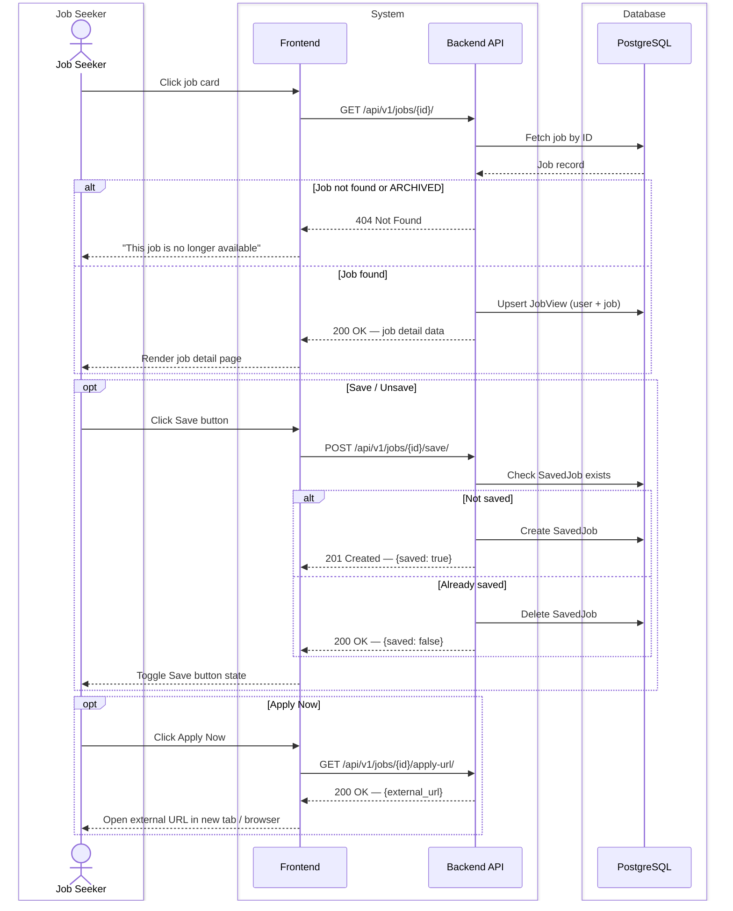
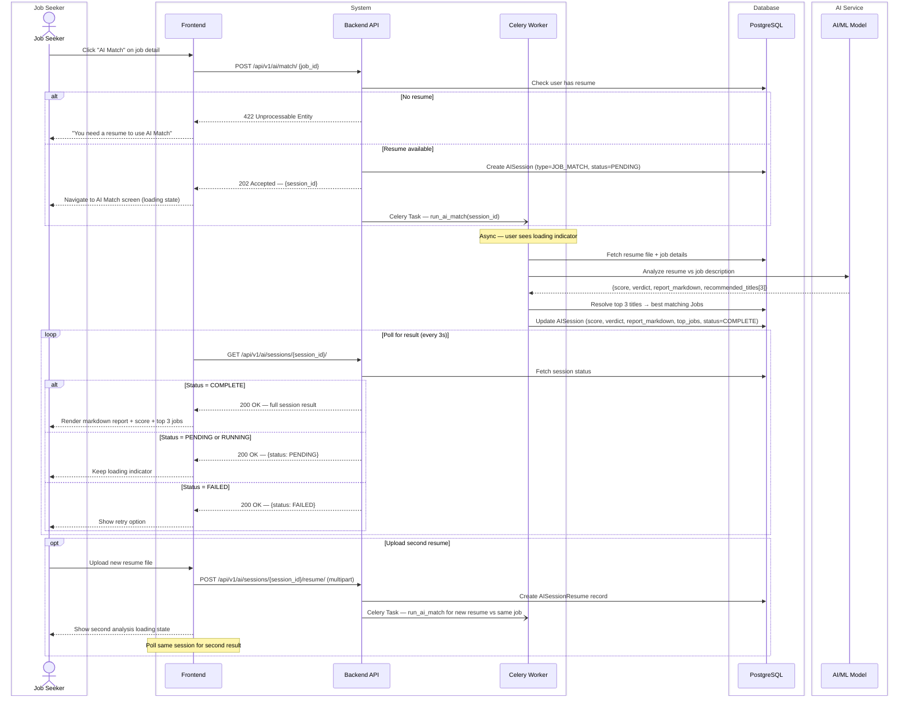
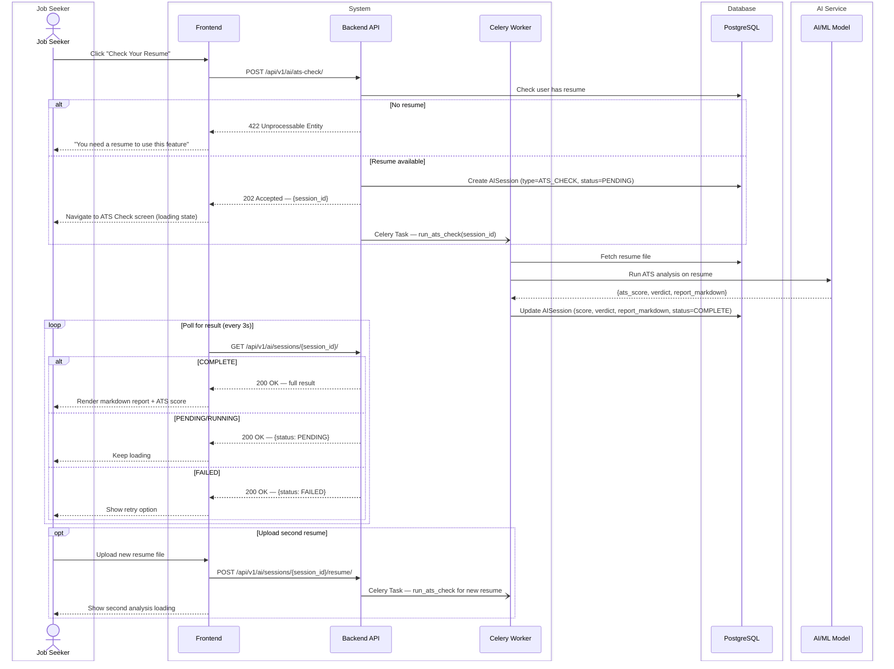
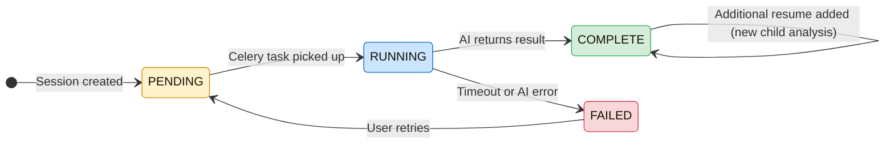

# CAREERLY-003 — Jobs Flow

# PART 1 — ANALYSIS

## 1.1 Flow Title & Metadata

```
Flow Name:     Jobs — Detail, Save, Apply, AI Match, Check Resume
Flow ID:       CAREERLY-003
Trigger:       User clicks on a job card from the home page or job listing
Entry Point:   Job card on Home page or Job listing
Exit Point:
  Apply Now    → External job page (browser/webview)
  AI Match     → AI analysis result screen with suitability score + top 3 jobs
  Check Resume → AI ATS analysis result screen with ATS score
  Save         → Job saved, user stays on detail page
Related Flows: CAREERLY-002 (Home Page), CAREERLY-004 (Notifications), CAREERLY-005 (Profile)
```

## 1.2 Description

This flow covers everything that happens after a user selects a job. The job detail page presents scraped and organized data about the job, and offers four actions: save for later, apply now (external redirect), AI Match (resume vs job suitability scoring), and Check Your Resume (general ATS scoring). Both AI features are analysis sessions — they persist to the user's history and contribute to profile stats. The AI Match session is scoped to a specific job; the Check Resume session is general. Both support uploading additional resumes for comparison within the same session, and both render AI responses in markdown. This flow does not cover the scraping of jobs (CAREERLY-002) or notifications triggered by these actions (CAREERLY-004).

## 1.3 Actors / User Roles

| Role | Type | Responsibilities in this flow |
|------|------|-------------------------------|
| Job Seeker | Human | Views job detail, saves, applies, requests AI analysis |
| System | Automated | Records views, saves, routes to external URL, manages sessions |
| AI/ML Service | Automated | Analyzes resume against job or general ATS, returns scored markdown report |

## 1.4 Step-by-Step Bullet Points

### Route 1 — View Job Detail

- Job Seeker — clicks on a job card
- System — records a `JobView` for this user + job (upsert — update `viewed_at` if already exists)
- System — fetches job details from DB
  ↳ if job no longer exists or is archived: shows "This job is no longer available"
- Job Seeker — sees the job detail page with all available scraped fields (title, company, location, description, skills, job type, salary if available, platform badge, source link)
- System — shows a notice for fields that were not available from the source platform (e.g. "Description not available for this listing")

### Route 2 — Save Job

- Job Seeker — clicks the Save button on the detail page
- System — checks if the job is already saved by this user
  ↳ if already saved: toggles to unsave — removes from saved jobs, button state changes to "Save"
  ↳ if not saved: saves the job, button state changes to "Saved"
- System — creates or deletes a `SavedJob` record
- Job Seeker — stays on the job detail page, button reflects current state

### Route 3 — Apply Now

- Job Seeker — clicks the "Apply Now" button
- System — retrieves the `external_url` for this job
- System — opens the external job page (opens in a new tab on web, in-app browser or external browser on mobile)
- Job Seeker — lands on the original job page (Indeed, LinkedIn, Glassdoor, or Naukri) to complete the application there

### Route 4 — AI Match

- Job Seeker — clicks the "AI Match" button on the job detail page
- System — checks if the user has a resume on file
  ↳ if no resume: prompts user to upload one — "You need a resume to use AI Match"
- System — creates a new `AISession` record with type = `JOB_MATCH`, linked to the job, status = `PENDING`
- Job Seeker — is navigated to the AI Match screen, which shows the job title and company at the top
- System — dispatches Celery Task to analyze the user's default resume against this job
- System — streams or polls analysis progress
- AI/ML Service — analyzes the resume against the job description and requirements
- AI/ML Service — returns a markdown-formatted report including:
  - Suitability score (0–100)
  - Verdict tier (Poor / Fair / Good / Excellent)
  - Strengths and gaps breakdown
  - Top 3 recommended job titles based on the resume
- System — resolves the top 3 recommended job titles against the jobs DB (best match per title)
- System — updates `AISession` with: `score`, `verdict`, `report_markdown`, `top_jobs[]`, `status = COMPLETE`
- Job Seeker — sees the rendered markdown report, suitability score, verdict badge, and the 3 recommended jobs
- Job Seeker — can click any of the 3 recommended jobs to view their detail (re-enters this flow)
- Job Seeker — can upload a second resume to compare against the same job
  ↳ System — creates a new `AISessionResume` record linked to this session
  ↳ System — runs the same AI analysis for the new resume against the same job
  ↳ Job Seeker — sees both results side-by-side or as separate tabs

### Route 5 — Check Your Resume (ATS Analysis)

- Job Seeker — clicks the "Check Your Resume" button (available on the job detail page and as a standalone feature)
- System — checks if the user has a resume on file
  ↳ if no resume: prompts user to upload one
- System — creates a new `AISession` record with type = `ATS_CHECK`, status = `PENDING`
- Job Seeker — is navigated to the Check Resume screen
- System — dispatches Celery Task to run a general ATS analysis on the user's default resume
- AI/ML Service — analyzes the resume for ATS compliance and returns a markdown-formatted report including:
  - ATS score (0–100)
  - Verdict tier (Poor / Fair / Good / Excellent)
  - Keyword coverage analysis
  - Formatting recommendations
  - Skills gap suggestions
- System — updates `AISession` with: `score`, `verdict`, `report_markdown`, `status = COMPLETE`
- Job Seeker — sees the rendered markdown report, ATS score, and verdict badge
- Job Seeker — can upload a second resume to compare ATS scores
  ↳ System — runs the same ATS analysis for the new resume
  ↳ Job Seeker — sees both results side-by-side or as separate tabs

## 1.5 Validations

### Input Validations

| Field | Rule | Error Message |
|-------|------|---------------|
| Resume upload (AI features) | PDF  only, max 5MB | "Only PDF  files are accepted" / "File size must be under 5MB" |
| Job ID (URL param) | Must be a valid UUID, must exist in DB | 404 Not Found |

### Business Rule Validations

| Rule | Condition | Behavior |
|------|-----------|----------|
| Resume required for AI features | No resume on file | Prompt upload — block AI feature until resumed |
| Archived/expired job viewed | Job status is not ACTIVE | Show "This job is no longer available" — disable Apply and AI Match |
| Save toggle | Job already saved | Toggle to unsaved on second click |
| Top 3 job resolution | AI returns a title with no DB match | Return the closest available match; if none, omit that slot (can return 1–3 jobs) |
| Second resume in session | User uploads 2nd resume | Runs AI analysis for the new resume against the same job/context as the first |

### Security Validations

| Check | Details |
|-------|---------|
| Authentication | JWT required for all job actions |
| Role-based access | Only Job Seekers — admins do not interact with job detail |
| Session ownership | AI sessions can only be viewed by the user who created them |
| File upload | Validate MIME type server-side (not just extension) — reject non-PDF content types |

### Error Handling

| Scenario | System Response |
|----------|----------------|
| AI service unavailable | Show "AI analysis is temporarily unavailable. Try again later." — do not create a session |
| AI analysis times out | Mark session status = `FAILED`, notify user — allow retry |
| External URL missing or broken | Show "Apply link is unavailable for this listing" — disable Apply Now button |
| Job not found in DB | 404 with message "This job is no longer available" |
| Save/unsave server error | Show toast error, revert button state |

# PART 2 — TECHNICAL

## 2.1 Diagrams

### Sequence Diagram — Job Detail + Save + Apply



### Sequence Diagram — AI Match



### Sequence Diagram — Check Your Resume (ATS)



### State Diagram — AI Session Lifecycle



## 2.2 Data Models

### Model: `AISession`

**Purpose:** Represents one AI analysis session — either a job match or ATS check  
**Django app:** `ai`

| Field | Django Field Type | Required | Default | Notes |
|-------|------------------|----------|---------|-------|
| `id` | `UUIDField(primary_key=True)` | Auto | `uuid4` | PK |
| `user` | `ForeignKey(User, on_delete=CASCADE)` | Yes | — | Owning user |
| `session_type` | `CharField(choices=SESSION_TYPE, max_length=20)` | Yes | — | Enum: JOB_MATCH, ATS_CHECK |
| `job` | `ForeignKey(Job, on_delete=SET_NULL, null=True, blank=True)` | No | `null` | Only for JOB_MATCH sessions |
| `resume` | `ForeignKey(Resume, on_delete=SET_NULL, null=True)` | Yes | — | The primary resume analyzed |
| `score` | `PositiveSmallIntegerField(null=True)` | No | `null` | 0–100, set on completion |
| `verdict` | `CharField(choices=VERDICT, max_length=20, null=True)` | No | `null` | Enum: POOR, FAIR, GOOD, EXCELLENT |
| `report_markdown` | `TextField(null=True, blank=True)` | No | `null` | Full AI-generated markdown report |
| `top_jobs` | `ManyToManyField(Job, blank=True, related_name='recommended_in')` | No | — | Top 3 jobs (JOB_MATCH only) |
| `status` | `CharField(choices=SESSION_STATUS, max_length=20)` | Yes | `PENDING` | Enum: PENDING, RUNNING, COMPLETE, FAILED |
| `created_at` | `DateTimeField(auto_now_add=True)` | Auto | `now` | Indexed — used for session history |
| `completed_at` | `DateTimeField(null=True, blank=True)` | No | `null` | Set when status = COMPLETE |

### Model: `AISessionResume`

**Purpose:** Tracks additional resumes analyzed within the same session (for comparison)  
**Django app:** `ai`

| Field | Django Field Type | Required | Default | Notes |
|-------|------------------|----------|---------|-------|
| `id` | `UUIDField(primary_key=True)` | Auto | `uuid4` | PK |
| `session` | `ForeignKey(AISession, on_delete=CASCADE)` | Yes | — | Parent session |
| `resume` | `ForeignKey(Resume, on_delete=CASCADE)` | Yes | — | The additional resume |
| `score` | `PositiveSmallIntegerField(null=True)` | No | `null` | Score for this resume in this session |
| `verdict` | `CharField(choices=VERDICT, max_length=20, null=True)` | No | `null` | Verdict for this resume |
| `report_markdown` | `TextField(null=True, blank=True)` | No | `null` | Separate markdown report for this resume |
| `status` | `CharField(choices=SESSION_STATUS, max_length=20)` | Yes | `PENDING` | Same enum as AISession |
| `created_at` | `DateTimeField(auto_now_add=True)` | Auto | `now` | — |

### Model: `Resume`

**Purpose:** A resume file uploaded by a user  
**Django app:** `accounts`

| Field | Django Field Type | Required | Default | Notes |
|-------|------------------|----------|---------|-------|
| `id` | `UUIDField(primary_key=True)` | Auto | `uuid4` | PK |
| `user` | `ForeignKey(User, on_delete=CASCADE)` | Yes | — | Owner |
| `file` | `FileField(upload_to='resumes/')` | Yes | — | Stored in S3 or local media |
| `original_filename` | `CharField(max_length=255)` | Yes | — | Displayed in UI and sessions |
| `file_size` | `PositiveIntegerField` | Yes | — | In bytes |
| `parsed_data` | `JSONField(null=True, blank=True)` | No | `null` | AI-extracted: skills, titles, experience_level, education |
| `parse_status` | `CharField(choices=PARSE_STATUS, max_length=20)` | Yes | `PENDING` | Enum: PENDING, COMPLETE, FAILED |
| `is_default` | `BooleanField` | No | `False` | The resume used by default for AI features |
| `uploaded_at` | `DateTimeField(auto_now_add=True)` | Auto | `now` | — |

**Constraint:** Only one `Resume` per user can have `is_default=True`. Enforce with a `UniqueConstraint` filtered on `is_default=True`.

## 2.3 Table Relationships & Logic

`AISession` links `User`, `Job` (optional), and `Resume`. When a `Job` is deleted or archived, the FK is set to `null` — sessions are preserved for historical record. When a `User` is deleted, sessions cascade-delete.

`AISessionResume` is a child of `AISession`. Each additional resume uploaded in a session creates one `AISessionResume` record with its own independent score, verdict, and markdown report.

**Verdict tier computation** — applied after score is returned by AI:
```
85–100  → EXCELLENT
70–84   → GOOD
50–69   → FAIR
0–49    → POOR
```
This is computed in the backend before saving — the AI returns only a numeric score.

**Average ATS score on profile** — computed as:
```python
AISession.objects.filter(
    user=user,
    session_type='ATS_CHECK',
    status='COMPLETE'
).aggregate(avg=Avg('score'))
```
This is not stored — it is computed on profile load and cached in Redis with TTL 10 minutes.

**Average suitability score on profile** — same approach, filtered on `session_type='JOB_MATCH'`.

**Default resume logic** — when a user uploads their first resume, it is automatically set as `is_default=True`. When they upload subsequent resumes, they can explicitly set a new default. When the default resume is deleted, set the most recently uploaded remaining resume as the new default via `post_delete` signal.

**Top 3 job resolution** — AI returns 3 job title strings. For each title, run:
```python
Job.objects.filter(
    status='ACTIVE',
    title__icontains=title
).order_by('-scraped_at').first()
```
If no match, omit that slot. Store the resolved `Job` instances in the `top_jobs` M2M field.

**Session polling** — frontend polls every 3 seconds. Backend returns current status. Once `COMPLETE`, frontend stops polling and renders the result. Celery task timeout is 5 minutes — if exceeded, mark session as `FAILED`.

## 2.4 API Endpoints

| Method | Endpoint | Auth | Role | Request Body / Params | Response | Description |
|--------|----------|------|------|----------------------|----------|-------------|
| `GET` | `/api/v1/jobs/{id}/` | Yes | Job Seeker | — | `200` — job detail | Get job details, records view |
| `POST` | `/api/v1/jobs/{id}/save/` | Yes | Job Seeker | — | `201 / 200` — `{saved: bool}` | Toggle save/unsave |
| `POST` | `/api/v1/ai/match/` | Yes | Job Seeker | `{job_id}` | `202` — `{session_id}` | Start AI Match session |
| `POST` | `/api/v1/ai/ats-check/` | Yes | Job Seeker | — | `202` — `{session_id}` | Start ATS Check session |
| `GET` | `/api/v1/ai/sessions/{id}/` | Yes | Job Seeker | — | `200` — session data | Poll session status and result |
| `POST` | `/api/v1/ai/sessions/{id}/resume/` | Yes | Job Seeker | `multipart: {resume_file}` | `202` — `{sub_session_id}` | Add additional resume to session |
| `GET` | `/api/v1/ai/sessions/` | Yes | Job Seeker | `?type=JOB_MATCH\|ATS_CHECK&page=N` | `200` — paginated sessions | List user's session history |
<!-- | `GET` | `/api/v1/jobs/{id}/apply-url/` | Yes | Job Seeker | — | `200` — `{external_url}` | Get external apply URL | -->

## 2.5 Developer Notes

### 🔵 Backend Developer (Django)

- `GET /api/v1/jobs/{id}/` should upsert `JobView` inside the view using `update_or_create` — do not fire a separate request for view tracking.
- `POST /api/v1/jobs/{id}/save/` should be idempotent — second call toggles the save, not duplicates it. Use `get_or_create` then delete if it existed.
- AI sessions return `202 Accepted` immediately — the Celery task runs async. Never make the user wait synchronously for AI response.
- Celery task `run_ai_match(session_id)`: fetch session → fetch resume file → send to AI → parse response → compute verdict → resolve top 3 jobs → update session. Wrap in `try/except` — on any exception, set `status=FAILED`.
- Set `CELERY_TASK_SOFT_TIME_LIMIT = 280` and `CELERY_TASK_TIME_LIMIT = 300` for AI tasks (5 min hard limit).
- Markdown in `report_markdown`: store exactly as returned by AI — do not sanitize or strip. The frontend handles rendering.
- For `top_jobs` resolution: do the DB query inside the Celery task, not in the API view.
- Average score computation for profile: use Django's `Avg` aggregation, cache in Redis for 10 minutes. Key: `user:{id}:avg_ats_score` and `user:{id}:avg_match_score`.
- Resume `is_default` uniqueness: use `UniqueConstraint(fields=['user'], condition=Q(is_default=True), name='unique_default_resume_per_user')`.
- `post_delete` signal on `Resume`: if deleted resume was the default, find the latest remaining resume and set it as default.

### 🟢 Frontend Developer (React)

- Job detail page sections: header (title, company, location, platform badge, save button, apply button), body (description with null notice if missing, skills chips or null notice, job type, salary if available), AI actions section (AI Match button, Check Resume button).
- Save button: optimistic UI — toggle state immediately, revert on API error.
- "AI Match" and "Check Resume" buttons should be disabled and show tooltip "Upload a resume first" if user has no resume.
- AI result screen: render `report_markdown` using a markdown renderer (e.g. `react-markdown` with `remark-gfm` plugin for tables and lists). Never render raw HTML.
- Polling: use `setInterval` every 3 seconds while `status === 'PENDING' || status === 'RUNNING'`. Clear interval on `COMPLETE` or `FAILED`. Use React Query's `refetchInterval` option for cleaner implementation.
- Score display: large circular progress indicator showing the score (0–100). Color-coded by verdict: POOR = red, FAIR = orange, GOOD = blue, EXCELLENT = green.
- Verdict badge: pill/chip component with verdict label and matching color.
- Top 3 recommended jobs: horizontal job cards below the report — clickable, navigate to their detail pages.
- Second resume comparison: show two columns (or tabs on mobile) — "Resume 1" and "Resume 2" — each with their own score, verdict, and report.
- Apply Now: always open in a new tab (`target="_blank"` with `rel="noopener noreferrer"`).

### 🟡 Mobile Developer (Flutter)

- Job detail: `SingleChildScrollView` with sections. Use `Chip` widgets for skills. Show "Not available" `Text` in grey for null fields.
- Apply Now: use `url_launcher` package to open external URL. Try external browser first, fall back to in-app webview.
- Save button: `IconButton` with bookmark icon — filled when saved, outlined when not. Optimistic toggle.
- AI Match / ATS result screen: use `flutter_markdown` package to render `report_markdown`. Ensure the package supports tables and code blocks.
- Score display: use `CircularProgressIndicator` styled as a score ring, with color driven by verdict.
- Polling: use a `Timer.periodic` in the state — cancel it when status is `COMPLETE` or `FAILED`.
- Second resume: use a `TabBar` with two tabs ("Resume 1", "Resume 2") — each tab holds a full result view.
- AI features unavailable (no resume): show a `BottomSheet` prompting resume upload, with a direct upload button.

### 🟣 AI Engineer

**AI Match:**
- Input: resume text (extracted from PDF), job title, job description (may be null — handle gracefully), required skills (may be null).
- Output (JSON): `{score: int, recommended_titles: [str, str, str], report_markdown: str}`
- If description is null: base analysis on job title + skills only — note this limitation in the report.
- The markdown report must include: an executive summary, a strengths section, a gaps section, and recommendations.
- Use structured prompting with explicit markdown formatting instructions — the model must output markdown, not plain text.

**ATS Check:**
- Input: resume text only.
- Output (JSON): `{score: int, report_markdown: str}`
- The markdown report must include: ATS compatibility summary, keyword coverage, formatting issues, improvement recommendations.

**Verdict tier:** backend computes verdict from score — AI does not return a verdict string.

**Second resume comparison:** AI is called independently for each resume — there is no "compare two resumes" prompt. The frontend handles the side-by-side display.

**Fallback:** if AI service is unavailable (connection error, timeout), raise an exception in the Celery task — the task retry logic handles it. After 3 retries, mark session as `FAILED`.

**Latency target:** AI analysis should complete within 30–60 seconds. Design prompts to be concise. If resume is very long (>3 pages), truncate to first 3 pages for analysis.

## 2.6 General Notes

**AI Match with null job data:** When `description` and `skills` are both null, the AI model has minimal context and can only work from `title`, `job_level`, `job_function`, and company name — which is thin. Chosen approach: run AI Match regardless, but pass only available fields to the model and instruct it explicitly to acknowledge the data limitation in the report. Apply a confidence penalty to the displayed score and show a warning badge: *"Limited job data — score based on job title only. For a more accurate match, view the full job post."* If testing after the first AI integration round reveals consistently unreliable scores on null-data jobs, switch to blocking AI Match entirely when both `description` and `skills` are null, replacing the button with: *"Not enough job data to run AI Match. View the original post for full details."* This decision should be revisited after the first round of AI testing — do not finalize the approach before then.

**Null field UI behavior (job detail page):** Refer to CAREERLY-002 General Notes for the full null field display rules. Summary: `description` and `skills` get styled placeholders with a link to `job_url`; salary fields show *"Salary not disclosed"* if all salary fields are null; `job_level` and `job_function` are omitted entirely if null; minor fields (`vacancy_count`, `emails`, `listing_type`) are silently hidden.