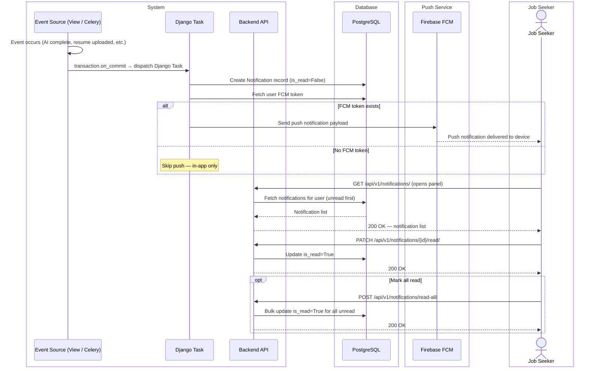
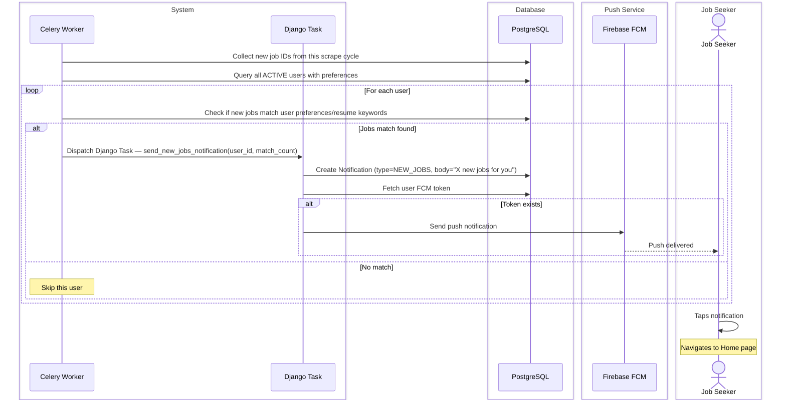
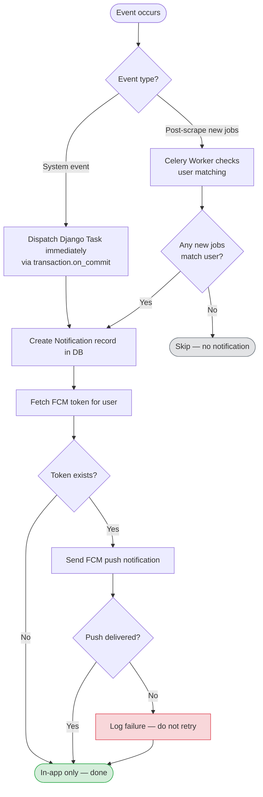

# CAREERLY-004 — Notifications Flow

# PART 1 — ANALYSIS

## 1.1 Flow Title & Metadata

```
Flow Name:     Notifications — System & New Jobs
Flow ID:       CAREERLY-004
Trigger:       System event (AI complete, resume uploaded, new jobs scraped, account changes)
Entry Point:   Any point in the app — notifications are pushed to the user
Exit Point:    User reads or dismisses the notification; optionally navigates to relevant content
Related Flows: CAREERLY-001 (Auth), CAREERLY-002 (Home Page), CAREERLY-003 (Jobs)
```

## 1.2 Description

Careerly has two categories of notifications: system notifications (triggered by specific user-related events like AI analysis completion or account changes) and new jobs notifications (triggered at the end of each Celery scrape cycle when relevant new jobs are found for a user). System notifications are dispatched as Django Tasks — they are lightweight, event-driven, and tied directly to user actions. New jobs notifications are dispatched from within the Celery scrape pipeline since they depend on the scrape cycle completing. All notifications are stored in the database for in-app display and marked as read/unread. Push notifications to mobile are delivered via a third-party push service (e.g. Firebase Cloud Messaging).

## 1.3 Actors / User Roles

| Role | Type | Responsibilities in this flow |
|------|------|-------------------------------|
| Job Seeker | Human | Receives, reads, and dismisses notifications |
| System | Automated | Creates notification records, marks read/unread |
| Django Task | Automated | Dispatches lightweight system notifications |
| Celery Worker | Automated | Dispatches new jobs notifications post-scrape |
| Push Service (FCM) | Third-Party | Delivers push notifications to mobile devices |

## 1.4 Step-by-Step Bullet Points

### System Notifications — Triggers

System notifications are created by a Django Task dispatched via `transaction.on_commit()` immediately after the triggering event. Each trigger maps to a notification type:

| Trigger Event | Notification Type | Message |
|---|---|---|
| AI Match analysis complete | `AI_MATCH_COMPLETE` | "Your AI Match for [Job Title] at [Company] is ready" |
| ATS Check analysis complete | `ATS_CHECK_COMPLETE` | "Your resume ATS check is ready" |
| Resume uploaded successfully | `RESUME_UPLOADED` | "Your resume '[filename]' was uploaded successfully" |
| Resume parsing failed | `RESUME_PARSE_FAILED` | "We couldn't process your resume. Please try re-uploading." |
| Account email changed | `ACCOUNT_UPDATED` | "Your email address was updated successfully" |
| Password changed | `ACCOUNT_UPDATED` | "Your password was changed successfully" |
| Account suspended by admin | `ACCOUNT_SUSPENDED` | "Your account has been suspended. Contact support." |

### Flow — System Notification Dispatch

- System event occurs (AI analysis completes, resume uploaded, etc.)
- Celery Worker or View — calls `transaction.on_commit()` to dispatch a Django Task
- Django Task — creates a `Notification` record in the DB:
  - `user`, `type`, `title`, `body`, `related_object_id` (e.g. session ID or job ID), `is_read=False`
- Django Task — checks if the user has a registered FCM push token
  ↳ if push token exists: calls FCM API to send push notification
  ↳ if no push token: skips push, in-app notification is still stored
- Job Seeker — receives push notification on mobile (if token registered)
- Job Seeker — sees unread notification badge on the notification bell in the app
- Job Seeker — opens the notifications panel and sees the notification
- Job Seeker — taps the notification, navigated to the relevant screen (e.g. AI result screen, resume screen)
- System — marks notification as `is_read=True`

### Flow — New Jobs Notification Dispatch

- Celery Worker — finishes scrape cycle, collects all newly inserted job IDs
- Celery Worker — queries all active users
- Celery Worker — for each user, checks if any new jobs match their preferences (job titles, locations) or resume keywords
  ↳ if no matches: skips this user — no notification sent
  ↳ if matches found: counts matched jobs, dispatches Django Task for this user
- Django Task — creates one `Notification` record per user:
  - type = `NEW_JOBS`, title = "New jobs for you", body = "X new jobs matching your profile were just added"
- Django Task — sends FCM push notification if token available
- Job Seeker — receives notification: "X new jobs matching your profile were just added"
- Job Seeker — taps notification, navigated to Home page (job listing section, optionally filtered)

### Flow — Read / Dismiss Notifications

- Job Seeker — opens notifications panel
- System — returns paginated list of notifications (unread first, then read, sorted by `created_at` desc)
- Job Seeker — taps a notification
- System — marks notification as `is_read=True`, navigates to linked content
- Job Seeker — can also tap "Mark all as read" to bulk-mark all unread notifications
- System — marks all unread notifications for this user as read in a single bulk update

## 1.5 Validations

### Input Validations

| Field | Rule | Error Message |
|-------|------|---------------|
| FCM token | Max 512 chars, non-empty string | Silently reject malformed tokens — do not error to user |
| Page number | Positive integer | Invalid requests return empty list |

### Business Rule Validations

| Rule | Condition | Behavior |
|------|-----------|----------|
| No duplicate new-jobs notification | New jobs notification already sent this cycle for this user | Skip — one notification per scrape cycle per user |
| User has no matching jobs | No new jobs match user preferences/resume | Do not create a notification for this user |
| Notification ownership | User requests another user's notifications | 403 Forbidden |
| Suspended user | User account is suspended | Still receives account-related notifications only |

### Security Validations

| Check | Details |
|-------|---------|
| Authentication | JWT required for all notification endpoints |
| Role-based access | Users only see their own notifications |
| FCM token registration | Only authenticated user can register their own push token |

### Error Handling

| Scenario | System Response |
|----------|----------------|
| FCM push delivery fails | Log the failure, in-app notification is unaffected — do not retry push more than once |
| DB write fails for notification | Log the error — do not crash the parent flow (notification failure must never block AI completion or scrape cycle) |
| User has no active session/token | Skip push silently — in-app only |
| Notification panel empty | Show "No notifications yet" empty state |

# PART 2 — TECHNICAL

## 2.1 Diagrams

### Sequence Diagram — System Notification



### Sequence Diagram — New Jobs Notification (Post-Scrape)



### Flowchart — Notification Dispatch Decision



## 2.2 Data Models

### Model: `Notification`
**Purpose:** Stores all in-app notifications for a user  
**Django app:** `notifications`

| Field | Django Field Type | Required | Default | Notes |
|-------|------------------|----------|---------|-------|
| `id` | `UUIDField(primary_key=True)` | Auto | `uuid4` | PK |
| `user` | `ForeignKey(User, on_delete=CASCADE)` | Yes | — | Recipient |
| `type` | `CharField(choices=NOTIFICATION_TYPE, max_length=30)` | Yes | — | Enum: AI_MATCH_COMPLETE, ATS_CHECK_COMPLETE, RESUME_UPLOADED, RESUME_PARSE_FAILED, NEW_JOBS, ACCOUNT_UPDATED, ACCOUNT_SUSPENDED |
| `title` | `CharField(max_length=255)` | Yes | — | Short title shown in the panel |
| `body` | `TextField` | Yes | — | Full notification message |
| `related_object_id` | `UUIDField(null=True, blank=True)` | No | `null` | ID of related entity (session_id, job_id) for deep link navigation |
| `related_object_type` | `CharField(max_length=50, null=True, blank=True)` | No | `null` | Type hint for routing: 'ai_session', 'job' |
| `is_read` | `BooleanField` | No | `False` | Indexed — used for unread badge count |
| `created_at` | `DateTimeField(auto_now_add=True)` | Auto | `now` | Indexed — used for sorting |

### Model: `PushToken`
**Purpose:** Stores FCM push tokens per user device  
**Django app:** `notifications`

| Field | Django Field Type | Required | Default | Notes |
|-------|------------------|----------|---------|-------|
| `id` | `UUIDField(primary_key=True)` | Auto | `uuid4` | PK |
| `user` | `ForeignKey(User, on_delete=CASCADE)` | Yes | — | Token owner |
| `token` | `CharField(max_length=512, unique=True)` | Yes | — | FCM registration token |
| `device_type` | `CharField(choices=DEVICE_TYPE, max_length=10)` | Yes | — | Enum: ANDROID, IOS |
| `created_at` | `DateTimeField(auto_now_add=True)` | Auto | `now` | — |
| `last_used_at` | `DateTimeField(auto_now=True)` | Auto | `now` | Updated on each notification attempt |

## 2.3 Table Relationships & Logic

`Notification` is owned by `User`. When the user is deleted, all notifications cascade-delete. Notifications are never deleted by the user — only marked as read. A cleanup Celery Beat task runs weekly to delete notifications older than 90 days.

`PushToken` allows multiple tokens per user (one per device). When a new token is registered, check if it already exists — if yes, update `last_used_at`. If a push delivery fails with an "invalid token" error from FCM, delete that token from the DB automatically.

**Unread badge count** — computed as:
```python
Notification.objects.filter(user=user, is_read=False).count()
```
Cache this count in Redis with key `notifications:unread:{user_id}`, TTL 5 minutes. Invalidate on new notification creation and on mark-read operations.

**`related_object_id` + `related_object_type`** — used for deep linking. When the user taps a notification, the frontend reads these fields and routes to the correct screen:
- `ai_session` → navigate to AI session result screen
- `job` → navigate to job detail screen
- `null` → no navigation, just mark as read

**New jobs notification deduplication** — before creating a `NEW_JOBS` notification, check if one was already created for this user in the last 15 minutes (one scrape cycle). Use:
```python
Notification.objects.filter(
    user=user,
    type='NEW_JOBS',
    created_at__gte=now() - timedelta(minutes=15)
).exists()
```
If one exists, skip creation.

## 2.4 API Endpoints

| Method | Endpoint | Auth | Role | Request Body / Params | Response | Description |
|--------|----------|------|------|----------------------|----------|-------------|
| `GET` | `/api/v1/notifications/` | Yes | Job Seeker | `?page=N` | `200` — `{notifications[], unread_count, pagination}` | List user notifications |
| `PATCH` | `/api/v1/notifications/{id}/read/` | Yes | Job Seeker | — | `200` | Mark single notification as read |
| `POST` | `/api/v1/notifications/read-all/` | Yes | Job Seeker | — | `200` | Mark all as read |
| `POST` | `/api/v1/notifications/push-token/` | Yes | Job Seeker | `{token, device_type}` | `200` | Register or update FCM push token |
| `DELETE` | `/api/v1/notifications/push-token/` | Yes | Job Seeker | `{token}` | `204` | Remove push token on logout |

## 2.5 Developer Notes

### 🔵 Backend Developer (Django)

- Create a `notifications` Django app with `Notification` and `PushToken` models.
- Write a utility function `create_notification(user, type, title, body, related_object_id=None, related_object_type=None)` — used everywhere to create notifications consistently.
- Write a utility function `dispatch_push(user, title, body, data={})` — fetches all push tokens for the user, calls FCM for each. On `invalid token` FCM error, auto-delete that token.
- Use `firebase-admin` Python SDK for FCM: `pip install firebase-admin`. Initialize with service account credentials in Django settings.
- Use `transaction.on_commit()` before every Django Task dispatch in views and Celery tasks.
- New jobs notification dispatch: run inside the Celery scrape task after all platforms are scraped. Use `User.objects.filter(status='ACTIVE').select_related('preferences')` and batch process. Do not run one DB query per user — fetch all users and their preferences, then filter in Python or use a single optimized query.
- Cache unread count per user in Redis. Invalidate on `post_save` signal of `Notification` and after mark-read operations.
- Notification cleanup Celery Beat task: `Notification.objects.filter(created_at__lt=now()-90days).delete()` — runs weekly.
- On user logout: call `DELETE /api/v1/notifications/push-token/` to remove the token — ensure this is called from the logout endpoint automatically.

### 🟢 Frontend Developer (React)

- Notification bell icon in the top nav bar with an unread count badge (red dot or number).
- Fetch unread count on app load and cache it. Refresh when the notifications panel is opened.
- Notifications panel: slide-in drawer or dropdown — `GET /api/v1/notifications/` on open.
- List items: title, body, relative timestamp ("2 minutes ago"), read/unread visual state (unread = highlighted background or bold text).
- On item click: call `PATCH /api/v1/notifications/{id}/read/` and navigate using `related_object_type` + `related_object_id`.
- "Mark all as read" button at the top of the panel.
- On web, use browser `Notification` API for push if the user grants permission — fallback to in-app only if not granted.
- Register service worker for web push (optional for MVP — prioritize mobile push).

### 🟡 Mobile Developer (Flutter)

- Use `firebase_messaging` Flutter package for FCM integration.
- On app launch (after login): call `FirebaseMessaging.instance.getToken()` to get the FCM token and `POST /api/v1/notifications/push-token/` to register it.
- On logout: `DELETE /api/v1/notifications/push-token/` with the current token.
- Handle three notification states:
  - **Foreground**: show in-app banner (`flutter_local_notifications`).
  - **Background/terminated**: FCM delivers it as a system notification. On tap, open the app and navigate using `data.related_object_type` + `data.related_object_id`.
- Deep link routing: implement a `NotificationRouter` that reads `related_object_type` and calls the appropriate screen navigator.
- Notification panel: `ListView.builder` with `NotificationTile` widgets. Unread tiles have a different background color.
- Badge count: display on the notification bell icon using `badges` Flutter package.
- Request notification permissions on iOS explicitly (`FirebaseMessaging.instance.requestPermission()`).

### 🟣 AI Engineer

N/A for this flow. Notifications are triggered by AI session completions, but the notification logic itself is system-level only.