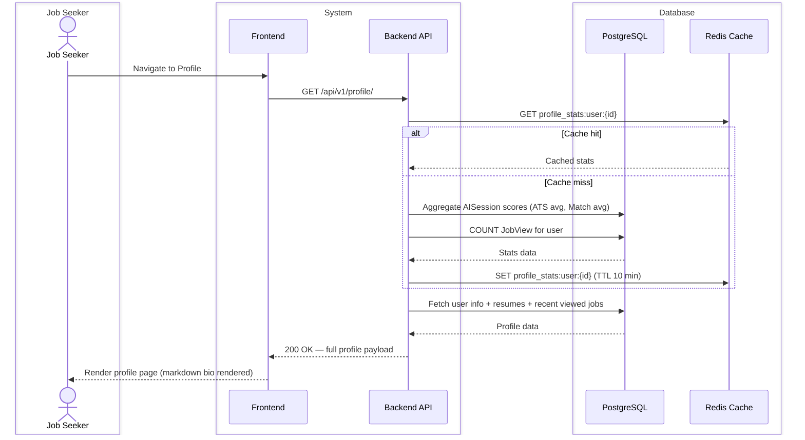
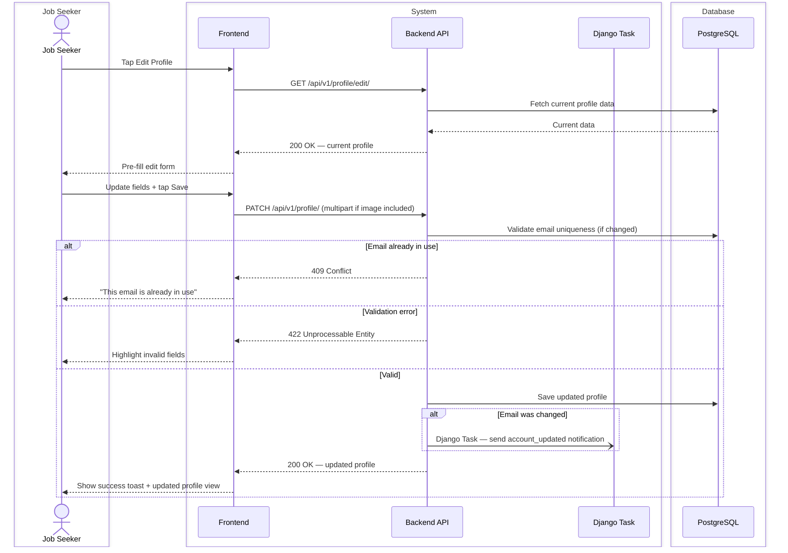
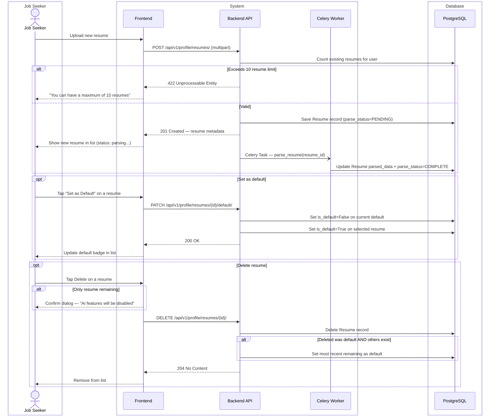

# CAREERLY-005 — Profile Flow

# PART 1 — ANALYSIS

## 1.1 Flow Title & Metadata

```
Flow Name:     Profile — View & Edit
Flow ID:       CAREERLY-005
Trigger:       User navigates to their profile page or edit profile page
Entry Point:   Profile tab / Profile screen
Exit Point:    Profile viewed or updated successfully
Related Flows: CAREERLY-001 (Auth — resume uploaded at setup), CAREERLY-003 (Jobs — AI sessions feed profile stats)
```

## 1.2 Description

The profile flow covers both viewing and editing a job seeker's profile. The profile view is a summary dashboard showing the user's personal info, computed stats (average ATS score, average suitability score, total jobs viewed), their uploaded resumes, and a list of jobs they have viewed. The edit profile page allows the user to update their personal information and manage multiple resume files. The biography field supports markdown so users can format their bio with structure. This flow does not cover the AI analysis sessions themselves (CAREERLY-003) but reads their aggregated results.

## 1.3 Actors / User Roles

| Role | Type | Responsibilities in this flow |
|------|------|-------------------------------|
| Job Seeker | Human | Views their profile, edits personal info, manages resumes |
| System | Automated | Computes and serves stats, validates inputs, stores updates |

## 1.4 Step-by-Step Bullet Points

### Route 1 — View Profile

- Job Seeker — navigates to the profile screen
- System — fetches user data, computed stats, resumes, and viewed jobs list
- System — computes stats:
  - Average ATS score: average of all completed ATS_CHECK sessions
  - Average suitability score: average of all completed JOB_MATCH sessions
  - Total jobs viewed: count of JobView records for this user
- Job Seeker — sees:
  - Profile image (or placeholder if not set)
  - Full name
  - Current position/title
  - Average ATS score (with verdict color)
  - Average suitability score (with verdict color)
  - Total jobs viewed count
  - Biography (rendered as markdown)
  - List of uploaded resumes (filename, upload date, parse status)
  - Paginated list of viewed jobs (title, company, date viewed)

### Route 2 — Edit Profile

- Job Seeker — taps "Edit Profile"
- System — loads the current profile data into the edit form
- Job Seeker — updates any combination of:
  - Profile image (upload new image)
  - Full name
  - Email address
  - Phone number
  - Position/title
  - Country
  - Biography (markdown input)
- Job Seeker — taps Save
- System — validates all updated fields
  ↳ if validation fails: highlights invalid fields, does not save
- System — if email was changed:
  - Updates email
  - Dispatches Django Task to send "Your email has been updated" system notification
  - Does NOT require re-verification (email is already trusted from registration)
- System — saves updated profile
- Job Seeker — sees updated profile

### Route 3 — Manage Resumes

- Job Seeker — navigates to the resumes section (within edit profile or standalone)
- System — lists all uploaded resumes for this user (filename, size, upload date, parse status, default badge)
- Job Seeker — can upload a new resume (PDF or DOCX, max 5MB)
- System — validates the file
  ↳ if invalid type or size: shows error, does not upload
- System — saves the resume, dispatches Celery Task to parse it
- System — if this is the user's first resume, sets it as default automatically
- Job Seeker — can set any resume as the default (used for AI features)
- System — updates `is_default` flag (sets new default, removes old default)
- Job Seeker — can delete a resume
  ↳ if deleting the default resume and other resumes exist: system auto-sets the most recently uploaded as the new default
  ↳ if deleting the only resume: warns user "This is your only resume. Deleting it will disable AI features."
  ↳ if user confirms: deletes it — AI features will be unavailable until a new resume is uploaded

## 1.5 Validations

### Input Validations

| Field | Rule | Error Message |
|-------|------|---------------|
| Full name | Required, 2–100 chars, letters and spaces only | "Please enter a valid full name" |
| Email | Valid email format, required | "Please enter a valid email address" |
| Phone number | Optional, valid international format (E.164) | "Please enter a valid phone number" |
| Position | Optional, max 100 chars | "Position must be under 100 characters" |
| Country | Optional, must be from a predefined list | "Please select a valid country" |
| Biography | Optional, max 2000 chars, markdown allowed | "Biography must be under 2000 characters" |
| Profile image | Optional, JPG/PNG only, max 2MB | "Only JPG and PNG images are accepted" / "Image must be under 2MB" |
| Resume file | PDF or DOCX only, max 5MB | "Only PDF and DOCX files are accepted" / "File size must be under 5MB" |

### Business Rule Validations

| Rule | Condition | Behavior |
|------|-----------|----------|
| Resume limit | More than 10 resumes uploaded | Block upload — "You can have a maximum of 10 resumes" |
| Default resume | Deleting the default resume | Auto-assign next most recent as default, or warn if it's the last one |
| Email uniqueness | New email already used by another account | Block — "This email is already in use" |

### Security Validations

| Check | Details |
|-------|---------|
| Authentication | JWT required — profile is private |
| Role-based access | Users can only edit their own profile |
| File MIME type | Validate server-side — reject spoofed extensions |
| Profile image | Strip EXIF data before storing |

### Error Handling

| Scenario | System Response |
|----------|----------------|
| Image upload fails | Show "Image upload failed. Try again." — preserve other form changes |
| Resume upload fails | Show "Resume upload failed. Try again." |
| Server error on save | Show generic error — preserve form data |
| Stats computation returns null | Show "—" or "N/A" for stats with no data yet |
| No viewed jobs yet | Show "You haven't viewed any jobs yet" empty state |

# PART 2 — TECHNICAL

## 2.1 Diagrams

### Sequence Diagram — View Profile



### Sequence Diagram — Edit Profile



### Sequence Diagram — Manage Resumes



## 2.2 Data Models

### Model: `UserProfile`

**Purpose:** Extended profile data for a job seeker — separate from the auth `User` model  
**Django app:** `accounts`

| Field | Django Field Type | Required | Default | Notes |
|-------|------------------|----------|---------|-------|
| `id` | `UUIDField(primary_key=True)` | Auto | `uuid4` | PK |
| `user` | `OneToOneField(User, on_delete=CASCADE)` | Yes | — | One profile per user |
| `full_name` | `CharField(max_length=100)` | Yes | — | Display name |
| `phone_number` | `CharField(max_length=20, null=True, blank=True)` | No | `null` | E.164 format |
| `position` | `CharField(max_length=100, null=True, blank=True)` | No | `null` | Current or desired job title |
| `country` | `CharField(max_length=100, null=True, blank=True)` | No | `null` | From a validated country list |
| `biography` | `TextField(max_length=2000, null=True, blank=True)` | No | `null` | Supports markdown |
| `profile_image` | `ImageField(upload_to='profiles/', null=True, blank=True)` | No | `null` | Stored in S3 / media |
| `updated_at` | `DateTimeField(auto_now=True)` | Auto | `now` | — |

### Model: `Resume` (referenced from CAREERLY-003)

**Purpose:** Resume files uploaded by a user  
**Django app:** `accounts`

*(Full definition in CAREERLY-003 — reproduced here for completeness)*

| Field | Django Field Type | Required | Default | Notes |
|-------|------------------|----------|---------|-------|
| `id` | `UUIDField(primary_key=True)` | Auto | `uuid4` | PK |
| `user` | `ForeignKey(User, on_delete=CASCADE)` | Yes | — | Owner |
| `file` | `FileField(upload_to='resumes/')` | Yes | — | S3 or local |
| `original_filename` | `CharField(max_length=255)` | Yes | — | Shown in UI |
| `file_size` | `PositiveIntegerField` | Yes | — | Bytes |
| `parsed_data` | `JSONField(null=True, blank=True)` | No | `null` | Extracted: skills, titles, experience |
| `parse_status` | `CharField(choices=PARSE_STATUS, max_length=20)` | Yes | `PENDING` | PENDING, COMPLETE, FAILED |
| `is_default` | `BooleanField` | No | `False` | One default per user |
| `uploaded_at` | `DateTimeField(auto_now_add=True)` | Auto | `now` | — |

## 2.3 Table Relationships & Logic

`UserProfile` has a `OneToOneField` to `User`. It is created automatically via a `post_save` signal on `User` — every user gets a `UserProfile` at creation time with empty optional fields.

`Resume` has a `ForeignKey` to `User`. Multiple resumes per user are allowed (max 10 enforced at the API level). The `is_default` flag has a `UniqueConstraint` filtered on `is_default=True` to enforce one default per user at the DB level.

**Stats computation:**
- Average ATS score: `AISession.objects.filter(user=user, session_type='ATS_CHECK', status='COMPLETE').aggregate(Avg('score'))['score__avg']`
- Average suitability score: `AISession.objects.filter(user=user, session_type='JOB_MATCH', status='COMPLETE').aggregate(Avg('score'))['score__avg']`
- Total jobs viewed: `JobView.objects.filter(user=user).count()`

All three are cached in Redis under `profile_stats:user:{id}` as a single JSON object, TTL 10 minutes. Invalidated when:
- A new `AISession` reaches `COMPLETE` status (via `post_save` signal)
- A new `JobView` is created (via `post_save` signal)

**Viewed jobs list** on profile — paginated, sorted by `viewed_at` desc. Uses `JobView.objects.filter(user=user).select_related('job').order_by('-viewed_at')`.

**Biography markdown** — stored as raw markdown text in the DB. Never pre-rendered on the backend. Rendered exclusively on the frontend. Max 2000 chars validated at the API level.

**Profile image** — strip EXIF metadata server-side using `Pillow` before saving. Resize to max 500×500px to prevent storing unnecessarily large images. Store processed version only.

**Resume default reassignment** — implemented as a `post_delete` signal on `Resume`:
```python
@receiver(post_delete, sender=Resume)
def reassign_default_resume(sender, instance, **kwargs):
    if instance.is_default:
        next_resume = Resume.objects.filter(
            user=instance.user
        ).order_by('-uploaded_at').first()
        if next_resume:
            next_resume.is_default = True
            next_resume.save()
```

## 2.4 API Endpoints

| Method | Endpoint | Auth | Role | Request Body / Params | Response | Description |
|--------|----------|------|------|----------------------|----------|-------------|
| `GET` | `/api/v1/profile/` | Yes | Job Seeker | — | `200` — full profile + stats | View own profile |
| `PATCH` | `/api/v1/profile/` | Yes | Job Seeker | `multipart: {full_name, email, phone, position, country, biography, profile_image}` | `200` — updated profile | Update profile fields |
| `GET` | `/api/v1/profile/resumes/` | Yes | Job Seeker | — | `200` — resume list | List all resumes |
| `POST` | `/api/v1/profile/resumes/` | Yes | Job Seeker | `multipart: {resume_file}` | `201` — resume metadata | Upload new resume |
| `PATCH` | `/api/v1/profile/resumes/{id}/default/` | Yes | Job Seeker | — | `200` | Set resume as default |
| `DELETE` | `/api/v1/profile/resumes/{id}/` | Yes | Job Seeker | — | `204` | Delete a resume |
| `GET` | `/api/v1/profile/viewed-jobs/` | Yes | Job Seeker | `?page=N` | `200` — paginated viewed jobs | List viewed jobs |

## 2.5 Developer Notes

### 🔵 Backend Developer (Django)

- Create `UserProfile` via `post_save` signal on `User` model — use `get_or_create` to be safe.
- `PATCH /api/v1/profile/`: use a partial serializer (`partial=True` in DRF). Only update fields that are present in the request — do not overwrite unspecified fields with null.
- Profile image processing: use `Pillow` to strip EXIF and resize to 500×500 max before saving. Do this in the serializer's `validate_profile_image` method.
- Resume upload: `FileField` with `upload_to='resumes/{user_id}/'` — organize by user ID. Validate MIME type using `python-magic` (not just extension).
- `parse_resume` Celery task: extract text from PDF using `pdfplumber` or `PyMuPDF`. Extract from DOCX using `python-docx`. Send extracted text to AI service for parsing. Store result in `Resume.parsed_data` as JSON.
- Cache invalidation: add `post_save` signal on `AISession` (when `status` changes to `COMPLETE`) to `cache.delete(f'profile_stats:user:{instance.user_id}')`.
- Stats aggregation: use a single DB call that returns all three stats together — avoid three separate queries.
- Viewed jobs endpoint: `JobView.objects.filter(user=user).select_related('job').order_by('-viewed_at')`. Use `only('job__id', 'job__title', 'job__company', 'viewed_at')` to avoid overfetching.

### 🟢 Frontend Developer (React)

- Profile page sections: top card (image, name, position, stats row), bio section (render with `react-markdown`), resumes section (file cards), viewed jobs section (paginated list).
- Stats row: three stat blocks — "Avg ATS Score" (with color-coded score), "Avg Match Score", "Jobs Viewed". Show "—" if no data.
- Edit form: use controlled inputs pre-filled from `GET /api/v1/profile/edit/`. Only send changed fields in the `PATCH` request.
- Biography input: use a markdown-aware textarea (e.g. `react-mde` or `@uiw/react-md-editor`) with a live preview toggle.
- Resume list: each item shows filename, upload date, parse status badge (Parsing... / Ready / Failed), "Set as Default" button (hidden on current default), and "Delete" with confirmation dialog.
- Profile image upload: click-to-upload circle avatar. Show preview before saving.
- Viewed jobs list: `JobCard` components (reuse from Home/Jobs). Paginate with "Load More" button.

### 🟡 Mobile Developer (Flutter)

- Profile screen: `CustomScrollView` with `SliverAppBar` showing the profile image, then `SliverList` for sections.
- Profile image: `CircleAvatar` with `CachedNetworkImage`. On tap, open image picker using `image_picker` package.
- Biography: use `flutter_markdown` for rendering. In edit mode, use a plain `TextField` with a preview toggle.
- Stats row: `Row` of three `StatCard` widgets with color-coded score values.
- Resume list: `ListView` with swipe-to-delete (using `Dismissible` widget) and a "Set as Default" option in a long-press context menu.
- Edit form: same fields as web. Use `TextInputType.phone` for phone number, `TextInputType.emailAddress` for email.
- Navigation: profile tab is one of the bottom nav tabs — use `IndexedStack` to preserve scroll state.

### 🟣 AI Engineer

- Resume parsing Celery task (`parse_resume`):
  - Input: `resume_id` — fetch file from storage, extract text.
  - PDF text extraction: use `pdfplumber` — handles multi-column layouts better than PyPDF2.
  - DOCX text extraction: use `python-docx`.
  - Send extracted text to AI parsing model. Expected output JSON: `{skills: [], job_titles: [], years_experience: int, education_level: str}`.
  - Store in `Resume.parsed_data`. Set `parse_status=COMPLETE`.
  - On failure: set `parse_status=FAILED`, dispatch Django Task to send `RESUME_PARSE_FAILED` notification.
- This parsed data feeds: home page recommendations (CAREERLY-002), AI Match (CAREERLY-003), and ATS Check (CAREERLY-003).
- Keep the parsing model fast — target under 10 seconds. If resume text is very long, truncate to first 5000 tokens before sending.