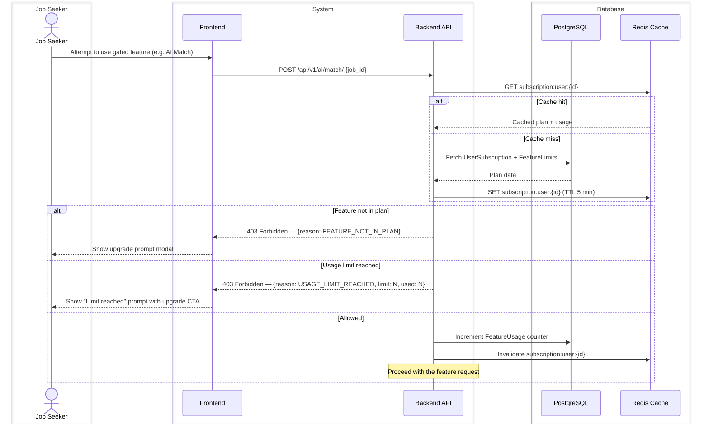
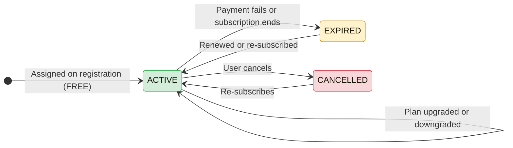

# CAREERLY-006 — Subscription Flow

# PART 1 — ANALYSIS

## 1.1 Flow Title & Metadata

```
Flow Name:     Subscription — Plans & Feature Gating
Flow ID:       CAREERLY-006
Trigger:       User attempts to use a gated feature, or navigates to the subscription/upgrade screen
Entry Point:   Any gated feature CTA, or the Subscription screen in settings
Exit Point:    User is subscribed to a plan and has access to its features
Related Flows: CAREERLY-003 (Jobs — AI features are gated), CAREERLY-001 (Auth — plan assigned at registration)
```

## 1.2 Description

Careerly uses a subscription model to govern access to premium features. Every user is assigned a plan — new users start on the FREE plan by default. Plans define a set of feature flags and usage limits (e.g. number of AI Match sessions per month). The feature configuration is intentionally flexible — limits and flags are stored in the database and can be changed by an admin without a code deployment. This flow covers plan assignment, upgrade, and feature gate enforcement. Payment processing is out of scope for this version — the subscription record is created manually or through a payment integration to be defined later.

## 1.3 Actors / User Roles

| Role | Type | Responsibilities in this flow |
|------|------|-------------------------------|
| Job Seeker | Human | Views plans, upgrades subscription, uses features within limits |
| Admin | Human | Configures plans and feature limits via admin dashboard |
| System | Automated | Enforces feature gates, tracks usage, assigns default plan on registration |

## 1.4 Step-by-Step Bullet Points

### Route 1 — Plan Assignment at Registration

- System — when a new user completes registration and setup, automatically assigns the FREE plan
- System — creates a `UserSubscription` record with `plan=FREE`, `status=ACTIVE`, `start_date=today`

### Route 2 — View Plans & Upgrade

- Job Seeker — navigates to the Subscription screen
- System — fetches all available plans with their features and limits
- Job Seeker — sees the current plan (highlighted) and available upgrade options
- Job Seeker — selects a plan to upgrade to
- System — (payment processing TBD) — for now, records the plan change directly
- System — updates `UserSubscription` with new plan and `start_date=today`
- Job Seeker — immediately has access to the new plan's features

### Route 3 — Feature Gate Enforcement

- Job Seeker — attempts to use a feature (e.g. AI Match)
- System — checks the user's active plan
- System — checks if the feature is enabled for this plan
  ↳ if feature not in plan: blocks action, shows upgrade prompt
- System — checks if the user has remaining usage for this feature (if it has a limit)
  ↳ if usage limit reached: blocks action, shows "You've reached your limit for this month. Upgrade to continue."
  ↳ if within limit: allows action, increments usage counter

## 1.5 Validations

### Business Rule Validations

| Rule | Condition | Behavior |
|------|-----------|----------|
| Default plan | New user registered | Auto-assign FREE plan |
| Feature access | Feature not included in user's plan | Block + show upgrade prompt |
| Usage limit | User has hit monthly limit for a feature | Block + show upgrade prompt with limit details |
| Downgrade | User downgrades to a lower plan | Usage resets at next cycle, existing sessions preserved |

### Security Validations

| Check | Details |
|-------|---------|
| Authentication | JWT required |
| Feature gate checks | Always enforced server-side — never trust client-side gating alone |
| Plan configuration | Only admins can create or modify plans |

### Error Handling

| Scenario | System Response |
|----------|----------------|
| Subscription record missing | Auto-create with FREE plan — do not error |
| Plan config not found | Fall back to most restrictive defaults, alert admin |

# PART 2 — TECHNICAL

## 2.1 Diagrams

### Sequence Diagram — Feature Gate Check



### State Diagram — Subscription Status



## 2.2 Data Models

### Model: `Plan`
**Purpose:** Defines a subscription tier and its feature configuration  
**Django app:** `subscriptions`

| Field | Django Field Type | Required | Default | Notes |
|-------|------------------|----------|---------|-------|
| `id` | `UUIDField(primary_key=True)` | Auto | `uuid4` | PK |
| `name` | `CharField(max_length=50, unique=True)` | Yes | — | e.g. FREE, PRO, PREMIUM |
| `display_name` | `CharField(max_length=100)` | Yes | — | Shown in UI |
| `price_monthly` | `DecimalField(max_digits=8, decimal_places=2)` | Yes | `0.00` | 0 for free plan |
| `is_active` | `BooleanField` | No | `True` | Inactive plans are hidden from upgrade screen |
| `created_at` | `DateTimeField(auto_now_add=True)` | Auto | `now` | — |

### Model: `PlanFeature`
**Purpose:** Configurable feature flags and limits per plan — admin-editable  
**Django app:** `subscriptions`

| Field | Django Field Type | Required | Default | Notes |
|-------|------------------|----------|---------|-------|
| `id` | `UUIDField(primary_key=True)` | Auto | `uuid4` | PK |
| `plan` | `ForeignKey(Plan, on_delete=CASCADE)` | Yes | — | Which plan this feature belongs to |
| `feature_key` | `CharField(max_length=100)` | Yes | — | e.g. `ai_match`, `ats_check`, `saved_jobs`. Indexed. |
| `is_enabled` | `BooleanField` | Yes | `True` | Whether the feature is available at all |
| `monthly_limit` | `PositiveIntegerField(null=True, blank=True)` | No | `null` | Null = unlimited. e.g. 5 for AI Match on FREE |

**Unique constraint:** `unique_together = [('plan', 'feature_key')]`

### Model: `UserSubscription`
**Purpose:** The active subscription record for a user  
**Django app:** `subscriptions`

| Field | Django Field Type | Required | Default | Notes |
|-------|------------------|----------|---------|-------|
| `id` | `UUIDField(primary_key=True)` | Auto | `uuid4` | PK |
| `user` | `OneToOneField(User, on_delete=CASCADE)` | Yes | — | One active subscription per user |
| `plan` | `ForeignKey(Plan, on_delete=PROTECT)` | Yes | — | PROTECT — do not delete plans with active subscribers |
| `status` | `CharField(choices=SUB_STATUS, max_length=20)` | Yes | `ACTIVE` | Enum: ACTIVE, EXPIRED, CANCELLED |
| `start_date` | `DateField` | Yes | `today` | When this subscription period started |
| `end_date` | `DateField(null=True, blank=True)` | No | `null` | Null for ongoing; set for fixed-term |
| `created_at` | `DateTimeField(auto_now_add=True)` | Auto | `now` | — |
| `updated_at` | `DateTimeField(auto_now=True)` | Auto | `now` | — |

### Model: `FeatureUsage`
**Purpose:** Tracks monthly usage of limited features per user  
**Django app:** `subscriptions`

| Field | Django Field Type | Required | Default | Notes |
|-------|------------------|----------|---------|-------|
| `id` | `UUIDField(primary_key=True)` | Auto | `uuid4` | PK |
| `user` | `ForeignKey(User, on_delete=CASCADE)` | Yes | — | The user |
| `feature_key` | `CharField(max_length=100)` | Yes | — | Same key as PlanFeature.feature_key |
| `month` | `DateField` | Yes | — | First day of the month — e.g. 2025-06-01. Indexed. |
| `count` | `PositiveIntegerField` | No | `0` | Incremented on each use |

**Unique constraint:** `unique_together = [('user', 'feature_key', 'month')]`

## 2.3 Table Relationships & Logic

`Plan` → `PlanFeature` is one-to-many. Each plan has multiple feature entries. Admin configures these via Django admin.

`UserSubscription` is a `OneToOneField` to `User`. Created automatically when the user completes setup. If the record is missing (e.g. legacy users), auto-create with FREE plan on access.

`FeatureUsage` tracks per-user, per-feature, per-month usage. The `month` field is always the first day of the current month (e.g. `date.today().replace(day=1)`). Use `get_or_create` when incrementing:
```python
usage, _ = FeatureUsage.objects.get_or_create(
    user=user,
    feature_key=feature_key,
    month=date.today().replace(day=1),
    defaults={'count': 0}
)
usage.count = F('count') + 1
usage.save(update_fields=['count'])
```
Using `F('count') + 1` is atomic — prevents race conditions.

**Feature gate check logic** (implemented as a reusable utility):
```python
def can_use_feature(user, feature_key) -> tuple[bool, str]:
    sub = UserSubscription.objects.select_related('plan').get(user=user)
    feature = PlanFeature.objects.get(plan=sub.plan, feature_key=feature_key)
    
    if not feature.is_enabled:
        return False, 'FEATURE_NOT_IN_PLAN'
    
    if feature.monthly_limit is not None:
        month = date.today().replace(day=1)
        usage = FeatureUsage.objects.filter(
            user=user, feature_key=feature_key, month=month
        ).first()
        current_count = usage.count if usage else 0
        if current_count >= feature.monthly_limit:
            return False, 'USAGE_LIMIT_REACHED'
    
    return True, 'ALLOWED'
```

Cache the plan + feature config in Redis per user. Invalidate when subscription or plan config changes.

**Feature keys** (initial set — admin can add more):
| Key | Description |
|---|---|
| `ai_match` | AI Match feature |
| `ats_check` | Check Your Resume / ATS |
| `saved_jobs` | Save jobs for later |
| `job_recommendations` | Personalized recommendations |

## 2.4 API Endpoints

| Method | Endpoint | Auth | Role | Request Body / Params | Response | Description |
|--------|----------|------|------|----------------------|----------|-------------|
| `GET` | `/api/v1/subscriptions/plans/` | No | — | — | `200` — list of active plans with features | Public plans listing |
| `GET` | `/api/v1/subscriptions/me/` | Yes | Job Seeker | — | `200` — current subscription + usage | Get own subscription status |
| `POST` | `/api/v1/subscriptions/upgrade/` | Yes | Job Seeker | `{plan_id}` | `200` — updated subscription | Upgrade plan (payment TBD) |

## 2.5 Developer Notes

### 🔵 Backend Developer (Django)

- Create a reusable `can_use_feature(user, feature_key)` utility in `subscriptions/utils.py`. Use this as a check at the start of any gated API view.
- Create a DRF permission class `HasFeatureAccess(feature_key)` that calls `can_use_feature` — use it as a permission on gated views: `permission_classes = [IsAuthenticated, HasFeatureAccess('ai_match')]`.
- `post_save` signal on `User` (status changes to `ACTIVE`): create `UserSubscription` with FREE plan.
- Use `select_related('plan')` when fetching `UserSubscription` to avoid N+1 on plan lookups.
- Cache `subscription:user:{id}` in Redis as a dict of `{plan_name, features: {key: {is_enabled, monthly_limit, used}}}`. TTL 5 minutes. Invalidate on subscription change.
- Monthly usage reset: Celery Beat task on the 1st of each month — not needed since usage is tracked by `month` field. No reset job required — the `get_or_create` on a new month key naturally starts at 0.
- Admin: register `Plan`, `PlanFeature`, `UserSubscription`, `FeatureUsage` in Django admin. Use `inline` for `PlanFeature` under `Plan` for easy editing.

### 🟢 Frontend Developer (React)

- Subscription screen: plan cards side-by-side. Current plan has "Current Plan" badge. Other plans have "Upgrade" CTA.
- Each plan card: name, price, feature list (checkmarks for included, crossed for excluded), monthly limits shown inline ("5 AI Matches/month").
- When a feature gate is hit (API returns 403 `FEATURE_NOT_IN_PLAN` or `USAGE_LIMIT_REACHED`): show a modal with the reason and an "Upgrade" button that routes to the subscription screen.
- Current usage display: on the subscription page, show a usage bar for limited features ("3 of 5 AI Matches used this month").
- Feature flags: also fetch from `GET /api/v1/subscriptions/me/` on app load and store in global state — use this to conditionally show/hide feature buttons in the UI. This is a UX enhancement only — server-side gating is the enforcement layer.

### 🟡 Mobile Developer (Flutter)

- Subscription screen: `PageView` or `Column` of plan cards with feature comparison.
- Gate enforcement: intercept 403 responses in the global HTTP interceptor — if `reason` is `FEATURE_NOT_IN_PLAN` or `USAGE_LIMIT_REACHED`, show a `BottomSheet` with upgrade prompt.
- Cache the user's plan and feature access in local state after login — refresh on subscription change.
- Usage bars: `LinearProgressIndicator` for each limited feature.

### 🟣 AI Engineer

- AI features (`ai_match`, `ats_check`) are gated by this subscription system.
- Before dispatching an AI Celery task, the backend checks `can_use_feature`. If allowed, it increments usage and then dispatches the task.
- If usage limit is reached mid-session (edge case — user hits limit between check and completion), the session is still completed — do not cancel in-flight AI tasks.
- No AI involvement in the subscription logic itself.

## 2.6 General Notes

- Payment integration details to be added once provider is selected
- Plan names and limits to be finalized with product team