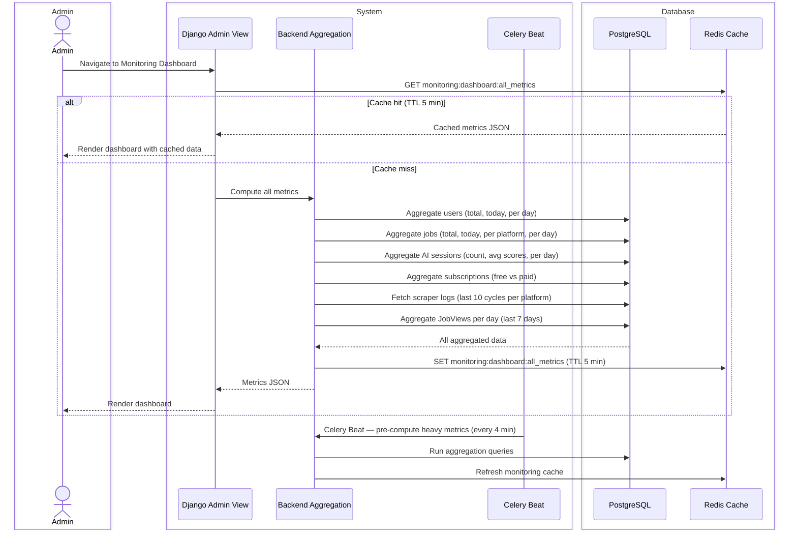
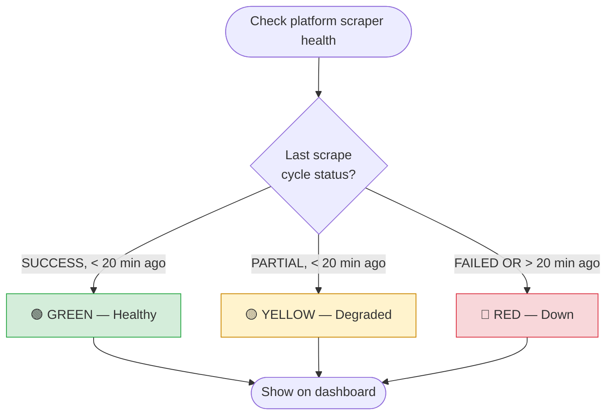

# CAREERLY-007 — Monitoring Flow

# PART 1 — ANALYSIS

## 1.1 Flow Title & Metadata

```
Flow Name:     Monitoring — Admin Dashboard & System Analytics
Flow ID:       CAREERLY-007
Trigger:       Admin logs into the admin dashboard and navigates to monitoring
Entry Point:   Django Admin — Monitoring section
Exit Point:    Admin views metrics, takes action if needed
Related Flows: All flows — monitoring reads data from all other flows
```

## 1.2 Description

The monitoring flow provides the admin with a real-time and historical view of Careerly's health and usage. It extends Django's built-in admin with custom views that render area charts, stat cards, and color-coded health indicators. The dashboard covers platform health (scraper success rates), user activity (registrations, active users, jobs viewed), AI usage (resumes checked, ATS scores, match scores), and subscription metrics (conversion rates). Data is aggregated from the existing models — no separate analytics database is needed at this stage. This flow is admin-only and does not affect any user-facing features.

## 1.3 Actors / User Roles

| Role | Type | Responsibilities in this flow |
|------|------|-------------------------------|
| Admin | Human | Views metrics, monitors system health, identifies anomalies |
| System | Automated | Aggregates metrics, caches results, serves dashboard data |
| Celery Beat | Automated | Runs periodic aggregation tasks to pre-compute heavy metrics |

## 1.4 Step-by-Step Bullet Points

### Dashboard Load

- Admin — navigates to the monitoring section in Django admin
- System — loads the custom admin monitoring view
- System — checks Redis cache for pre-computed metrics
  ↳ if cache hit: returns cached metrics immediately
  ↳ if cache miss: computes metrics from DB and caches them
- Admin — sees the dashboard with:
  - Platform health cards (scraper status per platform — green/yellow/red)
  - Key stats row (total users, new users today, total jobs, new jobs today)
  - Area chart: jobs viewed throughout the week (per day)
  - Area chart: new user registrations over time (per day, last 30 days)
  - Area chart: new jobs added per day (last 30 days, per platform)
  - Stat cards: total AI sessions, average ATS score, average match score
  - Area chart: AI sessions over time (last 30 days)
  - Subscription conversion card: free vs paid user ratio
  - Active users per day (last 7 days)
  - Scraper success rate per platform (last 10 cycles)

### Metric Refresh

- Admin — clicks "Refresh" or metrics auto-refresh every 5 minutes
- System — invalidates cache, recomputes metrics, returns updated data

## 1.5 Validations

### Security Validations

| Check | Details |
|-------|---------|
| Authentication | Django admin session required — `is_staff=True` and `is_admin=True` |
| Role-based access | Monitoring views only accessible to admins |
| Read-only | Monitoring views do not mutate data |

### Error Handling

| Scenario | System Response |
|----------|----------------|
| DB aggregation query times out | Show last cached value with "Last updated: X minutes ago" |
| Scraper log missing | Show "No data" for that platform |
| Redis unavailable | Compute directly from DB, warn admin of degraded performance |

# PART 2 — TECHNICAL

## 2.1 Diagrams

### Sequence Diagram — Dashboard Load



### Flowchart — Scraper Health Color Code Logic



## 2.2 Data Models

### Model: `MetricSnapshot` *(optional — for historical trending)*
**Purpose:** Pre-aggregated daily metric snapshots to power fast historical charts without heavy live queries  
**Django app:** `monitoring`

| Field | Django Field Type | Required | Default | Notes |
|-------|------------------|----------|---------|-------|
| `id` | `UUIDField(primary_key=True)` | Auto | `uuid4` | PK |
| `date` | `DateField` | Yes | — | The day this snapshot covers. Indexed. |
| `metric_key` | `CharField(max_length=100)` | Yes | — | e.g. `new_users`, `new_jobs`, `jobs_viewed`, `ai_sessions` |
| `platform` | `CharField(max_length=20, null=True)` | No | `null` | Non-null for per-platform metrics |
| `value` | `FloatField` | Yes | — | The aggregated value for that day |
| `created_at` | `DateTimeField(auto_now_add=True)` | Auto | `now` | — |

**Unique constraint:** `unique_together = [('date', 'metric_key', 'platform')]`

## 2.3 Metrics Reference

All metrics, their source models, and how they are computed:

| Metric | Source | Computation |
|---|---|---|
| Total users | `User` | `User.objects.filter(status='ACTIVE').count()` |
| New users today | `User` | `User.objects.filter(created_at__date=today).count()` |
| New registrations per day (30d) | `User` | `GROUP BY DATE(created_at)` last 30 days |
| Total jobs in system | `Job` | `Job.objects.filter(status='ACTIVE').count()` |
| New jobs today | `Job` | `Job.objects.filter(scraped_at__date=today).count()` |
| New jobs per day per platform (30d) | `Job` | `GROUP BY DATE(scraped_at), platform` |
| Jobs viewed (this week) | `JobView` | `GROUP BY DATE(viewed_at)` last 7 days |
| Total AI sessions | `AISession` | `AISession.objects.count()` |
| AI sessions per day (30d) | `AISession` | `GROUP BY DATE(created_at)` |
| Resumes checked by AI | `AISession` | `AISession.objects.filter(session_type='ATS_CHECK', status='COMPLETE').count()` |
| Avg ATS score (global) | `AISession` | `Avg('score') WHERE session_type='ATS_CHECK'` |
| Avg match score (global) | `AISession` | `Avg('score') WHERE session_type='JOB_MATCH'` |
| Active users per day (7d) | `JobView` or `AISession` | Distinct users with any activity per day |
| Scraper success rate | `ScrapeLog` | Last 10 logs per platform — `SUCCESS / total * 100` |
| Free vs paid users | `UserSubscription` | `GROUP BY plan.name` |
| Subscription conversion rate | `UserSubscription` | `paid_users / total_users * 100` |

## 2.4 API Endpoints

| Method | Endpoint | Auth | Role | Response | Description |
|--------|----------|------|------|----------|-------------|
| `GET` | `/api/v1/admin/monitoring/` | Yes | Admin | `200` — full metrics JSON | All dashboard metrics |
| `GET` | `/api/v1/admin/monitoring/scrapers/` | Yes | Admin | `200` — scraper health per platform | Scraper status + last cycle details |
| `POST` | `/api/v1/admin/monitoring/refresh/` | Yes | Admin | `200` | Force cache refresh |

## 2.5 Developer Notes

### 🔵 Backend Developer (Django)

- Create a `monitoring` Django app.
- Create a custom Django admin view (not a ModelAdmin — a plain `AdminSite` view or a custom `TemplateView` registered in the admin). Use `admin.site.register_view` or override `get_urls()` on a custom `AdminSite`.
- All aggregation queries should be wrapped in `try/except` — return last cached value if a query fails.
- Use Django ORM's `annotate`, `values`, `Count`, `Avg`, `TruncDate` for all aggregations. Example:
  ```python
  from django.db.models.functions import TruncDate
  from django.db.models import Count

  User.objects.annotate(day=TruncDate('created_at')) \
      .values('day') \
      .annotate(count=Count('id')) \
      .order_by('day')
  ```
- Celery Beat task `refresh_monitoring_cache`: runs every 4 minutes, pre-computes all metrics and sets them in Redis under `monitoring:dashboard:all_metrics` with TTL 5 minutes. This ensures the dashboard almost always hits cache.
- `MetricSnapshot` model: populate daily via a Celery Beat task at midnight. Used for charts that need historical data beyond 30 days. For the MVP, direct DB aggregation for the last 30 days is acceptable.
- Scraper health: fetch `ScrapeLog.objects.filter(platform=p).order_by('-started_at')[:10]` for each platform. Compute success rate. Determine health color: GREEN if latest is SUCCESS and `started_at > now - 20min`, YELLOW if PARTIAL, RED if FAILED or stale.
- Protect all monitoring endpoints with a custom permission: `IsAdminUser` (checks `user.is_admin=True`).

### 🟢 Frontend Developer (React)

- Monitoring dashboard is built inside Django admin — use Django's template system with a custom admin template.
- Embed a React-powered chart component via a `<script>` tag in the Django template, or use a pure JS charting library (Chart.js or Recharts via CDN) to avoid a full React build in admin.
- Charts needed:
  - **Area chart** — jobs viewed per day (last 7 days) — `Chart.js` area type
  - **Area chart** — new users per day (last 30 days)
  - **Area chart** — new jobs per day per platform (last 30 days) — multi-series, one per platform
  - **Area chart** — AI sessions per day (last 30 days)
  - **Bar chart** — scraper success rate per platform
  - **Donut chart** — free vs paid users
- Stat cards: simple HTML/CSS cards with large numbers — total users, total jobs, avg ATS score, conversion rate.
- Color-coded scraper health: green/yellow/red dot next to each platform name.
- Auto-refresh: `setInterval` every 5 minutes — re-fetch `/api/v1/admin/monitoring/` and update charts.
- "Refresh" button for manual refresh — calls `POST /api/v1/admin/monitoring/refresh/` then re-fetches.

### 🟡 Mobile Developer (Flutter)

N/A — monitoring dashboard is admin-only and web-based. No mobile implementation needed.

### 🟣 AI Engineer

- Avg ATS score and avg suitability score displayed on the dashboard are computed from `AISession` records — no AI involvement in the monitoring itself.
- Monitoring helps AI engineers track: how many sessions are running, average scores over time (useful for detecting model drift), and session failure rates.
- If the AI session failure rate exceeds a threshold (e.g. >10% in the last 24 hours), the monitoring dashboard should surface this as a RED alert in the AI health section.
- Recommendation: add a `monitoring:ai_health` Redis key that is updated by the AI Celery tasks themselves — increments a success/fail counter that the monitoring endpoint reads. This gives near-real-time AI health without a heavy DB query.

## 2.6 General Notes

- Consider adding email alerts to admin when scraper health goes RED for > 30 minutes