# CAREERLY-001 — Authentication Flow

# PART 1 — ANALYSIS

## 1.1 Flow Title & Metadata

```
Flow Name:     Authentication (Register, Login, Password Reset)
Flow ID:       CAREERLY-001
Trigger:       User visits the platform for the first time, or returns to log in, or requests a password reset
Entry Point:   Landing page / Auth screen
Exit Point:    
  Register     → Home page (profile + resume set up)
  Login        → Home page
  Password     → Profile page
Related Flows: CAREERLY-005 (Profile), CAREERLY-002 (Home Page)
```

## 1.2 Description

This flow covers all three authentication routes for Careerly: registration, login, and password reset. It exists to securely onboard new job seekers and return authenticated users to the platform. The business value is establishing a verified user identity tied to a resume and preferences, which every other feature in the platform depends on. Registration is the critical path — it is not complete until the user uploads a resume and sets their preferences, as these are required for job recommendations to function. Login and password reset are standard credential flows with OTP-based email verification.

## 1.3 Actors / User Roles

| Role | Type | Responsibilities in this flow |
|------|------|-------------------------------|
| Job Seeker | Human | Provides credentials, verifies OTP, uploads resume, sets preferences |
| System | Automated | Validates inputs, generates and sends OTP, creates user record, issues auth token |
| Email Service | Third-Party | Delivers OTP emails |

## 1.4 Step-by-Step Bullet Points

### Route 1 — Register

- Job Seeker — navigates to the Register screen and enters email, password, and confirm password
- System — validates all fields (format, strength, match)
  ↳ if validation fails: highlights invalid fields with error messages, does not proceed
- System — checks if email is already registered
  ↳ if duplicate: shows "An account with this email already exists" message, does not proceed
- System — creates a user record with status = `UNVERIFIED`
- System — generates a 6-digit OTP, stores it with a 10-minute expiry, and dispatches a Django Task to send the OTP email
- Job Seeker — is redirected to the OTP verification screen
- Job Seeker — enters the 6-digit OTP
- System — validates the OTP (correct, not expired)
  ↳ if OTP is wrong: shows "Invalid code. Please try again." — allows retry
  ↳ if OTP is expired: shows "Code expired. Request a new one." — shows resend button
  ↳ if OTP attempts exceed 5: locks OTP entry for 15 minutes
- System — marks user status = `VERIFIED`, generates auth token
- Job Seeker — is redirected to the Preferences + Resume setup screen
- Job Seeker — selects job preferences (job titles of interest, locations, job types)
- Job Seeker — uploads their resume (PDF, required — cannot skip)
  ↳ if user tries to skip resume: shows "Resume is required to continue" — blocks navigation
- System — validates resume file (type, size)
  ↳ if invalid file type: shows "Only PDF files are accepted"
  ↳ if file too large: shows "File size must be under 5MB"
- System — saves preferences and resume, links them to the user profile
- System — dispatches Celery Task to parse resume in background (AI extraction of skills, titles, etc.)
- Job Seeker — is redirected to the Home page
- System — issues JWT access token + refresh token, stored client-side

### Route 2 — Login

- Job Seeker — navigates to the Login screen and enters email and password
- System — validates fields (both required, non-empty)
  ↳ if fields are empty: shows "Please fill in all fields"
- System — looks up email, verifies password hash
  ↳ if email not found or password wrong: shows "Incorrect email or password" (intentionally vague — no account enumeration)
  ↳ if user status = `UNVERIFIED`: shows "Please verify your email first" — offers resend OTP
  ↳ if account is suspended: shows "Your account has been suspended. Contact support."
- System — issues JWT access token + refresh token
- Job Seeker — is redirected to the Home page

### Route 3 — Password Reset

- Job Seeker — navigates to the Forgot Password screen and enters their email
- System — validates email format
  ↳ if invalid format: shows "Please enter a valid email address"
- System — checks if email exists
  ↳ if email not found: shows the same success message anyway (prevents account enumeration)
- System — generates a 6-digit OTP, stores it with a 10-minute expiry, dispatches Django Task to send email
- Job Seeker — is redirected to OTP verification screen
- Job Seeker — enters the OTP
- System — validates OTP (correct, not expired)
  ↳ if wrong: shows "Invalid code. Please try again."
  ↳ if expired: shows "Code expired." — shows resend button (disabled for 60 seconds after each send)
  ↳ if attempts exceed 5: locks for 15 minutes
- System — issues a short-lived password reset token (valid 15 minutes, single use)
- Job Seeker — is redirected to the New Password screen (2 inputs: new password, confirm password)
- Job Seeker — enters and confirms new password
- System — validates password strength and match
  ↳ if mismatch: shows "Passwords do not match"
  ↳ if weak: shows strength requirements
- System — hashes and saves the new password, invalidates the reset token, invalidates all existing sessions
- Job Seeker — is redirected to the Profile page (logged in automatically)

## 1.5 Validations

### Input Validations

| Field | Rule | Error Message |
|-------|------|---------------|
| Email | Required, valid email format | "Please enter a valid email address" |
| Password (Register) | Required, min 8 chars, at least 1 uppercase, 1 number, 1 special character | "Password must be at least 8 characters and include an uppercase letter, a number, and a special character" |
| Confirm Password | Must match password field exactly | "Passwords do not match" |
| OTP | Required, exactly 6 digits, numeric only | "Please enter the 6-digit code" |
| Resume | Required, PDF only, max 5MB | "Only PDF files are accepted" / "File size must be under 5MB" |
| New Password | Same rules as registration password | Same message |
| Job Preferences | At least 1 job title required | "Please select at least one job preference to continue" |

### Business Rule Validations

| Rule | Condition | Behavior |
|------|-----------|----------|
| No duplicate accounts | Email already registered | Block + "An account with this email already exists" |
| Resume is mandatory | User tries to proceed without uploading | Block navigation + show message |
| OTP expiry | OTP older than 10 minutes | Invalidate + prompt resend |
| OTP attempt limit | More than 5 wrong attempts | Lock entry for 15 minutes |
| Resend cooldown | OTP resend requested | Disable resend button for 60 seconds |
| Reset token single-use | Token already used | Reject + redirect to forgot password |
| Session invalidation on reset | Password changed | All existing JWT tokens are blacklisted |
| Unverified login | User logs in before verifying email | Block + offer resend OTP |

### Security Validations

| Check | Details |
|-------|---------|
| Authentication | Not required for register/login/reset — these are public endpoints |
| Account enumeration prevention | "Email not found" and "Wrong password" return the same error message |
| Password hashing | bcrypt via Django's default hasher — never store plain text |
| OTP storage | Stored hashed, not plain text, with expiry timestamp |
| JWT | Access token: 15 min expiry. Refresh token: 30 days. Stored in HttpOnly cookies or secure storage |
| Reset token | Single-use, 15-minute expiry, invalidated on use or on new request |
| HTTPS | All auth endpoints must be HTTPS only |

### Error Handling

| Scenario | System Response |
|----------|----------------|
| Email service fails (OTP not sent) | Show "We couldn't send the code. Please try again." — do not create user record yet |
| Server error on register submit | Show generic error, preserve form data, allow retry |
| Resume upload network failure | Show "Upload failed. Please try again." — preserve other form data |
| Token refresh fails | Force logout, redirect to login with "Session expired" message |
| Timeout on OTP verification screen | Keep screen alive — OTP expiry is time-based, not session-based |

# PART 2 — TECHNICAL

## 2.1 Diagrams

### Sequence Diagram — Register

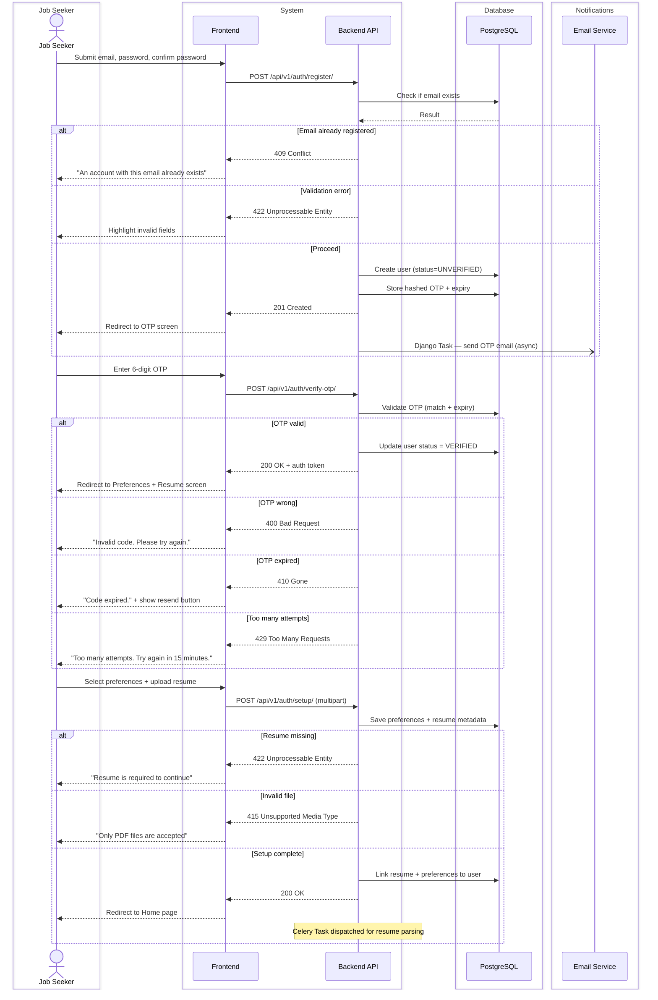
```mermaid
sequenceDiagram
  box Job Seeker
    actor JS as Job Seeker
  end
  box System
    participant FE as Frontend
    participant BE as Backend API
  end
  box Database
    participant DB as PostgreSQL
  end
  box Notifications
    participant ES as Email Service
  end

  JS->>FE: Submit email, password, confirm password
  FE->>BE: POST /api/v1/auth/register/
  BE->>DB: Check if email exists
  DB-->>BE: Result

  alt Email already registered
    BE-->>FE: 409 Conflict
    FE-->>JS: "An account with this email already exists"
  else Validation error
    BE-->>FE: 422 Unprocessable Entity
    FE-->>JS: Highlight invalid fields
  else Proceed
    BE->>DB: Create user (status=UNVERIFIED)
    BE->>DB: Store hashed OTP + expiry
    BE-->>FE: 201 Created
    FE-->>JS: Redirect to OTP screen
    BE-)ES: Django Task — send OTP email (async)
  end

  JS->>FE: Enter 6-digit OTP
  FE->>BE: POST /api/v1/auth/verify-otp/
  BE->>DB: Validate OTP (match + expiry)

  alt OTP valid
    BE->>DB: Update user status = VERIFIED
    BE-->>FE: 200 OK + auth token
    FE-->>JS: Redirect to Preferences + Resume screen
  else OTP wrong
    BE-->>FE: 400 Bad Request
    FE-->>JS: "Invalid code. Please try again."
  else OTP expired
    BE-->>FE: 410 Gone
    FE-->>JS: "Code expired." + show resend button
  else Too many attempts
    BE-->>FE: 429 Too Many Requests
    FE-->>JS: "Too many attempts. Try again in 15 minutes."
  end

  JS->>FE: Select preferences + upload resume
  FE->>BE: POST /api/v1/auth/setup/ (multipart)
  BE->>DB: Save preferences + resume metadata

  alt Resume missing
    BE-->>FE: 422 Unprocessable Entity
    FE-->>JS: "Resume is required to continue"
  else Invalid file
    BE-->>FE: 415 Unsupported Media Type
    FE-->>JS: "Only PDF files are accepted"
  else Setup complete
    BE->>DB: Link resume + preferences to user
    BE-->>FE: 200 OK
    FE-->>JS: Redirect to Home page
    Note over BE: Celery Task dispatched for resume parsing
  end
```

### Sequence Diagram — Login

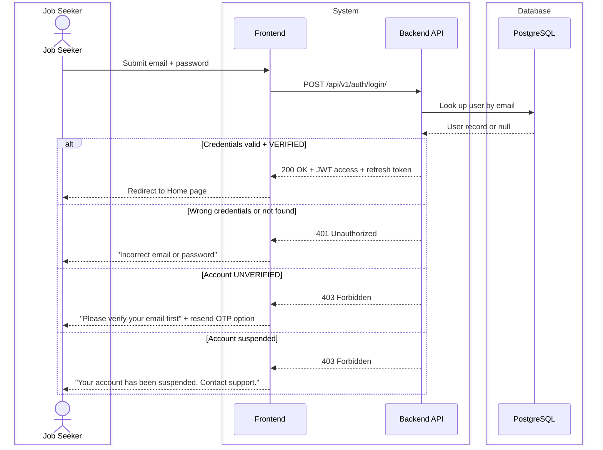
```mermaid
sequenceDiagram
  box Job Seeker
    actor JS as Job Seeker
  end
  box System
    participant FE as Frontend
    participant BE as Backend API
  end
  box Database
    participant DB as PostgreSQL
  end

  JS->>FE: Submit email + password
  FE->>BE: POST /api/v1/auth/login/
  BE->>DB: Look up user by email
  DB-->>BE: User record or null

  alt Credentials valid + VERIFIED
    BE-->>FE: 200 OK + JWT access + refresh token
    FE-->>JS: Redirect to Home page
  else Wrong credentials or not found
    BE-->>FE: 401 Unauthorized
    FE-->>JS: "Incorrect email or password"
  else Account UNVERIFIED
    BE-->>FE: 403 Forbidden
    FE-->>JS: "Please verify your email first" + resend OTP option
  else Account suspended
    BE-->>FE: 403 Forbidden
    FE-->>JS: "Your account has been suspended. Contact support."
  end
```

### Sequence Diagram — Password Reset

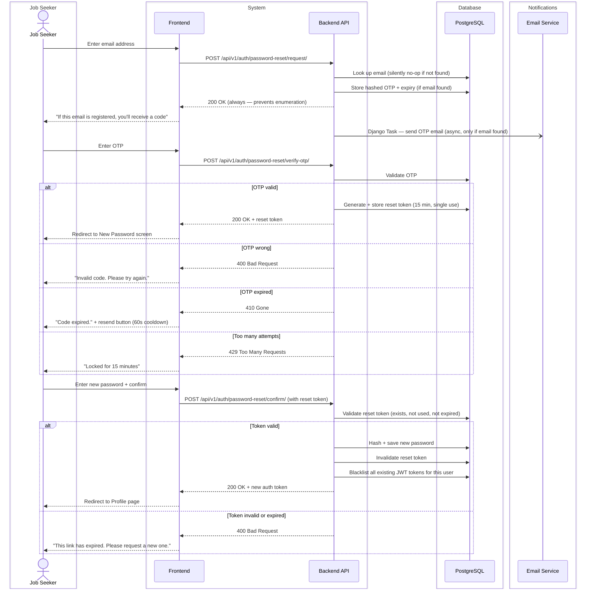
```mermaid
sequenceDiagram
  box Job Seeker
    actor JS as Job Seeker
  end
  box System
    participant FE as Frontend
    participant BE as Backend API
  end
  box Database
    participant DB as PostgreSQL
  end
  box Notifications
    participant ES as Email Service
  end

  JS->>FE: Enter email address
  FE->>BE: POST /api/v1/auth/password-reset/request/
  BE->>DB: Look up email (silently no-op if not found)
  BE->>DB: Store hashed OTP + expiry (if email found)
  BE-->>FE: 200 OK (always — prevents enumeration)
  FE-->>JS: "If this email is registered, you'll receive a code"
  BE-)ES: Django Task — send OTP email (async, only if email found)

  JS->>FE: Enter OTP
  FE->>BE: POST /api/v1/auth/password-reset/verify-otp/
  BE->>DB: Validate OTP

  alt OTP valid
    BE->>DB: Generate + store reset token (15 min, single use)
    BE-->>FE: 200 OK + reset token
    FE-->>JS: Redirect to New Password screen
  else OTP wrong
    BE-->>FE: 400 Bad Request
    FE-->>JS: "Invalid code. Please try again."
  else OTP expired
    BE-->>FE: 410 Gone
    FE-->>JS: "Code expired." + resend button (60s cooldown)
  else Too many attempts
    BE-->>FE: 429 Too Many Requests
    FE-->>JS: "Locked for 15 minutes"
  end

  JS->>FE: Enter new password + confirm
  FE->>BE: POST /api/v1/auth/password-reset/confirm/ (with reset token)
  BE->>DB: Validate reset token (exists, not used, not expired)

  alt Token valid
    BE->>DB: Hash + save new password
    BE->>DB: Invalidate reset token
    BE->>DB: Blacklist all existing JWT tokens for this user
    BE-->>FE: 200 OK + new auth token
    FE-->>JS: Redirect to Profile page
  else Token invalid or expired
    BE-->>FE: 400 Bad Request
    FE-->>JS: "This link has expired. Please request a new one."
  end
```

### State Diagram — User Account Status

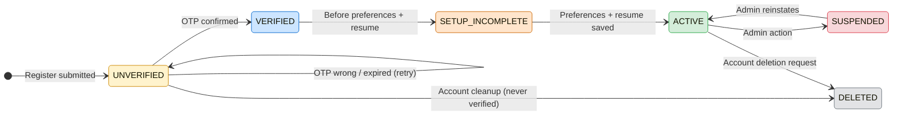
```mermaid
stateDiagram-v2
  direction LR
  [*] --> UNVERIFIED : Register submitted

  UNVERIFIED --> VERIFIED : OTP confirmed
  UNVERIFIED --> UNVERIFIED : OTP wrong / expired (retry)
  UNVERIFIED --> DELETED : Account cleanup (never verified)

  VERIFIED --> SETUP_INCOMPLETE : Before preferences + resume
  SETUP_INCOMPLETE --> ACTIVE : Preferences + resume saved

  ACTIVE --> SUSPENDED : Admin action
  SUSPENDED --> ACTIVE : Admin reinstates
  ACTIVE --> DELETED : Account deletion request

  style UNVERIFIED fill:#fff3cd,stroke:#cc8800
  style VERIFIED fill:#cce5ff,stroke:#0066cc
  style SETUP_INCOMPLETE fill:#ffe5cc,stroke:#cc6600
  style ACTIVE fill:#d4edda,stroke:#28a745
  style SUSPENDED fill:#f8d7da,stroke:#dc3545
  style DELETED fill:#e2e3e5,stroke:#6c757d
```

## 2.2 Data Models

### Model: `User`

**Purpose:** Core user account — authentication identity and status  
**Django app:** `accounts`

| Field | Django Field Type | Required | Default | Notes |
|-------|------------------|----------|---------|-------|
| `id` | `UUIDField(primary_key=True)` | Auto | `uuid4` | PK, auto-generated |
| `email` | `EmailField(unique=True)` | Yes | — | Unique, indexed — primary login identifier |
| `password` | `CharField(max_length=128)` | Yes | — | Django hashed password field — use `set_password()` |
| `status` | `CharField(choices=ACCOUNT_STATUS, max_length=20)` | Yes | `UNVERIFIED` | Enum: UNVERIFIED, VERIFIED, SETUP_INCOMPLETE, ACTIVE, SUSPENDED, DELETED |
| `is_admin` | `BooleanField` | No | `False` | True for admin users — controls admin dashboard access |
| `created_at` | `DateTimeField(auto_now_add=True)` | Auto | `now` | Immutable creation timestamp |
| `updated_at` | `DateTimeField(auto_now=True)` | Auto | `now` | Auto-updated on save |
| `last_login` | `DateTimeField(null=True, blank=True)` | No | `None` | Updated on successful login |

### Model: `OTPRecord`

**Purpose:** Stores OTP codes for email verification and password reset  
**Django app:** `accounts`

| Field | Django Field Type | Required | Default | Notes |
|-------|------------------|----------|---------|-------|
| `id` | `UUIDField(primary_key=True)` | Auto | `uuid4` | PK |
| `user` | `ForeignKey(User, on_delete=CASCADE)` | Yes | — | Owning user — delete OTPs when user deleted |
| `otp_hash` | `CharField(max_length=128)` | Yes | — | SHA-256 hash of the 6-digit OTP — never store plain |
| `purpose` | `CharField(choices=OTP_PURPOSE, max_length=20)` | Yes | — | Enum: EMAIL_VERIFICATION, PASSWORD_RESET |
| `expires_at` | `DateTimeField` | Yes | — | Set to `now + 10 minutes` on creation. Indexed. |
| `attempts` | `PositiveIntegerField` | No | `0` | Incremented on each wrong guess |
| `is_used` | `BooleanField` | No | `False` | Marked True after successful verification |
| `created_at` | `DateTimeField(auto_now_add=True)` | Auto | `now` | — |

### Model: `PasswordResetToken`

**Purpose:** Short-lived single-use token issued after OTP verification, used to authorize the actual password change  
**Django app:** `accounts`

| Field | Django Field Type | Required | Default | Notes |
|-------|------------------|----------|---------|-------|
| `id` | `UUIDField(primary_key=True)` | Auto | `uuid4` | PK — also used as the token value |
| `user` | `ForeignKey(User, on_delete=CASCADE)` | Yes | — | Cascade delete with user |
| `expires_at` | `DateTimeField` | Yes | — | `now + 15 minutes` |
| `is_used` | `BooleanField` | No | `False` | Invalidated on first use |
| `created_at` | `DateTimeField(auto_now_add=True)` | Auto | `now` | — |

### Model: `UserPreferences`

**Purpose:** Job seeker preferences set during onboarding, used for recommendations  
**Django app:** `accounts`

| Field | Django Field Type | Required | Default | Notes |
|-------|------------------|----------|---------|-------|
| `id` | `UUIDField(primary_key=True)` | Auto | `uuid4` | PK |
| `user` | `OneToOneField(User, on_delete=CASCADE)` | Yes | — | One preferences record per user |
| `job_titles` | `ArrayField(CharField(max_length=100))` | Yes | — | At least 1 required. Postgres ArrayField. |
| `locations` | `ArrayField(CharField(max_length=100))` | No | `[]` | Preferred job locations |
| `job_types` | `ArrayField(CharField(max_length=50))` | No | `[]` | Enum values: FULL_TIME, PART_TIME, REMOTE, CONTRACT, INTERNSHIP |
| `updated_at` | `DateTimeField(auto_now=True)` | Auto | `now` | — |

## 2.3 Table Relationships & Logic

`User` is the root entity. Every other model in this flow hangs off it. When a `User` is deleted, all related `OTPRecord`, `PasswordResetToken`, and `UserPreferences` records are cascade-deleted.

`OTPRecord` can have multiple records per user over time (one per request). Before creating a new OTP, the system should mark all previous OTPs of the same `purpose` as `is_used=True` to prevent old codes from being valid. Query pattern: `OTPRecord.objects.filter(user=user, purpose=purpose, is_used=False).order_by('-created_at').first()`.

`PasswordResetToken` is a separate model from OTP intentionally — it has a different lifecycle. It is issued only after OTP verification succeeds, so there is no risk of someone using just an email to get a reset token. It is single-use and expires in 15 minutes.

`UserPreferences` is a `OneToOneField` — there is exactly one preferences record per user. It is created during the setup step, not at registration. A `post_save` signal on `UserPreferences` should update the user's `status` to `ACTIVE` once preferences and a resume both exist.

**Status transition logic** — the `User.status` field is the canonical source of truth for what the user is allowed to do:
- `UNVERIFIED` → cannot log in
- `VERIFIED` → can log in but will be redirected to setup if `UserPreferences` or resume is missing
- `SETUP_INCOMPLETE` → logged in but gated — only setup screen accessible
- `ACTIVE` → full access
- `SUSPENDED` → read-only or full block depending on admin decision

**OTP rate limiting** — `attempts` on `OTPRecord` is checked before validating. If `attempts >= 5`, return 429 without checking the code. On each wrong guess, increment `attempts`. On success, set `is_used=True`.

**Resend cooldown** — enforced by checking `created_at` of the most recent OTP. If `now - created_at < 60 seconds`, reject the resend request with 429.

## 2.4 API Endpoints

| Method | Endpoint | Auth | Role | Request Body | Response | Description |
|--------|----------|------|------|--------------|----------|-------------|
| `POST` | `/api/v1/auth/register/` | No | — | `{email, password, confirm_password}` | `201` | Create unverified user, send OTP |
| `POST` | `/api/v1/auth/verify-otp/` | No | — | `{email, otp, purpose}` | `200 + token` | Verify OTP, mark user verified |
| `POST` | `/api/v1/auth/resend-otp/` | No | — | `{email, purpose}` | `200` | Resend OTP (60s cooldown) |
| `POST` | `/api/v1/auth/setup/` | Yes | Job Seeker | `multipart: {job_titles, locations, job_types, resume_file}` | `200` | Save preferences + resume |
| `POST` | `/api/v1/auth/login/` | No | — | `{email, password}` | `200 + JWT` | Authenticate user |
| `POST` | `/api/v1/auth/logout/` | Yes | Any | `{refresh_token}` | `204` | Blacklist refresh token |
| `POST` | `/api/v1/auth/token/refresh/` | No | — | `{refresh_token}` | `200 + new access token` | Refresh JWT access token |
| `POST` | `/api/v1/auth/password-reset/request/` | No | — | `{email}` | `200` | Send password reset OTP |
| `POST` | `/api/v1/auth/password-reset/verify-otp/` | No | — | `{email, otp}` | `200 + reset_token` | Verify reset OTP, issue reset token |
| `POST` | `/api/v1/auth/password-reset/confirm/` | No | — | `{reset_token, new_password, confirm_password}` | `200 + JWT` | Set new password |

## 2.5 Developer Notes

### 🔵 Backend Developer (Django)

- Use `AbstractBaseUser` + `BaseUserManager` for the custom `User` model — do not use Django's default `User` since we need `email` as the login field instead of `username`.
- Use `djangorestframework-simplejwt` for JWT — configure `ACCESS_TOKEN_LIFETIME = timedelta(minutes=15)` and `REFRESH_TOKEN_LIFETIME = timedelta(days=30)`.
- Blacklist refresh tokens on logout and on password reset using simplejwt's token blacklist app — add `rest_framework_simplejwt.token_blacklist` to `INSTALLED_APPS`.
- OTP generation: use `secrets.randbelow(1000000)` zero-padded to 6 digits. Hash with `hashlib.sha256` before storing.
- Resume file upload: use `django-storages` with S3 (or local `FileField` for development). Store file path in the `Resume` model (defined in CAREERLY-005 Profile flow).
- `post_save` signal on `UserPreferences`: check if user also has at least one resume — if yes, set `user.status = ACTIVE`.
- Use `transaction.on_commit()` before dispatching Django Task for OTP email.
- Rate limiting on OTP endpoints: enforce at the model level (attempts counter) AND at the API level with `django-ratelimit`.
- For the setup endpoint, handle `multipart/form-data` — use DRF's `MultiPartParser`.
- Password reset token: use the record's UUID as the token. No need for a separate token string.

### 🟢 Frontend Developer (React)

- **Register screen**: email, password, confirm password fields. Show password strength indicator. Disable submit button until all fields pass client-side validation.
- **OTP screen**: 6 individual digit input boxes (auto-advance on each digit entry). Show countdown timer for expiry (10 min). Show resend button — disable it for 60 seconds after each send, display countdown.
- **Preferences + Resume screen**: multi-select for job titles and locations (searchable dropdown), checkbox group for job types. File upload zone for resume (drag-and-drop + click). Show file name after upload. Disable "Continue" button until resume is attached.
- **Login screen**: email + password. "Forgot password?" link routes to reset flow.
- **Password reset — New Password screen**: 2 fields (new password, confirm). Show same strength indicator as register.
- Store JWT access token in memory (not localStorage). Store refresh token in HttpOnly cookie or secure storage.
- On 401 responses: attempt silent refresh via `/api/v1/auth/token/refresh/`. If refresh fails, force logout.
- Redirect logic after login: check user `status` from the profile API — if `SETUP_INCOMPLETE`, redirect to setup screen instead of home.

### 🟡 Mobile Developer (Flutter)

- **OTP input**: use a `Row` of 6 `TextField` widgets with `maxLength=1`, `keyboardType=TextInputType.number`. Auto-focus next field on entry, auto-submit when 6th digit entered.
- **Resume upload**: use `file_picker` package — filter to `.pdf` and `.docx` only. Show file name and size after selection.
- **Token storage**: use `flutter_secure_storage` for both access and refresh tokens — never use `SharedPreferences` for tokens.
- **Silent refresh**: implement an HTTP interceptor (using `dio` interceptors) that catches 401 responses, attempts token refresh, then retries the original request.
- **Deep links**: register `careerly://auth/verify-otp` deep link so that if the user opens the OTP email on mobile, they are taken directly to the OTP screen.
- **Keyboard types**: email fields use `TextInputType.emailAddress`, password fields use `obscureText: true` with a visibility toggle.
- **Navigation**: use `pushReplacement` after login and after setup completion — user should not be able to navigate back to auth screens using the back button.

### 🟣 AI Engineer

- On successful setup (resume uploaded + preferences saved), a Celery task is dispatched to parse the resume.
- Input: resume file (PDF), user ID.
- Output: extracted fields — job titles, skills, years of experience, education level. Store as structured JSON on the `Resume` model.
- This parsed data is used in CAREERLY-002 (Home Page) for job recommendations.
- Latency: async — user does not wait for this. Show "We're setting up your recommendations" on first home page visit if parsing is still in progress.
- Fallback: if parsing fails or times out, keep the resume on file and retry once. If retry fails, flag the resume as `parse_status=FAILED` — recommendations will fall back to preferences-only matching until re-parsed.
- No fine-tuning data generated from this flow.

---

# CAREERLY-002 — Home Page Flow

# PART 1 — ANALYSIS

## 1.1 Flow Title & Metadata

```
Flow Name:     Home Page — Job Feed & Recommendations
Flow ID:       CAREERLY-002
Trigger:       Authenticated user lands on the home page
Entry Point:   Home screen (post-login or post-setup)
Exit Point:    User views a job detail, or remains browsing the feed
Related Flows: CAREERLY-001 (Auth), CAREERLY-003 (Jobs), CAREERLY-004 (Notifications)
```

## 1.2 Description

The home page is the core discovery surface of Careerly. It serves two sections: a personalized recommendations section (driven by the user's resume and preferences) and a general job listing section (all scraped jobs, paginated). Jobs are scraped every 15 minutes via a Celery Beat task that pulls from Indeed, LinkedIn, Glassdoor, and Naukri. Each job in the feed is tagged as "new" if it was added in the last 2 hours, or "viewed" if the user has previously opened that job's detail page. The scope of this flow covers the scraping pipeline, the recommendation engine trigger, and the home page rendering — it does not cover the job detail view, which is CAREERLY-003.

## 1.3 Actors / User Roles

| Role | Type | Responsibilities in this flow |
|------|------|-------------------------------|
| Job Seeker | Human | Views home feed, scrolls recommendations and listings |
| System | Automated | Serves recommendations and job listing, applies "viewed"/"new" tags |
| Scraper | Automated | Periodically fetches jobs from external platforms |
| Celery Beat | Automated | Triggers the scraper task every 15 minutes |
| AI/ML Service | Automated | Generates job recommendations based on resume + preferences |

## 1.4 Step-by-Step Bullet Points

### Sub-flow A — Scraper Pipeline (background, runs every 15 minutes)

- Celery Beat — triggers `scrape_all_platforms` task every 15 minutes
- Celery Task — runs scrapers for Indeed, LinkedIn, Glassdoor, and Naukri in parallel (as a Celery group)
- Scraper (per platform) — fetches latest job listings, normalizes data into the common job schema
  ↳ if platform is unreachable or returns an error: logs the failure, marks that platform's scrape as `FAILED` for this cycle, continues with other platforms
  ↳ if partial data (no description, no skills): saves what is available, marks missing fields as `null` — does not discard the job
- System — for each scraped job, checks if it already exists in the DB (by `external_id` + `platform`)
  ↳ if duplicate: skips insertion, updates `last_seen_at` timestamp on the existing record
  ↳ if new: inserts the job with `status=ACTIVE`, `scraped_at=now`
- System — after all platform scrapers complete, dispatches a notification check:
  - identifies users whose preferences or resume keywords match newly added jobs
  - dispatches Django Task per matched user to send a "new jobs available" notification
- System — logs scrape cycle results (per platform: jobs found, new inserted, duplicates skipped, errors)

### Sub-flow B — Home Page Load (user-triggered)

- Job Seeker — lands on the home page (authenticated)
- System — checks if the user has a parsed resume and preferences
  ↳ if resume parsing is still in progress: shows a loading state in the recommendations section with message "Setting up your recommendations..."
  ↳ if resume parsing failed: shows fallback recommendations based on preferences only
- System — checks Redis cache for this user's recommendations (`recommendations:user:{id}`)
  ↳ if cache hit: returns cached recommendations immediately
  ↳ if cache miss: triggers recommendation generation (see Sub-flow C), returns loading state until ready
- System — returns the first page of the general job listing (paginated, 20 per page, sorted by `scraped_at` descending)
- System — for each job in both sections, checks the user's `JobView` history:
  ↳ if job is in the user's viewed history: tags it as `viewed`
  ↳ if job was added in the last 2 hours AND not viewed: tags it as `new`
  ↳ otherwise: no tag
- Job Seeker — sees the recommendations section and the job listing section
- Job Seeker — can scroll and paginate the job listing (infinite scroll or load more)
- Job Seeker — can click any job to go to the job detail (CAREERLY-003)

### Sub-flow C — Recommendation Generation (async, triggered on cache miss)

- System — fetches user's parsed resume data (skills, titles, experience) and preferences
- System — queries the jobs DB for jobs matching the user's profile using a relevance ranking query
- AI/ML Service — scores and ranks matched jobs by suitability (uses resume embedding vs job description embedding)
  ↳ if AI service unavailable: falls back to keyword-based matching from preferences only
- System — takes top N recommendations (configurable, default 10)
- System — stores recommendations in Redis cache with TTL of 30 minutes (`recommendations:user:{id}`)
- System — returns recommendations to the home page response

## 1.5 Validations

### Input Validations

| Field | Rule | Error Message |
|-------|------|---------------|
| Page number (pagination) | Positive integer, min 1 | "Invalid page number" |
| Page size | Max 50 per request | Capped at 50 silently |

### Business Rule Validations

| Rule | Condition | Behavior |
|------|-----------|----------|
| Auth required | Unauthenticated user accesses home | Redirect to login |
| Setup incomplete | User status is not ACTIVE | Redirect to setup screen |
| Resume not yet parsed | Parsing still in progress | Show loading state in recommendations, serve feed normally |
| Scrape deduplication | Job with same external_id + platform exists | Skip insert, update last_seen_at only |
| New tag window | Job scraped_at > now - 2 hours AND not viewed by user | Tag as "new" |
| Viewed tag | Job exists in user's JobView records | Tag as "viewed" — overrides "new" if both apply |

### Security Validations

| Check | Details |
|-------|---------|
| Authentication | JWT required — all home page endpoints are protected |
| Role-based access | Only Job Seekers access the home feed — admins have separate dashboard |
| Scraper endpoints | Internal only — not exposed via API, triggered by Celery only |

### Error Handling

| Scenario | System Response |
|----------|----------------|
| All scrapers fail in a cycle | Log error, alert admin via system notification, serve existing jobs from DB |
| One platform scraper fails | Continue with others, log failure, show in monitoring dashboard |
| Recommendations unavailable | Fall back to preference-based listing, no error shown to user |
| DB query timeout on job listing | Show "Something went wrong. Pull to refresh." |
| Redis cache unavailable | Fall back to DB query for recommendations, log the cache miss |
| Empty job listing (no jobs in DB yet) | Show "No jobs yet. Check back soon." empty state |

# PART 2 — TECHNICAL

## 2.1 Diagrams

### Sequence Diagram — Scraper Pipeline

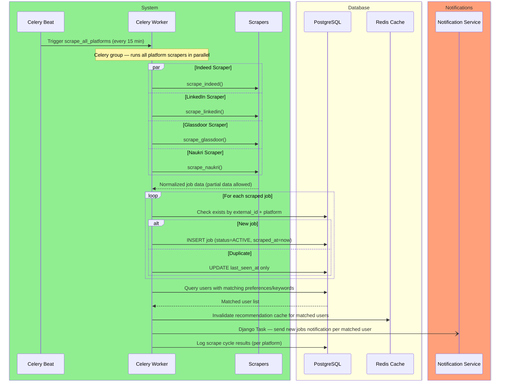
```mermaid
sequenceDiagram
  box LightGreen System
    participant CB as Celery Beat
    participant CW as Celery Worker
    participant SC as Scrapers
  end
  box LightYellow Database
    participant DB as PostgreSQL
    participant RD as Redis Cache
  end
  box LightSalmon Notifications
    participant NS as Notification Service
  end

  CB->>CW: Trigger scrape_all_platforms (every 15 min)
  Note over CW: Celery group — runs all platform scrapers in parallel

  par Indeed Scraper
    CW->>SC: scrape_indeed()
  and LinkedIn Scraper
    CW->>SC: scrape_linkedin()
  and Glassdoor Scraper
    CW->>SC: scrape_glassdoor()
  and Naukri Scraper
    CW->>SC: scrape_naukri()
  end

  SC-->>CW: Normalized job data (partial data allowed)

  loop For each scraped job
    CW->>DB: Check exists by external_id + platform
    alt New job
      CW->>DB: INSERT job (status=ACTIVE, scraped_at=now)
    else Duplicate
      CW->>DB: UPDATE last_seen_at only
    end
  end

  CW->>DB: Query users with matching preferences/keywords
  DB-->>CW: Matched user list
  CW->>RD: Invalidate recommendation cache for matched users
  CW-)NS: Django Task — send new jobs notification per matched user

  CW->>DB: Log scrape cycle results (per platform)
```

### Sequence Diagram — Home Page Load

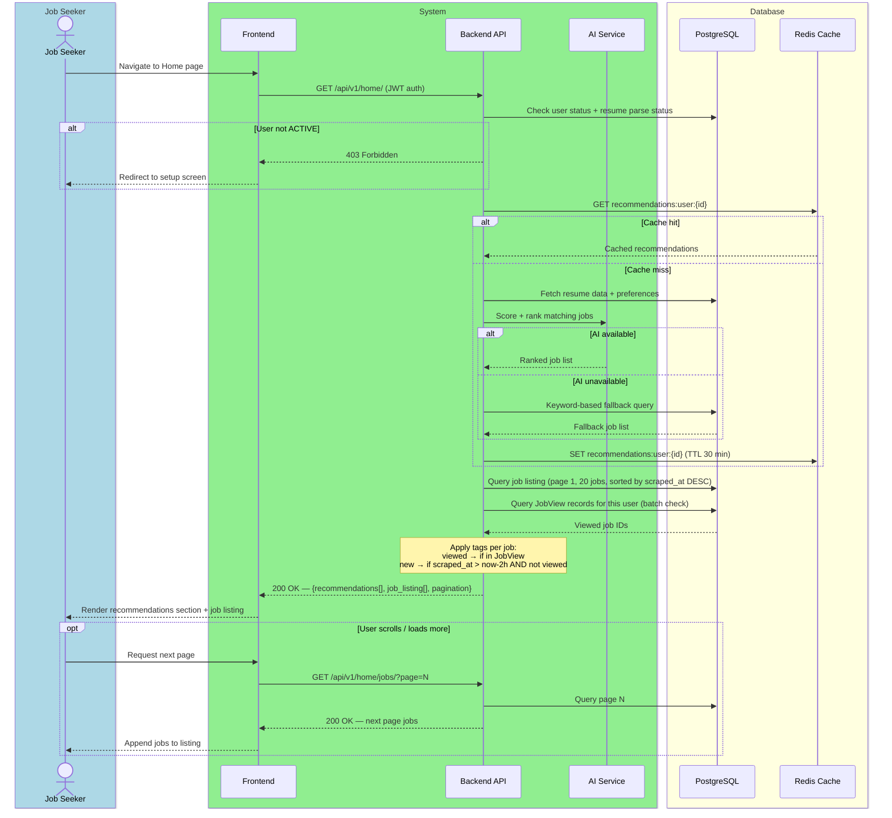
```mermaid
sequenceDiagram
  box LightBlue Job Seeker
    actor JS as Job Seeker
  end
  box LightGreen System
    participant FE as Frontend
    participant BE as Backend API
    participant AI as AI Service
  end
  box LightYellow Database
    participant DB as PostgreSQL
    participant RD as Redis Cache
  end

  JS->>FE: Navigate to Home page
  FE->>BE: GET /api/v1/home/ (JWT auth)
  BE->>DB: Check user status + resume parse status

  alt User not ACTIVE
    BE-->>FE: 403 Forbidden
    FE-->>JS: Redirect to setup screen
  end

  BE->>RD: GET recommendations:user:{id}

  alt Cache hit
    RD-->>BE: Cached recommendations
  else Cache miss
    BE->>DB: Fetch resume data + preferences
    BE->>AI: Score + rank matching jobs
    alt AI available
      AI-->>BE: Ranked job list
    else AI unavailable
      BE->>DB: Keyword-based fallback query
      DB-->>BE: Fallback job list
    end
    BE->>RD: SET recommendations:user:{id} (TTL 30 min)
  end

  BE->>DB: Query job listing (page 1, 20 jobs, sorted by scraped_at DESC)
  BE->>DB: Query JobView records for this user (batch check)
  DB-->>BE: Viewed job IDs

  Note over BE: Apply tags per job:<br/>viewed → if in JobView<br/>new → if scraped_at > now-2h AND not viewed

  BE-->>FE: 200 OK — {recommendations[], job_listing[], pagination}
  FE-->>JS: Render recommendations section + job listing

  opt User scrolls / loads more
    JS->>FE: Request next page
    FE->>BE: GET /api/v1/home/jobs/?page=N
    BE->>DB: Query page N
    BE-->>FE: 200 OK — next page jobs
    FE-->>JS: Append jobs to listing
  end
```

### Flowchart — Job Tag Logic

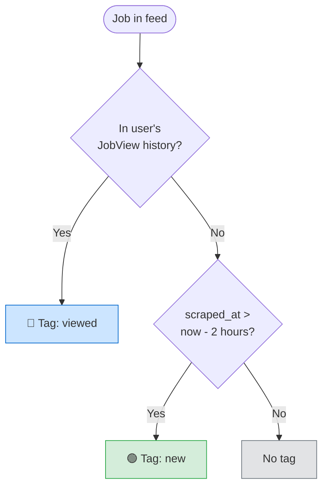
```mermaid
flowchart TD
    A([Job in feed]) --> B{In user's\nJobView history?}
    B -- Yes --> C[🔵 Tag: viewed]
    B -- No --> D{scraped_at >\nnow - 2 hours?}
    D -- Yes --> E[🟢 Tag: new]
    D -- No --> F[No tag]

    style C fill:#cce5ff,stroke:#0066cc
    style E fill:#d4edda,stroke:#28a745
    style F fill:#e2e3e5,stroke:#6c757d
```

### State Diagram — Scrape Job Status

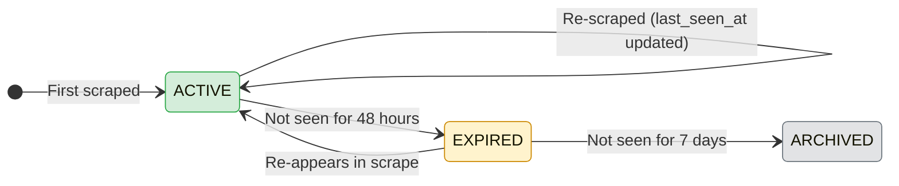
```mermaid
stateDiagram-v2
  direction LR
  [*] --> ACTIVE : First scraped

  ACTIVE --> ACTIVE : Re-scraped (last_seen_at updated)
  ACTIVE --> EXPIRED : Not seen for 48 hours
  EXPIRED --> ACTIVE : Re-appears in scrape
  EXPIRED --> ARCHIVED : Not seen for 7 days

  style ACTIVE fill:#d4edda,stroke:#28a745
  style EXPIRED fill:#fff3cd,stroke:#cc8800
  style ARCHIVED fill:#e2e3e5,stroke:#6c757d
```

## 2.2 Data Models

### Model: `Company`

**Purpose:** Represents a company extracted from scraped job data — shared across multiple job listings to avoid duplication  
**Django app:** `jobs`

| Field | Django Field Type | Required | Default | Notes |
|-------|------------------|----------|---------|-------|
| `id` | `UUIDField(primary_key=True)` | Auto | `uuid4` | PK |
| `name` | `CharField(max_length=255)` | Yes | — | Company name. Indexed. |
| `industry` | `CharField(max_length=255, null=True, blank=True)` | No | `null` | e.g. Technology, Healthcare |
| `url` | `URLField(null=True, blank=True)` | No | `null` | Company website |
| `url_direct` | `URLField(null=True, blank=True)` | No | `null` | Direct company page on the platform |
| `logo` | `URLField(null=True, blank=True)` | No | `null` | Logo image URL from the platform |
| `addresses` | `TextField(null=True, blank=True)` | No | `null` | Raw address string(s) as returned by scraper |
| `num_employees` | `CharField(max_length=50, null=True, blank=True)` | No | `null` | Range string e.g. "1000-5000" — not an integer, platforms return ranges |
| `revenue` | `CharField(max_length=100, null=True, blank=True)` | No | `null` | Revenue range string as returned by platform |
| `description` | `TextField(null=True, blank=True)` | No | `null` | Company description |
| `rating` | `DecimalField(max_digits=3, decimal_places=1, null=True, blank=True)` | No | `null` | Employer rating e.g. 4.2 |
| `reviews_count` | `PositiveIntegerField(null=True, blank=True)` | No | `null` | Number of reviews |
| `updated_at` | `DateTimeField(auto_now=True)` | Auto | `now` | Updated whenever new scrape brings fresher company data |

> **Deduplication note:** Companies are matched by `name` (case-insensitive). If a company appears across multiple platforms, they share one record. Company fields are updated (not overwritten blindly) — only update a field if the incoming value is non-null and the existing value is null, to progressively enrich the record.

### Model: `Job`

**Purpose:** Represents a scraped job listing from any supported platform  
**Django app:** `jobs`

| Field | Django Field Type | Required | Default | Notes |
|-------|------------------|----------|---------|-------|
| `id` | `UUIDField(primary_key=True)` | Auto | `uuid4` | PK |
| `external_id` | `CharField(max_length=255)` | Yes | — | Job ID from the source platform. Indexed. |
| `platform` | `CharField(choices=PLATFORM, max_length=20)` | Yes | — | Enum: INDEED, LINKEDIN, GLASSDOOR, NAUKRI |
| `company` | `ForeignKey(Company, on_delete=SET_NULL, null=True)` | No | `null` | FK to Company — SET_NULL if company record deleted |
| `title` | `CharField(max_length=255)` | Yes | — | Job title. Indexed for search. |
| `location` | `CharField(max_length=255, null=True, blank=True)` | No | `null` | City/region — null for fully remote roles |
| `date_posted` | `DateField(null=True, blank=True)` | No | `null` | Actual posting date from the platform — different from scraped_at |
| `job_type` | `CharField(choices=JOB_TYPE, max_length=20, null=True, blank=True)` | No | `null` | Enum: FULL_TIME, PART_TIME, CONTRACT, INTERNSHIP, null if not provided |
| `job_level` | `CharField(max_length=100, null=True, blank=True)` | No | `null` | Seniority level e.g. "Entry Level", "Senior", "Director" |
| `job_function` | `CharField(max_length=100, null=True, blank=True)` | No | `null` | Department/function e.g. "Engineering", "Marketing" |
| `description` | `TextField(null=True, blank=True)` | No | `null` | Full job description — not provided by all platforms |
| `skills` | `ArrayField(CharField(max_length=100), null=True, blank=True)` | No | `null` | Required skills — not provided by all platforms |
| `experience_range` | `CharField(max_length=100, null=True, blank=True)` | No | `null` | e.g. "2-5 years" — raw string as returned by scraper |
| `salary_source` | `CharField(max_length=50, null=True, blank=True)` | No | `null` | Source of salary info e.g. "employer", "estimated" |
| `interval` | `CharField(max_length=20, null=True, blank=True)` | No | `null` | Pay interval: "yearly", "monthly", "hourly" |
| `min_amount` | `DecimalField(max_digits=12, decimal_places=2, null=True, blank=True)` | No | `null` | Minimum salary amount |
| `max_amount` | `DecimalField(max_digits=12, decimal_places=2, null=True, blank=True)` | No | `null` | Maximum salary amount |
| `currency` | `CharField(max_length=10, null=True, blank=True)` | No | `null` | e.g. "USD", "EGP" |
| `is_remote` | `BooleanField(null=True)` | No | `null` | True/False/null — null means not specified |
| `work_from_home_type` | `CharField(max_length=50, null=True, blank=True)` | No | `null` | e.g. "hybrid", "fully_remote", "on_site" |
| `listing_type` | `CharField(max_length=50, null=True, blank=True)` | No | `null` | e.g. "organic", "sponsored" |
| `vacancy_count` | `PositiveIntegerField(null=True, blank=True)` | No | `null` | Number of openings — not always provided |
| `emails` | `ArrayField(EmailField(), null=True, blank=True)` | No | `null` | Contact emails if provided by the platform |
| `job_url` | `URLField(max_length=1000)` | Yes | — | Listing URL on the platform (job_url from scraper) |
| `job_url_direct` | `URLField(max_length=1000, null=True, blank=True)` | No | `null` | Direct application URL if different from listing URL |
| `search_country` | `CharField(max_length=100, null=True, blank=True)` | No | `null` | The country context used in the scrape search |
| `search_location` | `CharField(max_length=255, null=True, blank=True)` | No | `null` | The location query used in the scrape search |
| `status` | `CharField(choices=JOB_STATUS, max_length=20)` | Yes | `ACTIVE` | Enum: ACTIVE, EXPIRED, ARCHIVED |
| `scraped_at` | `DateTimeField` | Yes | `now` | When first scraped into the system. Indexed. |
| `last_seen_at` | `DateTimeField` | Yes | `now` | Updated every scrape cycle when job reappears. Indexed. |

**Unique constraint:** `unique_together = [('external_id', 'platform')]`

> **Null handling rule:** Never substitute an empty string for a null. If the scraper returns no value for a field, store `null`. This is enforced on all nullable fields with `null=True, blank=True`.

### Model: `ScrapeLog`

**Purpose:** Logs each scrape cycle per platform for monitoring and debugging  
**Django app:** `jobs`

| Field | Django Field Type | Required | Default | Notes |
|-------|------------------|----------|---------|-------|
| `id` | `UUIDField(primary_key=True)` | Auto | `uuid4` | PK |
| `platform` | `CharField(choices=PLATFORM, max_length=20)` | Yes | — | Which platform this log is for |
| `status` | `CharField(choices=SCRAPE_STATUS, max_length=20)` | Yes | — | Enum: SUCCESS, PARTIAL, FAILED |
| `jobs_found` | `PositiveIntegerField` | No | `0` | Total jobs returned by platform |
| `jobs_inserted` | `PositiveIntegerField` | No | `0` | New jobs inserted this cycle |
| `jobs_updated` | `PositiveIntegerField` | No | `0` | Existing jobs with updated last_seen_at |
| `error_message` | `TextField(null=True, blank=True)` | No | `null` | Error details if status = FAILED |
| `started_at` | `DateTimeField` | Yes | — | When this platform's scraper started |
| `finished_at` | `DateTimeField(null=True)` | No | `null` | When it finished (null if still running) |

### Model: `JobView`
**Purpose:** Tracks which jobs a user has viewed — used for "viewed" tags and profile stats  
**Django app:** `jobs`

| Field | Django Field Type | Required | Default | Notes |
|-------|------------------|----------|---------|-------|
| `id` | `UUIDField(primary_key=True)` | Auto | `uuid4` | PK |
| `user` | `ForeignKey(User, on_delete=CASCADE)` | Yes | — | The viewing user |
| `job` | `ForeignKey(Job, on_delete=CASCADE)` | Yes | — | The viewed job |
| `viewed_at` | `DateTimeField(auto_now_add=True)` | Auto | `now` | Indexed — used for weekly stats |

**Unique constraint:** `unique_together = [('user', 'job')]` — one record per user-job pair. Update `viewed_at` on revisit rather than inserting a new record.

### Model: `SavedJob`

**Purpose:** Jobs saved by a user for later reference  
**Django app:** `jobs`

| Field | Django Field Type | Required | Default | Notes |
|-------|------------------|----------|---------|-------|
| `id` | `UUIDField(primary_key=True)` | Auto | `uuid4` | PK |
| `user` | `ForeignKey(User, on_delete=CASCADE)` | Yes | — | The saving user |
| `job` | `ForeignKey(Job, on_delete=CASCADE)` | Yes | — | The saved job |
| `saved_at` | `DateTimeField(auto_now_add=True)` | Auto | `now` | — |

**Unique constraint:** `unique_together = [('user', 'job')]`

## 2.3 Table Relationships & Logic

`Company` and `Job` have a `ForeignKey` relationship — one company has many jobs. `Job` uses `SET_NULL` on company deletion so job records are never lost if a company record is cleaned up. `JobView` and `SavedJob` are junction tables between `User` and `Job`. When a `User` is deleted, all their `JobView` and `SavedJob` records cascade-delete. When a `Job` is deleted, the same applies.

**Company deduplication** — companies are matched by name (case-insensitive) using `iexact` lookup before creating a new record:
```python
company, created = Company.objects.get_or_create(
    name__iexact=scraped_name,
    defaults={'name': scraped_name, ...}
)
```
If the company already exists, enrich it — only update null fields with non-null incoming values. Never overwrite existing data with null:
```python
for field in ['logo', 'url', 'description', 'rating', ...]:
    incoming = scraped_data.get(field)
    if incoming and not getattr(company, field):
        setattr(company, field, incoming)
company.save()
```

**Job deduplication** uses `update_or_create` on `(external_id, platform)`. If the record exists, update `last_seen_at` only — do not overwrite any other fields. This preserves the original scraped data integrity.

**Tag computation** is done in the backend, not the frontend. When building the home page response, the backend fetches the user's `JobView` IDs as a set, then annotates each job in the response:
```
tag = "viewed" if job.id in viewed_ids
     else "new" if job.scraped_at > now - 2h
     else None
```
This is computed in Python after the DB query — do not compute tags in SQL to keep the query simple. The computed `tag` value is included as a field on every job object in the API response (`"new"`, `"viewed"`, or `null`). The frontend reads `job.tag` directly — no tag logic lives on the client.

**Job expiry** — a separate Celery Beat task runs daily: marks jobs as `EXPIRED` if `last_seen_at < now - 48 hours`. Marks `EXPIRED` jobs as `ARCHIVED` if `last_seen_at < now - 7 days`. Expired/archived jobs are excluded from the home feed by default (filter `status=ACTIVE`).

**Recommendation cache invalidation** — when new jobs matching a user are inserted, invalidate their recommendations cache key in Redis. This ensures the next home page load recalculates recommendations with fresh data.

**Scraper field mapping** — the scraper output fields map to models as follows:

| Scraper Field | Model | Model Field |
|---|---|---|
| `id` | `Job` | `external_id` |
| `site` | `Job` | `platform` |
| `job_url` | `Job` | `job_url` |
| `job_url_direct` | `Job` | `job_url_direct` |
| `title` | `Job` | `title` |
| `company` | `Company` | `name` |
| `location` | `Job` | `location` |
| `date_posted` | `Job` | `date_posted` |
| `job_type` | `Job` | `job_type` |
| `salary_source` | `Job` | `salary_source` |
| `interval` | `Job` | `interval` |
| `min_amount` | `Job` | `min_amount` |
| `max_amount` | `Job` | `max_amount` |
| `currency` | `Job` | `currency` |
| `is_remote` | `Job` | `is_remote` |
| `job_level` | `Job` | `job_level` |
| `job_function` | `Job` | `job_function` |
| `listing_type` | `Job` | `listing_type` |
| `emails` | `Job` | `emails` |
| `description` | `Job` | `description` |
| `company_industry` | `Company` | `industry` |
| `company_url` | `Company` | `url` |
| `company_logo` | `Company` | `logo` |
| `company_url_direct` | `Company` | `url_direct` |
| `company_addresses` | `Company` | `addresses` |
| `company_num_employees` | `Company` | `num_employees` |
| `company_revenue` | `Company` | `revenue` |
| `company_description` | `Company` | `description` |
| `skills` | `Job` | `skills` |
| `experience_range` | `Job` | `experience_range` |
| `company_rating` | `Company` | `rating` |
| `company_reviews_count` | `Company` | `reviews_count` |
| `vacancy_count` | `Job` | `vacancy_count` |
| `work_from_home_type` | `Job` | `work_from_home_type` |
| `search_country` | `Job` | `search_country` |
| `search_location` | `Job` | `search_location` |
| *(set by system)* | `Job` | `scraped_at` |
| *(set by system)* | `Job` | `last_seen_at` |

**Indexes needed:**
- `Job.scraped_at` — used for sorting the feed
- `Job.last_seen_at` — used for expiry checks
- `Job.title` — used for search and recommendation matching
- `Job.external_id` + `Job.platform` — covered by unique constraint
- `Company.name` — used for deduplication lookup
- `JobView.viewed_at` — used for weekly stats in monitoring
- `JobView.user` — used for tag lookups

## 2.4 API Endpoints

| Method | Endpoint | Auth | Role | Request Body / Params | Response | Description |
|--------|----------|------|------|----------------------|----------|-------------|
| `GET` | `/api/v1/home/` | Yes | Job Seeker | — | `200` — `{recommendations[], job_listing[], pagination}` | Home page data — recommendations + first page of listings |
| `GET` | `/api/v1/home/jobs/` | Yes | Job Seeker | `?page=N&page_size=20` | `200` — `{jobs[], pagination}` | Paginated job listing |
| `GET` | `/api/v1/home/recommendations/` | Yes | Job Seeker | — | `200` — `{jobs[]}` | Recommendations only (for refresh) |

## 2.5 Developer Notes

### 🔵 Backend Developer (Django)

- Celery Beat schedule: `scrape_all_platforms` every 15 minutes via `crontab(minute='*/15')`.
- Use `celery.group` to run all 4 platform scrapers in parallel within one Celery task. Each scraper is a separate `shared_task`.
- Scrapers should be stateless — no shared mutable state between runs. Each scraper returns a list of normalized job dicts that map directly to the scraper field mapping table above.
- **Company upsert first, then Job upsert.** For each scraped job: (1) `get_or_create` the Company by `name__iexact`, enrich null fields. (2) `update_or_create` the Job by `(external_id, platform)`, set `company=company_instance`, only update `last_seen_at` on existing records.
- Never overwrite existing non-null Job fields on update — only `last_seen_at` is updated on re-scrape. This protects data integrity if the platform returns degraded data in a later cycle.
- All nullable fields must be stored as `null`, never as empty string. Apply this strictly in the scraper normalization layer before hitting the DB.
- `is_remote` is a `NullBooleanField` — three states: `True`, `False`, `None` (not specified). Do not default to `False`.
- `skills` and `emails` are `ArrayField` — use `[]` as the default in Python but store `null` in DB when not provided (use `null=True`).
- Recommendation endpoint: use `select_related('company')` when fetching jobs — avoids N+1 on company name/logo lookups.
- `JobView` upsert: `update_or_create(user=user, job=job, defaults={'viewed_at': now()})`.
- Add a daily Celery Beat task `expire_old_jobs`: `Job.objects.filter(last_seen_at__lt=now()-48h, status='ACTIVE').update(status='EXPIRED')`.
- For the notification dispatch after scraping: collect new job IDs, find users with matching `job_titles` or `skills` overlap, batch them, dispatch one Django Task per user.
- Use `select_related('company')` and `only()` for the job listing query to avoid pulling unnecessary fields.
- The job serializer must include a `tag` field as a `SerializerMethodField` — compute it from the pre-fetched `viewed_ids` set passed into the serializer context. Never make a per-job DB query to determine the tag.

### 🟢 Frontend Developer (React)

- Home page has two distinct sections: **Recommendations** (horizontal scroll or grid, top) and **Job Listing** (vertical list, below).
- Each job card displays: title, company name, company logo (if available — fallback to initials avatar), location, platform badge, job type, remote badge (if `is_remote=true`), "new" or "viewed" tag (colored), `date_posted` (preferred over `scraped_at` for display).
- Recommendations section shows a skeleton loader while loading. If recommendations are not ready (resume parsing in progress), show a banner: "We're personalizing your feed — check back shortly."
- Job listing uses **infinite scroll** — trigger `GET /api/v1/home/jobs/?page=N` when user scrolls to 80% of the list. Append results to the existing list.
- Tag rendering: read `job.tag` from the API response directly — `"new"` → green badge, `"viewed"` → grey badge, `null` → nothing. Never compute tags on the frontend.
- Platform badge: show platform logo/icon (Indeed, LinkedIn, Glassdoor, Naukri).
- Salary display: show only if `min_amount` or `max_amount` is non-null. Format as `$X – $Y /year` using `interval` and `currency`. If only one bound is available, show `From $X` or `Up to $Y`.
- Clicking a job card navigates to the job detail page (CAREERLY-003) and fires a `POST /api/v1/jobs/{id}/view/` to record the view.
- Cache the home page data in React Query or SWR with a 5-minute stale time — don't re-fetch on every re-render.

### 🟡 Mobile Developer (Flutter)

- Recommendations section: `ListView` with `scrollDirection: Axis.horizontal`.
- Job listing: `ListView.builder` with `LazyLoading` — load next page when user reaches last 5 items.
- Job cards: use `Card` widget with platform icon, title, company, location, tag badge.
- Tag badges: `Chip` widget — read `job.tag` from the API response. Green `Chip` for `"new"`, grey for `"viewed"`, nothing rendered for `null`. No tag logic on mobile.
- Pull-to-refresh: wrap listing in `RefreshIndicator` — re-calls `/api/v1/home/` on pull.
- If recommendations are loading (parse in progress): show `Shimmer` loading effect in the recommendations row.
- Store first page of home data in local cache (using `hive` or `isar`) for offline viewing of previously loaded jobs.
- Platform icons: bundle as local assets — do not fetch from the web at runtime.

### 🟣 AI Engineer

- Recommendation generation: given a user's resume data (skills list, job titles, experience level), query the `Job` table for `ACTIVE` jobs. Score each by relevance using an embedding similarity model.
- Preferred approach: pre-compute job embeddings and store them (as a `vector` field using `pgvector` extension on PostgreSQL, or as a separate vector store). On recommendation request, compute the user's profile embedding and run a nearest-neighbor search.
- If `pgvector` is not available at this stage: fall back to PostgreSQL full-text search using `SearchVector` on `title + description + skills`.
- Input to recommendation model: `{user_skills: [], user_titles: [], experience_level: str}`.
- Output: list of `job_id` ranked by suitability score.
- TTL of recommendations is 30 minutes — cache is invalidated when new matching jobs arrive.
- This same recommendation engine is used in AI Match (CAREERLY-003) — share the scoring logic.


## 2.6 General Notes

**Null field UI behavior:** Fields critical to the job card and detail page (`description`, `skills`, `salary`) should show styled placeholders directing the user to the original post — e.g. *"Description not available for this listing. View the original post for full details."* Minor supplementary fields (`vacancy_count`, `listing_type`, `emails`, `work_from_home_type`) should be silently omitted if null — do not render the label at all. The general rule: if the user would notice it's missing, show a placeholder; if it's supplementary, hide the row entirely. Decision needed: confirm placeholder copy with design before the frontend builds the job detail component.

---

# CAREERLY-003 — Jobs Flow

# PART 1 — ANALYSIS

## 1.1 Flow Title & Metadata

```
Flow Name:     Jobs — Detail, Save, Apply, AI Match, Check Resume
Flow ID:       CAREERLY-003
Trigger:       User clicks on a job card from the home page or job listing
Entry Point:   Job card on Home page or Job listing
Exit Point:
  Apply Now    → External job page (browser/webview)
  AI Match     → AI analysis result screen with suitability score + top 3 jobs
  Check Resume → AI ATS analysis result screen with ATS score
  Save         → Job saved, user stays on detail page
Related Flows: CAREERLY-002 (Home Page), CAREERLY-004 (Notifications), CAREERLY-005 (Profile)
```

## 1.2 Description

This flow covers everything that happens after a user selects a job. The job detail page presents scraped and organized data about the job, and offers four actions: save for later, apply now (external redirect), AI Match (resume vs job suitability scoring), and Check Your Resume (general ATS scoring). Both AI features are analysis sessions — they persist to the user's history and contribute to profile stats. The AI Match session is scoped to a specific job; the Check Resume session is general. Both support uploading additional resumes for comparison within the same session, and both render AI responses in markdown. This flow does not cover the scraping of jobs (CAREERLY-002) or notifications triggered by these actions (CAREERLY-004).

## 1.3 Actors / User Roles

| Role | Type | Responsibilities in this flow |
|------|------|-------------------------------|
| Job Seeker | Human | Views job detail, saves, applies, requests AI analysis |
| System | Automated | Records views, saves, routes to external URL, manages sessions |
| AI/ML Service | Automated | Analyzes resume against job or general ATS, returns scored markdown report |

## 1.4 Step-by-Step Bullet Points

### Route 1 — View Job Detail

- Job Seeker — clicks on a job card
- System — records a `JobView` for this user + job (upsert — update `viewed_at` if already exists)
- System — fetches job details from DB
  ↳ if job no longer exists or is archived: shows "This job is no longer available"
- Job Seeker — sees the job detail page with all available scraped fields (title, company, location, description, skills, job type, salary if available, platform badge, source link)
- System — shows a notice for fields that were not available from the source platform (e.g. "Description not available for this listing")

### Route 2 — Save Job

- Job Seeker — clicks the Save button on the detail page
- System — checks if the job is already saved by this user
  ↳ if already saved: toggles to unsave — removes from saved jobs, button state changes to "Save"
  ↳ if not saved: saves the job, button state changes to "Saved"
- System — creates or deletes a `SavedJob` record
- Job Seeker — stays on the job detail page, button reflects current state

### Route 3 — Apply Now

- Job Seeker — clicks the "Apply Now" button
- System — retrieves the `external_url` for this job
- System — opens the external job page (opens in a new tab on web, in-app browser or external browser on mobile)
- Job Seeker — lands on the original job page (Indeed, LinkedIn, Glassdoor, or Naukri) to complete the application there

### Route 4 — AI Match

- Job Seeker — clicks the "AI Match" button on the job detail page
- System — checks if the user has a resume on file
  ↳ if no resume: prompts user to upload one — "You need a resume to use AI Match"
- System — creates a new `AISession` record with type = `JOB_MATCH`, linked to the job, status = `PENDING`
- Job Seeker — is navigated to the AI Match screen, which shows the job title and company at the top
- System — dispatches Celery Task to analyze the user's default resume against this job
- System — streams or polls analysis progress
- AI/ML Service — analyzes the resume against the job description and requirements
- AI/ML Service — returns a markdown-formatted report including:
  - Suitability score (0–100)
  - Verdict tier (Poor / Fair / Good / Excellent)
  - Strengths and gaps breakdown
  - Top 3 recommended job titles based on the resume
- System — resolves the top 3 recommended job titles against the jobs DB (best match per title)
- System — updates `AISession` with: `score`, `verdict`, `report_markdown`, `top_jobs[]`, `status = COMPLETE`
- Job Seeker — sees the rendered markdown report, suitability score, verdict badge, and the 3 recommended jobs
- Job Seeker — can click any of the 3 recommended jobs to view their detail (re-enters this flow)
- Job Seeker — can upload a second resume to compare against the same job
  ↳ System — creates a new `AISessionResume` record linked to this session
  ↳ System — runs the same AI analysis for the new resume against the same job
  ↳ Job Seeker — sees both results side-by-side or as separate tabs

### Route 5 — Check Your Resume (ATS Analysis)

- Job Seeker — clicks the "Check Your Resume" button (available on the job detail page and as a standalone feature)
- System — checks if the user has a resume on file
  ↳ if no resume: prompts user to upload one
- System — creates a new `AISession` record with type = `ATS_CHECK`, status = `PENDING`
- Job Seeker — is navigated to the Check Resume screen
- System — dispatches Celery Task to run a general ATS analysis on the user's default resume
- AI/ML Service — analyzes the resume for ATS compliance and returns a markdown-formatted report including:
  - ATS score (0–100)
  - Verdict tier (Poor / Fair / Good / Excellent)
  - Keyword coverage analysis
  - Formatting recommendations
  - Skills gap suggestions
- System — updates `AISession` with: `score`, `verdict`, `report_markdown`, `status = COMPLETE`
- Job Seeker — sees the rendered markdown report, ATS score, and verdict badge
- Job Seeker — can upload a second resume to compare ATS scores
  ↳ System — runs the same ATS analysis for the new resume
  ↳ Job Seeker — sees both results side-by-side or as separate tabs

## 1.5 Validations

### Input Validations

| Field | Rule | Error Message |
|-------|------|---------------|
| Resume upload (AI features) | PDF  only, max 5MB | "Only PDF  files are accepted" / "File size must be under 5MB" |
| Job ID (URL param) | Must be a valid UUID, must exist in DB | 404 Not Found |

### Business Rule Validations

| Rule | Condition | Behavior |
|------|-----------|----------|
| Resume required for AI features | No resume on file | Prompt upload — block AI feature until resumed |
| Archived/expired job viewed | Job status is not ACTIVE | Show "This job is no longer available" — disable Apply and AI Match |
| Save toggle | Job already saved | Toggle to unsaved on second click |
| Top 3 job resolution | AI returns a title with no DB match | Return the closest available match; if none, omit that slot (can return 1–3 jobs) |
| Second resume in session | User uploads 2nd resume | Runs AI analysis for the new resume against the same job/context as the first |

### Security Validations

| Check | Details |
|-------|---------|
| Authentication | JWT required for all job actions |
| Role-based access | Only Job Seekers — admins do not interact with job detail |
| Session ownership | AI sessions can only be viewed by the user who created them |
| File upload | Validate MIME type server-side (not just extension) — reject non-PDF content types |

### Error Handling

| Scenario | System Response |
|----------|----------------|
| AI service unavailable | Show "AI analysis is temporarily unavailable. Try again later." — do not create a session |
| AI analysis times out | Mark session status = `FAILED`, notify user — allow retry |
| External URL missing or broken | Show "Apply link is unavailable for this listing" — disable Apply Now button |
| Job not found in DB | 404 with message "This job is no longer available" |
| Save/unsave server error | Show toast error, revert button state |

# PART 2 — TECHNICAL

## 2.1 Diagrams

### Sequence Diagram — Job Detail + Save + Apply

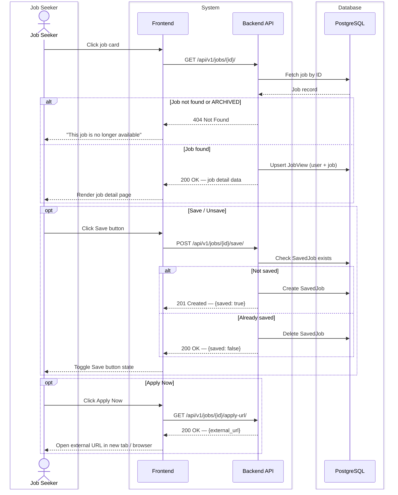
```mermaid
sequenceDiagram
  box White Job Seeker
    actor JS as Job Seeker
  end
  box  System
    participant FE as Frontend
    participant BE as Backend API
  end
  box  Database
    participant DB as PostgreSQL
  end

  JS->>FE: Click job card
  FE->>BE: GET /api/v1/jobs/{id}/
  BE->>DB: Fetch job by ID
  DB-->>BE: Job record

  alt Job not found or ARCHIVED
    BE-->>FE: 404 Not Found
    FE-->>JS: "This job is no longer available"
  else Job found
    BE->>DB: Upsert JobView (user + job)
    BE-->>FE: 200 OK — job detail data
    FE-->>JS: Render job detail page
  end

  opt Save / Unsave
    JS->>FE: Click Save button
    FE->>BE: POST /api/v1/jobs/{id}/save/
    BE->>DB: Check SavedJob exists
    alt Not saved
      BE->>DB: Create SavedJob
      BE-->>FE: 201 Created — {saved: true}
    else Already saved
      BE->>DB: Delete SavedJob
      BE-->>FE: 200 OK — {saved: false}
    end
    FE-->>JS: Toggle Save button state
  end

  opt Apply Now
    JS->>FE: Click Apply Now
    FE->>BE: GET /api/v1/jobs/{id}/apply-url/
    BE-->>FE: 200 OK — {external_url}
    FE-->>JS: Open external URL in new tab / browser
  end
```

### Sequence Diagram — AI Match

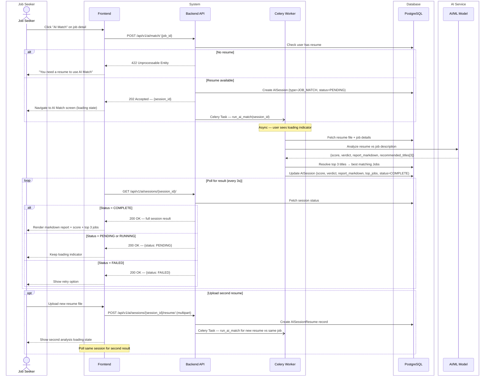
```mermaid
sequenceDiagram
  box  Job Seeker
    actor JS as Job Seeker
  end
  box  System
    participant FE as Frontend
    participant BE as Backend API
    participant CW as Celery Worker
  end
  box  Database
    participant DB as PostgreSQL
  end
  box  AI Service
    participant AI as AI/ML Model
  end

  JS->>FE: Click "AI Match" on job detail
  FE->>BE: POST /api/v1/ai/match/ {job_id}
  BE->>DB: Check user has resume

  alt No resume
    BE-->>FE: 422 Unprocessable Entity
    FE-->>JS: "You need a resume to use AI Match"
  else Resume available
    BE->>DB: Create AISession (type=JOB_MATCH, status=PENDING)
    BE-->>FE: 202 Accepted — {session_id}
    FE-->>JS: Navigate to AI Match screen (loading state)
    BE-)CW: Celery Task — run_ai_match(session_id)
  end

  Note over CW: Async — user sees loading indicator

  CW->>DB: Fetch resume file + job details
  CW->>AI: Analyze resume vs job description
  AI-->>CW: {score, verdict, report_markdown, recommended_titles[3]}

  CW->>DB: Resolve top 3 titles → best matching Jobs
  CW->>DB: Update AISession (score, verdict, report_markdown, top_jobs, status=COMPLETE)

  loop Poll for result (every 3s)
    FE->>BE: GET /api/v1/ai/sessions/{session_id}/
    BE->>DB: Fetch session status
    alt Status = COMPLETE
      BE-->>FE: 200 OK — full session result
      FE-->>JS: Render markdown report + score + top 3 jobs
    else Status = PENDING or RUNNING
      BE-->>FE: 200 OK — {status: PENDING}
      FE-->>JS: Keep loading indicator
    else Status = FAILED
      BE-->>FE: 200 OK — {status: FAILED}
      FE-->>JS: Show retry option
    end
  end

  opt Upload second resume
    JS->>FE: Upload new resume file
    FE->>BE: POST /api/v1/ai/sessions/{session_id}/resume/ (multipart)
    BE->>DB: Create AISessionResume record
    BE-)CW: Celery Task — run_ai_match for new resume vs same job
    FE-->>JS: Show second analysis loading state
    Note over FE: Poll same session for second result
  end
```

### Sequence Diagram — Check Your Resume (ATS)

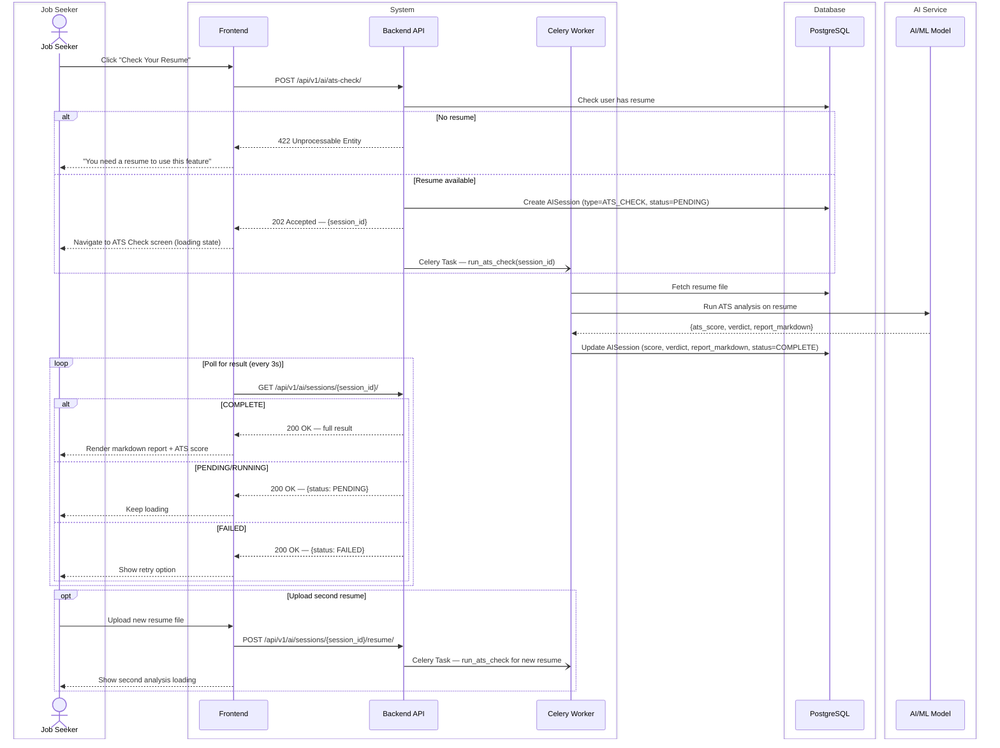
```mermaid
sequenceDiagram
  box  Job Seeker
    actor JS as Job Seeker
  end
  box  System
    participant FE as Frontend
    participant BE as Backend API
    participant CW as Celery Worker
  end
  box  Database
    participant DB as PostgreSQL
  end
  box  AI Service
    participant AI as AI/ML Model
  end

  JS->>FE: Click "Check Your Resume"
  FE->>BE: POST /api/v1/ai/ats-check/
  BE->>DB: Check user has resume
  alt No resume
    BE-->>FE: 422 Unprocessable Entity
    FE-->>JS: "You need a resume to use this feature"
  else Resume available
    BE->>DB: Create AISession (type=ATS_CHECK, status=PENDING)
    BE-->>FE: 202 Accepted — {session_id}
    FE-->>JS: Navigate to ATS Check screen (loading state)
    BE-)CW: Celery Task — run_ats_check(session_id)
  end

  CW->>DB: Fetch resume file
  CW->>AI: Run ATS analysis on resume
  AI-->>CW: {ats_score, verdict, report_markdown}

  CW->>DB: Update AISession (score, verdict, report_markdown, status=COMPLETE)

  loop Poll for result (every 3s)
    FE->>BE: GET /api/v1/ai/sessions/{session_id}/
    alt COMPLETE
      BE-->>FE: 200 OK — full result
      FE-->>JS: Render markdown report + ATS score
    else PENDING/RUNNING
      BE-->>FE: 200 OK — {status: PENDING}
      FE-->>JS: Keep loading
    else FAILED
      BE-->>FE: 200 OK — {status: FAILED}
      FE-->>JS: Show retry option
    end
  end

  opt Upload second resume
    JS->>FE: Upload new resume file
    FE->>BE: POST /api/v1/ai/sessions/{session_id}/resume/
    BE-)CW: Celery Task — run_ats_check for new resume
    FE-->>JS: Show second analysis loading
  end
```

### State Diagram — AI Session Lifecycle

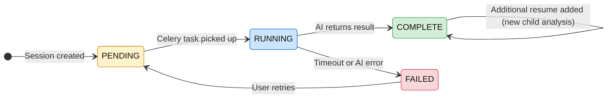
```mermaid
stateDiagram-v2
  direction LR
  [*] --> PENDING : Session created

  PENDING --> RUNNING : Celery task picked up
  RUNNING --> COMPLETE : AI returns result
  RUNNING --> FAILED : Timeout or AI error

  FAILED --> PENDING : User retries
  COMPLETE --> COMPLETE : Additional resume added (new child analysis)

  style PENDING fill:#fff3cd,stroke:#cc8800
  style RUNNING fill:#cce5ff,stroke:#0066cc
  style COMPLETE fill:#d4edda,stroke:#28a745
  style FAILED fill:#f8d7da,stroke:#dc3545
```

## 2.2 Data Models

### Model: `AISession`

**Purpose:** Represents one AI analysis session — either a job match or ATS check  
**Django app:** `ai`

| Field | Django Field Type | Required | Default | Notes |
|-------|------------------|----------|---------|-------|
| `id` | `UUIDField(primary_key=True)` | Auto | `uuid4` | PK |
| `user` | `ForeignKey(User, on_delete=CASCADE)` | Yes | — | Owning user |
| `session_type` | `CharField(choices=SESSION_TYPE, max_length=20)` | Yes | — | Enum: JOB_MATCH, ATS_CHECK |
| `job` | `ForeignKey(Job, on_delete=SET_NULL, null=True, blank=True)` | No | `null` | Only for JOB_MATCH sessions |
| `resume` | `ForeignKey(Resume, on_delete=SET_NULL, null=True)` | Yes | — | The primary resume analyzed |
| `score` | `PositiveSmallIntegerField(null=True)` | No | `null` | 0–100, set on completion |
| `verdict` | `CharField(choices=VERDICT, max_length=20, null=True)` | No | `null` | Enum: POOR, FAIR, GOOD, EXCELLENT |
| `report_markdown` | `TextField(null=True, blank=True)` | No | `null` | Full AI-generated markdown report |
| `top_jobs` | `ManyToManyField(Job, blank=True, related_name='recommended_in')` | No | — | Top 3 jobs (JOB_MATCH only) |
| `status` | `CharField(choices=SESSION_STATUS, max_length=20)` | Yes | `PENDING` | Enum: PENDING, RUNNING, COMPLETE, FAILED |
| `created_at` | `DateTimeField(auto_now_add=True)` | Auto | `now` | Indexed — used for session history |
| `completed_at` | `DateTimeField(null=True, blank=True)` | No | `null` | Set when status = COMPLETE |

### Model: `AISessionResume`

**Purpose:** Tracks additional resumes analyzed within the same session (for comparison)  
**Django app:** `ai`

| Field | Django Field Type | Required | Default | Notes |
|-------|------------------|----------|---------|-------|
| `id` | `UUIDField(primary_key=True)` | Auto | `uuid4` | PK |
| `session` | `ForeignKey(AISession, on_delete=CASCADE)` | Yes | — | Parent session |
| `resume` | `ForeignKey(Resume, on_delete=CASCADE)` | Yes | — | The additional resume |
| `score` | `PositiveSmallIntegerField(null=True)` | No | `null` | Score for this resume in this session |
| `verdict` | `CharField(choices=VERDICT, max_length=20, null=True)` | No | `null` | Verdict for this resume |
| `report_markdown` | `TextField(null=True, blank=True)` | No | `null` | Separate markdown report for this resume |
| `status` | `CharField(choices=SESSION_STATUS, max_length=20)` | Yes | `PENDING` | Same enum as AISession |
| `created_at` | `DateTimeField(auto_now_add=True)` | Auto | `now` | — |

### Model: `Resume`

**Purpose:** A resume file uploaded by a user  
**Django app:** `accounts`

| Field | Django Field Type | Required | Default | Notes |
|-------|------------------|----------|---------|-------|
| `id` | `UUIDField(primary_key=True)` | Auto | `uuid4` | PK |
| `user` | `ForeignKey(User, on_delete=CASCADE)` | Yes | — | Owner |
| `file` | `FileField(upload_to='resumes/')` | Yes | — | Stored in S3 or local media |
| `original_filename` | `CharField(max_length=255)` | Yes | — | Displayed in UI and sessions |
| `file_size` | `PositiveIntegerField` | Yes | — | In bytes |
| `parsed_data` | `JSONField(null=True, blank=True)` | No | `null` | AI-extracted: skills, titles, experience_level, education |
| `parse_status` | `CharField(choices=PARSE_STATUS, max_length=20)` | Yes | `PENDING` | Enum: PENDING, COMPLETE, FAILED |
| `is_default` | `BooleanField` | No | `False` | The resume used by default for AI features |
| `uploaded_at` | `DateTimeField(auto_now_add=True)` | Auto | `now` | — |

**Constraint:** Only one `Resume` per user can have `is_default=True`. Enforce with a `UniqueConstraint` filtered on `is_default=True`.

## 2.3 Table Relationships & Logic

`AISession` links `User`, `Job` (optional), and `Resume`. When a `Job` is deleted or archived, the FK is set to `null` — sessions are preserved for historical record. When a `User` is deleted, sessions cascade-delete.

`AISessionResume` is a child of `AISession`. Each additional resume uploaded in a session creates one `AISessionResume` record with its own independent score, verdict, and markdown report.

**Verdict tier computation** — applied after score is returned by AI:
```
85–100  → EXCELLENT
70–84   → GOOD
50–69   → FAIR
0–49    → POOR
```
This is computed in the backend before saving — the AI returns only a numeric score.

**Average ATS score on profile** — computed as:
```python
AISession.objects.filter(
    user=user,
    session_type='ATS_CHECK',
    status='COMPLETE'
).aggregate(avg=Avg('score'))
```
This is not stored — it is computed on profile load and cached in Redis with TTL 10 minutes.

**Average suitability score on profile** — same approach, filtered on `session_type='JOB_MATCH'`.

**Default resume logic** — when a user uploads their first resume, it is automatically set as `is_default=True`. When they upload subsequent resumes, they can explicitly set a new default. When the default resume is deleted, set the most recently uploaded remaining resume as the new default via `post_delete` signal.

**Top 3 job resolution** — AI returns 3 job title strings. For each title, run:
```python
Job.objects.filter(
    status='ACTIVE',
    title__icontains=title
).order_by('-scraped_at').first()
```
If no match, omit that slot. Store the resolved `Job` instances in the `top_jobs` M2M field.

**Session polling** — frontend polls every 3 seconds. Backend returns current status. Once `COMPLETE`, frontend stops polling and renders the result. Celery task timeout is 5 minutes — if exceeded, mark session as `FAILED`.

## 2.4 API Endpoints

| Method | Endpoint | Auth | Role | Request Body / Params | Response | Description |
|--------|----------|------|------|----------------------|----------|-------------|
| `GET` | `/api/v1/jobs/{id}/` | Yes | Job Seeker | — | `200` — job detail | Get job details, records view |
| `POST` | `/api/v1/jobs/{id}/save/` | Yes | Job Seeker | — | `201 / 200` — `{saved: bool}` | Toggle save/unsave |
| `POST` | `/api/v1/ai/match/` | Yes | Job Seeker | `{job_id}` | `202` — `{session_id}` | Start AI Match session |
| `POST` | `/api/v1/ai/ats-check/` | Yes | Job Seeker | — | `202` — `{session_id}` | Start ATS Check session |
| `GET` | `/api/v1/ai/sessions/{id}/` | Yes | Job Seeker | — | `200` — session data | Poll session status and result |
| `POST` | `/api/v1/ai/sessions/{id}/resume/` | Yes | Job Seeker | `multipart: {resume_file}` | `202` — `{sub_session_id}` | Add additional resume to session |
| `GET` | `/api/v1/ai/sessions/` | Yes | Job Seeker | `?type=JOB_MATCH\|ATS_CHECK&page=N` | `200` — paginated sessions | List user's session history |
<!-- | `GET` | `/api/v1/jobs/{id}/apply-url/` | Yes | Job Seeker | — | `200` — `{external_url}` | Get external apply URL | -->

## 2.5 Developer Notes

### 🔵 Backend Developer (Django)

- `GET /api/v1/jobs/{id}/` should upsert `JobView` inside the view using `update_or_create` — do not fire a separate request for view tracking.
- `POST /api/v1/jobs/{id}/save/` should be idempotent — second call toggles the save, not duplicates it. Use `get_or_create` then delete if it existed.
- AI sessions return `202 Accepted` immediately — the Celery task runs async. Never make the user wait synchronously for AI response.
- Celery task `run_ai_match(session_id)`: fetch session → fetch resume file → send to AI → parse response → compute verdict → resolve top 3 jobs → update session. Wrap in `try/except` — on any exception, set `status=FAILED`.
- Set `CELERY_TASK_SOFT_TIME_LIMIT = 280` and `CELERY_TASK_TIME_LIMIT = 300` for AI tasks (5 min hard limit).
- Markdown in `report_markdown`: store exactly as returned by AI — do not sanitize or strip. The frontend handles rendering.
- For `top_jobs` resolution: do the DB query inside the Celery task, not in the API view.
- Average score computation for profile: use Django's `Avg` aggregation, cache in Redis for 10 minutes. Key: `user:{id}:avg_ats_score` and `user:{id}:avg_match_score`.
- Resume `is_default` uniqueness: use `UniqueConstraint(fields=['user'], condition=Q(is_default=True), name='unique_default_resume_per_user')`.
- `post_delete` signal on `Resume`: if deleted resume was the default, find the latest remaining resume and set it as default.

### 🟢 Frontend Developer (React)

- Job detail page sections: header (title, company, location, platform badge, save button, apply button), body (description with null notice if missing, skills chips or null notice, job type, salary if available), AI actions section (AI Match button, Check Resume button).
- Save button: optimistic UI — toggle state immediately, revert on API error.
- "AI Match" and "Check Resume" buttons should be disabled and show tooltip "Upload a resume first" if user has no resume.
- AI result screen: render `report_markdown` using a markdown renderer (e.g. `react-markdown` with `remark-gfm` plugin for tables and lists). Never render raw HTML.
- Polling: use `setInterval` every 3 seconds while `status === 'PENDING' || status === 'RUNNING'`. Clear interval on `COMPLETE` or `FAILED`. Use React Query's `refetchInterval` option for cleaner implementation.
- Score display: large circular progress indicator showing the score (0–100). Color-coded by verdict: POOR = red, FAIR = orange, GOOD = blue, EXCELLENT = green.
- Verdict badge: pill/chip component with verdict label and matching color.
- Top 3 recommended jobs: horizontal job cards below the report — clickable, navigate to their detail pages.
- Second resume comparison: show two columns (or tabs on mobile) — "Resume 1" and "Resume 2" — each with their own score, verdict, and report.
- Apply Now: always open in a new tab (`target="_blank"` with `rel="noopener noreferrer"`).

### 🟡 Mobile Developer (Flutter)

- Job detail: `SingleChildScrollView` with sections. Use `Chip` widgets for skills. Show "Not available" `Text` in grey for null fields.
- Apply Now: use `url_launcher` package to open external URL. Try external browser first, fall back to in-app webview.
- Save button: `IconButton` with bookmark icon — filled when saved, outlined when not. Optimistic toggle.
- AI Match / ATS result screen: use `flutter_markdown` package to render `report_markdown`. Ensure the package supports tables and code blocks.
- Score display: use `CircularProgressIndicator` styled as a score ring, with color driven by verdict.
- Polling: use a `Timer.periodic` in the state — cancel it when status is `COMPLETE` or `FAILED`.
- Second resume: use a `TabBar` with two tabs ("Resume 1", "Resume 2") — each tab holds a full result view.
- AI features unavailable (no resume): show a `BottomSheet` prompting resume upload, with a direct upload button.

### 🟣 AI Engineer

**AI Match:**
- Input: resume text (extracted from PDF), job title, job description (may be null — handle gracefully), required skills (may be null).
- Output (JSON): `{score: int, recommended_titles: [str, str, str], report_markdown: str}`
- If description is null: base analysis on job title + skills only — note this limitation in the report.
- The markdown report must include: an executive summary, a strengths section, a gaps section, and recommendations.
- Use structured prompting with explicit markdown formatting instructions — the model must output markdown, not plain text.

**ATS Check:**
- Input: resume text only.
- Output (JSON): `{score: int, report_markdown: str}`
- The markdown report must include: ATS compatibility summary, keyword coverage, formatting issues, improvement recommendations.

**Verdict tier:** backend computes verdict from score — AI does not return a verdict string.

**Second resume comparison:** AI is called independently for each resume — there is no "compare two resumes" prompt. The frontend handles the side-by-side display.

**Fallback:** if AI service is unavailable (connection error, timeout), raise an exception in the Celery task — the task retry logic handles it. After 3 retries, mark session as `FAILED`.

**Latency target:** AI analysis should complete within 30–60 seconds. Design prompts to be concise. If resume is very long (>3 pages), truncate to first 3 pages for analysis.

## 2.6 General Notes

**AI Match with null job data:** When `description` and `skills` are both null, the AI model has minimal context and can only work from `title`, `job_level`, `job_function`, and company name — which is thin. Chosen approach: run AI Match regardless, but pass only available fields to the model and instruct it explicitly to acknowledge the data limitation in the report. Apply a confidence penalty to the displayed score and show a warning badge: *"Limited job data — score based on job title only. For a more accurate match, view the full job post."* If testing after the first AI integration round reveals consistently unreliable scores on null-data jobs, switch to blocking AI Match entirely when both `description` and `skills` are null, replacing the button with: *"Not enough job data to run AI Match. View the original post for full details."* This decision should be revisited after the first round of AI testing — do not finalize the approach before then.

**Null field UI behavior (job detail page):** Refer to CAREERLY-002 General Notes for the full null field display rules. Summary: `description` and `skills` get styled placeholders with a link to `job_url`; salary fields show *"Salary not disclosed"* if all salary fields are null; `job_level` and `job_function` are omitted entirely if null; minor fields (`vacancy_count`, `emails`, `listing_type`) are silently hidden.

---

# CAREERLY-004 — Notifications Flow

# PART 1 — ANALYSIS

## 1.1 Flow Title & Metadata

```
Flow Name:     Notifications — System & New Jobs
Flow ID:       CAREERLY-004
Trigger:       System event (AI complete, resume uploaded, new jobs scraped, account changes)
Entry Point:   Any point in the app — notifications are pushed to the user
Exit Point:    User reads or dismisses the notification; optionally navigates to relevant content
Related Flows: CAREERLY-001 (Auth), CAREERLY-002 (Home Page), CAREERLY-003 (Jobs)
```

## 1.2 Description

Careerly has two categories of notifications: system notifications (triggered by specific user-related events like AI analysis completion or account changes) and new jobs notifications (triggered at the end of each Celery scrape cycle when relevant new jobs are found for a user). System notifications are dispatched as Django Tasks — they are lightweight, event-driven, and tied directly to user actions. New jobs notifications are dispatched from within the Celery scrape pipeline since they depend on the scrape cycle completing. All notifications are stored in the database for in-app display and marked as read/unread. Push notifications to mobile are delivered via a third-party push service (e.g. Firebase Cloud Messaging).

## 1.3 Actors / User Roles

| Role | Type | Responsibilities in this flow |
|------|------|-------------------------------|
| Job Seeker | Human | Receives, reads, and dismisses notifications |
| System | Automated | Creates notification records, marks read/unread |
| Django Task | Automated | Dispatches lightweight system notifications |
| Celery Worker | Automated | Dispatches new jobs notifications post-scrape |
| Push Service (FCM) | Third-Party | Delivers push notifications to mobile devices |

## 1.4 Step-by-Step Bullet Points

### System Notifications — Triggers

System notifications are created by a Django Task dispatched via `transaction.on_commit()` immediately after the triggering event. Each trigger maps to a notification type:

| Trigger Event | Notification Type | Message |
|---|---|---|
| AI Match analysis complete | `AI_MATCH_COMPLETE` | "Your AI Match for [Job Title] at [Company] is ready" |
| ATS Check analysis complete | `ATS_CHECK_COMPLETE` | "Your resume ATS check is ready" |
| Resume uploaded successfully | `RESUME_UPLOADED` | "Your resume '[filename]' was uploaded successfully" |
| Resume parsing failed | `RESUME_PARSE_FAILED` | "We couldn't process your resume. Please try re-uploading." |
| Account email changed | `ACCOUNT_UPDATED` | "Your email address was updated successfully" |
| Password changed | `ACCOUNT_UPDATED` | "Your password was changed successfully" |
| Account suspended by admin | `ACCOUNT_SUSPENDED` | "Your account has been suspended. Contact support." |

### Flow — System Notification Dispatch

- System event occurs (AI analysis completes, resume uploaded, etc.)
- Celery Worker or View — calls `transaction.on_commit()` to dispatch a Django Task
- Django Task — creates a `Notification` record in the DB:
  - `user`, `type`, `title`, `body`, `related_object_id` (e.g. session ID or job ID), `is_read=False`
- Django Task — checks if the user has a registered FCM push token
  ↳ if push token exists: calls FCM API to send push notification
  ↳ if no push token: skips push, in-app notification is still stored
- Job Seeker — receives push notification on mobile (if token registered)
- Job Seeker — sees unread notification badge on the notification bell in the app
- Job Seeker — opens the notifications panel and sees the notification
- Job Seeker — taps the notification, navigated to the relevant screen (e.g. AI result screen, resume screen)
- System — marks notification as `is_read=True`

### Flow — New Jobs Notification Dispatch

- Celery Worker — finishes scrape cycle, collects all newly inserted job IDs
- Celery Worker — queries all active users
- Celery Worker — for each user, checks if any new jobs match their preferences (job titles, locations) or resume keywords
  ↳ if no matches: skips this user — no notification sent
  ↳ if matches found: counts matched jobs, dispatches Django Task for this user
- Django Task — creates one `Notification` record per user:
  - type = `NEW_JOBS`, title = "New jobs for you", body = "X new jobs matching your profile were just added"
- Django Task — sends FCM push notification if token available
- Job Seeker — receives notification: "X new jobs matching your profile were just added"
- Job Seeker — taps notification, navigated to Home page (job listing section, optionally filtered)

### Flow — Read / Dismiss Notifications

- Job Seeker — opens notifications panel
- System — returns paginated list of notifications (unread first, then read, sorted by `created_at` desc)
- Job Seeker — taps a notification
- System — marks notification as `is_read=True`, navigates to linked content
- Job Seeker — can also tap "Mark all as read" to bulk-mark all unread notifications
- System — marks all unread notifications for this user as read in a single bulk update

## 1.5 Validations

### Input Validations

| Field | Rule | Error Message |
|-------|------|---------------|
| FCM token | Max 512 chars, non-empty string | Silently reject malformed tokens — do not error to user |
| Page number | Positive integer | Invalid requests return empty list |

### Business Rule Validations

| Rule | Condition | Behavior |
|------|-----------|----------|
| No duplicate new-jobs notification | New jobs notification already sent this cycle for this user | Skip — one notification per scrape cycle per user |
| User has no matching jobs | No new jobs match user preferences/resume | Do not create a notification for this user |
| Notification ownership | User requests another user's notifications | 403 Forbidden |
| Suspended user | User account is suspended | Still receives account-related notifications only |

### Security Validations

| Check | Details |
|-------|---------|
| Authentication | JWT required for all notification endpoints |
| Role-based access | Users only see their own notifications |
| FCM token registration | Only authenticated user can register their own push token |

### Error Handling

| Scenario | System Response |
|----------|----------------|
| FCM push delivery fails | Log the failure, in-app notification is unaffected — do not retry push more than once |
| DB write fails for notification | Log the error — do not crash the parent flow (notification failure must never block AI completion or scrape cycle) |
| User has no active session/token | Skip push silently — in-app only |
| Notification panel empty | Show "No notifications yet" empty state |

# PART 2 — TECHNICAL

## 2.1 Diagrams

### Sequence Diagram — System Notification

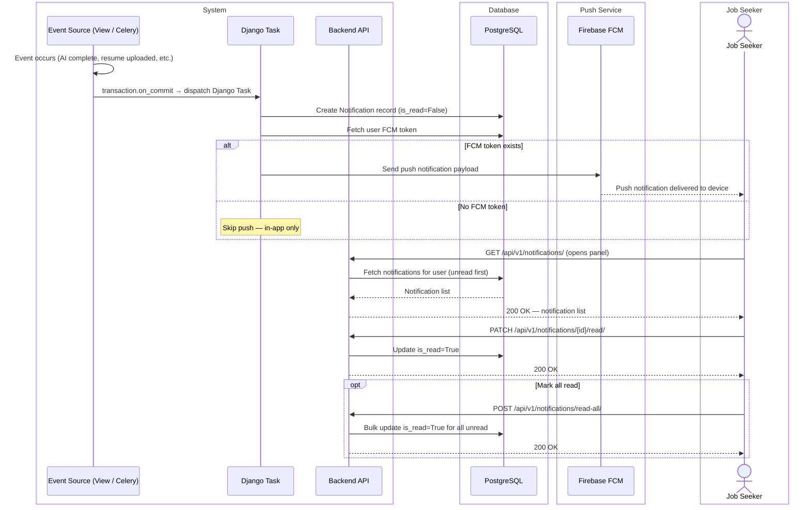
```mermaid
sequenceDiagram
  box System
    participant EV as Event Source (View / Celery)
    participant DT as Django Task
    participant BE as Backend API
  end
  box Database
    participant DB as PostgreSQL
  end
  box Push Service
    participant FCM as Firebase FCM
  end
  box Job Seeker
    actor JS as Job Seeker
  end

  EV->>EV: Event occurs (AI complete, resume uploaded, etc.)
  EV->>DT: transaction.on_commit → dispatch Django Task

  DT->>DB: Create Notification record (is_read=False)
  DT->>DB: Fetch user FCM token

  alt FCM token exists
    DT->>FCM: Send push notification payload
    FCM-->>JS: Push notification delivered to device
  else No FCM token
    Note over DT: Skip push — in-app only
  end

  JS->>BE: GET /api/v1/notifications/ (opens panel)
  BE->>DB: Fetch notifications for user (unread first)
  DB-->>BE: Notification list
  BE-->>JS: 200 OK — notification list

  JS->>BE: PATCH /api/v1/notifications/{id}/read/
  BE->>DB: Update is_read=True
  BE-->>JS: 200 OK

  opt Mark all read
    JS->>BE: POST /api/v1/notifications/read-all/
    BE->>DB: Bulk update is_read=True for all unread
    BE-->>JS: 200 OK
  end
```

### Sequence Diagram — New Jobs Notification (Post-Scrape)

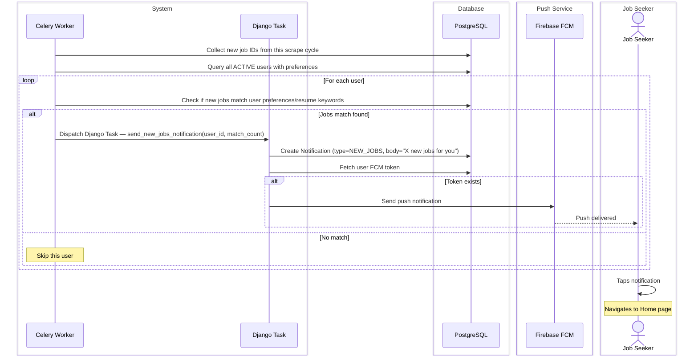
```mermaid
sequenceDiagram
  box System
    participant CW as Celery Worker
    participant DT as Django Task
  end
  box Database
    participant DB as PostgreSQL
  end
  box Push Service
    participant FCM as Firebase FCM
  end
  box Job Seeker
    actor JS as Job Seeker
  end

  CW->>DB: Collect new job IDs from this scrape cycle
  CW->>DB: Query all ACTIVE users with preferences

  loop For each user
    CW->>DB: Check if new jobs match user preferences/resume keywords
    alt Jobs match found
      CW->>DT: Dispatch Django Task — send_new_jobs_notification(user_id, match_count)
      DT->>DB: Create Notification (type=NEW_JOBS, body="X new jobs for you")
      DT->>DB: Fetch user FCM token
      alt Token exists
        DT->>FCM: Send push notification
        FCM-->>JS: Push delivered
      end
    else No match
      Note over CW: Skip this user
    end
  end

  JS->>JS: Taps notification
  Note over JS: Navigates to Home page
```

### Flowchart — Notification Dispatch Decision

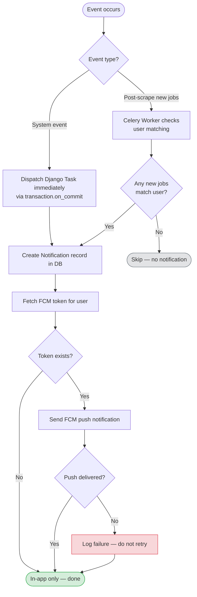
```mermaid
flowchart TD
    A([Event occurs]) --> B{Event type?}

    B -- System event --> C[Dispatch Django Task immediately\nvia transaction.on_commit]
    B -- Post-scrape new jobs --> D[Celery Worker checks\nuser matching]

    C --> E[Create Notification record in DB]
    D --> F{Any new jobs\nmatch user?}
    F -- No --> G([Skip — no notification])
    F -- Yes --> E

    E --> H[Fetch FCM token for user]
    H --> I{Token exists?}
    I -- Yes --> J[Send FCM push notification]
    I -- No --> K([In-app only — done])
    J --> L{Push delivered?}
    L -- Yes --> K
    L -- No --> M[Log failure — do not retry]
    M --> K

    style G fill:#e2e3e5,stroke:#6c757d
    style K fill:#d4edda,stroke:#28a745
    style M fill:#f8d7da,stroke:#dc3545
```

## 2.2 Data Models

### Model: `Notification`
**Purpose:** Stores all in-app notifications for a user  
**Django app:** `notifications`

| Field | Django Field Type | Required | Default | Notes |
|-------|------------------|----------|---------|-------|
| `id` | `UUIDField(primary_key=True)` | Auto | `uuid4` | PK |
| `user` | `ForeignKey(User, on_delete=CASCADE)` | Yes | — | Recipient |
| `type` | `CharField(choices=NOTIFICATION_TYPE, max_length=30)` | Yes | — | Enum: AI_MATCH_COMPLETE, ATS_CHECK_COMPLETE, RESUME_UPLOADED, RESUME_PARSE_FAILED, NEW_JOBS, ACCOUNT_UPDATED, ACCOUNT_SUSPENDED |
| `title` | `CharField(max_length=255)` | Yes | — | Short title shown in the panel |
| `body` | `TextField` | Yes | — | Full notification message |
| `related_object_id` | `UUIDField(null=True, blank=True)` | No | `null` | ID of related entity (session_id, job_id) for deep link navigation |
| `related_object_type` | `CharField(max_length=50, null=True, blank=True)` | No | `null` | Type hint for routing: 'ai_session', 'job' |
| `is_read` | `BooleanField` | No | `False` | Indexed — used for unread badge count |
| `created_at` | `DateTimeField(auto_now_add=True)` | Auto | `now` | Indexed — used for sorting |

### Model: `PushToken`
**Purpose:** Stores FCM push tokens per user device  
**Django app:** `notifications`

| Field | Django Field Type | Required | Default | Notes |
|-------|------------------|----------|---------|-------|
| `id` | `UUIDField(primary_key=True)` | Auto | `uuid4` | PK |
| `user` | `ForeignKey(User, on_delete=CASCADE)` | Yes | — | Token owner |
| `token` | `CharField(max_length=512, unique=True)` | Yes | — | FCM registration token |
| `device_type` | `CharField(choices=DEVICE_TYPE, max_length=10)` | Yes | — | Enum: ANDROID, IOS |
| `created_at` | `DateTimeField(auto_now_add=True)` | Auto | `now` | — |
| `last_used_at` | `DateTimeField(auto_now=True)` | Auto | `now` | Updated on each notification attempt |

## 2.3 Table Relationships & Logic

`Notification` is owned by `User`. When the user is deleted, all notifications cascade-delete. Notifications are never deleted by the user — only marked as read. A cleanup Celery Beat task runs weekly to delete notifications older than 90 days.

`PushToken` allows multiple tokens per user (one per device). When a new token is registered, check if it already exists — if yes, update `last_used_at`. If a push delivery fails with an "invalid token" error from FCM, delete that token from the DB automatically.

**Unread badge count** — computed as:
```python
Notification.objects.filter(user=user, is_read=False).count()
```
Cache this count in Redis with key `notifications:unread:{user_id}`, TTL 5 minutes. Invalidate on new notification creation and on mark-read operations.

**`related_object_id` + `related_object_type`** — used for deep linking. When the user taps a notification, the frontend reads these fields and routes to the correct screen:
- `ai_session` → navigate to AI session result screen
- `job` → navigate to job detail screen
- `null` → no navigation, just mark as read

**New jobs notification deduplication** — before creating a `NEW_JOBS` notification, check if one was already created for this user in the last 15 minutes (one scrape cycle). Use:
```python
Notification.objects.filter(
    user=user,
    type='NEW_JOBS',
    created_at__gte=now() - timedelta(minutes=15)
).exists()
```
If one exists, skip creation.

## 2.4 API Endpoints

| Method | Endpoint | Auth | Role | Request Body / Params | Response | Description |
|--------|----------|------|------|----------------------|----------|-------------|
| `GET` | `/api/v1/notifications/` | Yes | Job Seeker | `?page=N` | `200` — `{notifications[], unread_count, pagination}` | List user notifications |
| `PATCH` | `/api/v1/notifications/{id}/read/` | Yes | Job Seeker | — | `200` | Mark single notification as read |
| `POST` | `/api/v1/notifications/read-all/` | Yes | Job Seeker | — | `200` | Mark all as read |
| `POST` | `/api/v1/notifications/push-token/` | Yes | Job Seeker | `{token, device_type}` | `200` | Register or update FCM push token |
| `DELETE` | `/api/v1/notifications/push-token/` | Yes | Job Seeker | `{token}` | `204` | Remove push token on logout |

## 2.5 Developer Notes

### 🔵 Backend Developer (Django)

- Create a `notifications` Django app with `Notification` and `PushToken` models.
- Write a utility function `create_notification(user, type, title, body, related_object_id=None, related_object_type=None)` — used everywhere to create notifications consistently.
- Write a utility function `dispatch_push(user, title, body, data={})` — fetches all push tokens for the user, calls FCM for each. On `invalid token` FCM error, auto-delete that token.
- Use `firebase-admin` Python SDK for FCM: `pip install firebase-admin`. Initialize with service account credentials in Django settings.
- Use `transaction.on_commit()` before every Django Task dispatch in views and Celery tasks.
- New jobs notification dispatch: run inside the Celery scrape task after all platforms are scraped. Use `User.objects.filter(status='ACTIVE').select_related('preferences')` and batch process. Do not run one DB query per user — fetch all users and their preferences, then filter in Python or use a single optimized query.
- Cache unread count per user in Redis. Invalidate on `post_save` signal of `Notification` and after mark-read operations.
- Notification cleanup Celery Beat task: `Notification.objects.filter(created_at__lt=now()-90days).delete()` — runs weekly.
- On user logout: call `DELETE /api/v1/notifications/push-token/` to remove the token — ensure this is called from the logout endpoint automatically.

### 🟢 Frontend Developer (React)

- Notification bell icon in the top nav bar with an unread count badge (red dot or number).
- Fetch unread count on app load and cache it. Refresh when the notifications panel is opened.
- Notifications panel: slide-in drawer or dropdown — `GET /api/v1/notifications/` on open.
- List items: title, body, relative timestamp ("2 minutes ago"), read/unread visual state (unread = highlighted background or bold text).
- On item click: call `PATCH /api/v1/notifications/{id}/read/` and navigate using `related_object_type` + `related_object_id`.
- "Mark all as read" button at the top of the panel.
- On web, use browser `Notification` API for push if the user grants permission — fallback to in-app only if not granted.
- Register service worker for web push (optional for MVP — prioritize mobile push).

### 🟡 Mobile Developer (Flutter)

- Use `firebase_messaging` Flutter package for FCM integration.
- On app launch (after login): call `FirebaseMessaging.instance.getToken()` to get the FCM token and `POST /api/v1/notifications/push-token/` to register it.
- On logout: `DELETE /api/v1/notifications/push-token/` with the current token.
- Handle three notification states:
  - **Foreground**: show in-app banner (`flutter_local_notifications`).
  - **Background/terminated**: FCM delivers it as a system notification. On tap, open the app and navigate using `data.related_object_type` + `data.related_object_id`.
- Deep link routing: implement a `NotificationRouter` that reads `related_object_type` and calls the appropriate screen navigator.
- Notification panel: `ListView.builder` with `NotificationTile` widgets. Unread tiles have a different background color.
- Badge count: display on the notification bell icon using `badges` Flutter package.
- Request notification permissions on iOS explicitly (`FirebaseMessaging.instance.requestPermission()`).

### 🟣 AI Engineer

N/A for this flow. Notifications are triggered by AI session completions, but the notification logic itself is system-level only.

---

# CAREERLY-005 — Profile Flow

# PART 1 — ANALYSIS

## 1.1 Flow Title & Metadata

```
Flow Name:     Profile — View & Edit
Flow ID:       CAREERLY-005
Trigger:       User navigates to their profile page or edit profile page
Entry Point:   Profile tab / Profile screen
Exit Point:    Profile viewed or updated successfully
Related Flows: CAREERLY-001 (Auth — resume uploaded at setup), CAREERLY-003 (Jobs — AI sessions feed profile stats)
```

## 1.2 Description

The profile flow covers both viewing and editing a job seeker's profile. The profile view is a summary dashboard showing the user's personal info, computed stats (average ATS score, average suitability score, total jobs viewed), their uploaded resumes, and a list of jobs they have viewed. The edit profile page allows the user to update their personal information and manage multiple resume files. The biography field supports markdown so users can format their bio with structure. This flow does not cover the AI analysis sessions themselves (CAREERLY-003) but reads their aggregated results.

## 1.3 Actors / User Roles

| Role | Type | Responsibilities in this flow |
|------|------|-------------------------------|
| Job Seeker | Human | Views their profile, edits personal info, manages resumes |
| System | Automated | Computes and serves stats, validates inputs, stores updates |

## 1.4 Step-by-Step Bullet Points

### Route 1 — View Profile

- Job Seeker — navigates to the profile screen
- System — fetches user data, computed stats, resumes, and viewed jobs list
- System — computes stats:
  - Average ATS score: average of all completed ATS_CHECK sessions
  - Average suitability score: average of all completed JOB_MATCH sessions
  - Total jobs viewed: count of JobView records for this user
- Job Seeker — sees:
  - Profile image (or placeholder if not set)
  - Full name
  - Current position/title
  - Average ATS score (with verdict color)
  - Average suitability score (with verdict color)
  - Total jobs viewed count
  - Biography (rendered as markdown)
  - List of uploaded resumes (filename, upload date, parse status)
  - Paginated list of viewed jobs (title, company, date viewed)

### Route 2 — Edit Profile

- Job Seeker — taps "Edit Profile"
- System — loads the current profile data into the edit form
- Job Seeker — updates any combination of:
  - Profile image (upload new image)
  - Full name
  - Email address
  - Phone number
  - Position/title
  - Country
  - Biography (markdown input)
- Job Seeker — taps Save
- System — validates all updated fields
  ↳ if validation fails: highlights invalid fields, does not save
- System — if email was changed:
  - Updates email
  - Dispatches Django Task to send "Your email has been updated" system notification
  - Does NOT require re-verification (email is already trusted from registration)
- System — saves updated profile
- Job Seeker — sees updated profile

### Route 3 — Manage Resumes

- Job Seeker — navigates to the resumes section (within edit profile or standalone)
- System — lists all uploaded resumes for this user (filename, size, upload date, parse status, default badge)
- Job Seeker — can upload a new resume (PDF or DOCX, max 5MB)
- System — validates the file
  ↳ if invalid type or size: shows error, does not upload
- System — saves the resume, dispatches Celery Task to parse it
- System — if this is the user's first resume, sets it as default automatically
- Job Seeker — can set any resume as the default (used for AI features)
- System — updates `is_default` flag (sets new default, removes old default)
- Job Seeker — can delete a resume
  ↳ if deleting the default resume and other resumes exist: system auto-sets the most recently uploaded as the new default
  ↳ if deleting the only resume: warns user "This is your only resume. Deleting it will disable AI features."
  ↳ if user confirms: deletes it — AI features will be unavailable until a new resume is uploaded

## 1.5 Validations

### Input Validations

| Field | Rule | Error Message |
|-------|------|---------------|
| Full name | Required, 2–100 chars, letters and spaces only | "Please enter a valid full name" |
| Email | Valid email format, required | "Please enter a valid email address" |
| Phone number | Optional, valid international format (E.164) | "Please enter a valid phone number" |
| Position | Optional, max 100 chars | "Position must be under 100 characters" |
| Country | Optional, must be from a predefined list | "Please select a valid country" |
| Biography | Optional, max 2000 chars, markdown allowed | "Biography must be under 2000 characters" |
| Profile image | Optional, JPG/PNG only, max 2MB | "Only JPG and PNG images are accepted" / "Image must be under 2MB" |
| Resume file | PDF or DOCX only, max 5MB | "Only PDF and DOCX files are accepted" / "File size must be under 5MB" |

### Business Rule Validations

| Rule | Condition | Behavior |
|------|-----------|----------|
| Resume limit | More than 10 resumes uploaded | Block upload — "You can have a maximum of 10 resumes" |
| Default resume | Deleting the default resume | Auto-assign next most recent as default, or warn if it's the last one |
| Email uniqueness | New email already used by another account | Block — "This email is already in use" |

### Security Validations

| Check | Details |
|-------|---------|
| Authentication | JWT required — profile is private |
| Role-based access | Users can only edit their own profile |
| File MIME type | Validate server-side — reject spoofed extensions |
| Profile image | Strip EXIF data before storing |

### Error Handling

| Scenario | System Response |
|----------|----------------|
| Image upload fails | Show "Image upload failed. Try again." — preserve other form changes |
| Resume upload fails | Show "Resume upload failed. Try again." |
| Server error on save | Show generic error — preserve form data |
| Stats computation returns null | Show "—" or "N/A" for stats with no data yet |
| No viewed jobs yet | Show "You haven't viewed any jobs yet" empty state |

# PART 2 — TECHNICAL

## 2.1 Diagrams

### Sequence Diagram — View Profile

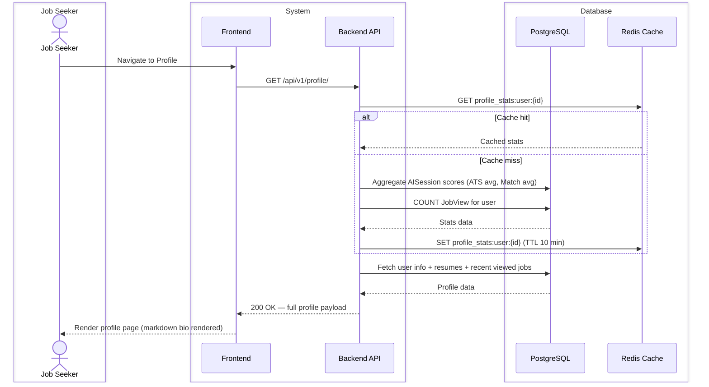
```mermaid
sequenceDiagram
  box Job Seeker
    actor JS as Job Seeker
  end
  box System
    participant FE as Frontend
    participant BE as Backend API
  end
  box Database
    participant DB as PostgreSQL
    participant RD as Redis Cache
  end

  JS->>FE: Navigate to Profile
  FE->>BE: GET /api/v1/profile/
  BE->>RD: GET profile_stats:user:{id}

  alt Cache hit
    RD-->>BE: Cached stats
  else Cache miss
    BE->>DB: Aggregate AISession scores (ATS avg, Match avg)
    BE->>DB: COUNT JobView for user
    DB-->>BE: Stats data
    BE->>RD: SET profile_stats:user:{id} (TTL 10 min)
  end

  BE->>DB: Fetch user info + resumes + recent viewed jobs
  DB-->>BE: Profile data
  BE-->>FE: 200 OK — full profile payload
  FE-->>JS: Render profile page (markdown bio rendered)
```

### Sequence Diagram — Edit Profile

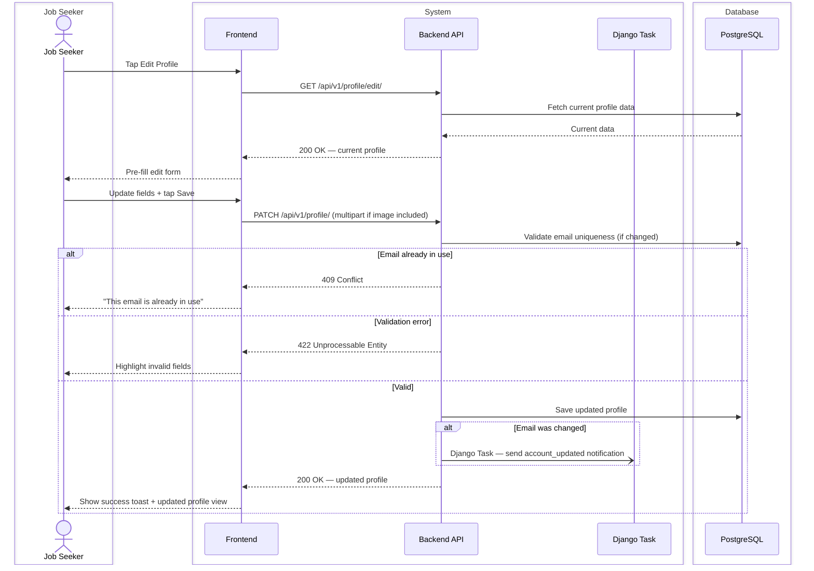
```mermaid
sequenceDiagram
  box Job Seeker
    actor JS as Job Seeker
  end
  box System
    participant FE as Frontend
    participant BE as Backend API
    participant DT as Django Task
  end
  box Database
    participant DB as PostgreSQL
  end

  JS->>FE: Tap Edit Profile
  FE->>BE: GET /api/v1/profile/edit/
  BE->>DB: Fetch current profile data
  DB-->>BE: Current data
  BE-->>FE: 200 OK — current profile
  FE-->>JS: Pre-fill edit form

  JS->>FE: Update fields + tap Save
  FE->>BE: PATCH /api/v1/profile/ (multipart if image included)
  BE->>DB: Validate email uniqueness (if changed)

  alt Email already in use
    BE-->>FE: 409 Conflict
    FE-->>JS: "This email is already in use"
  else Validation error
    BE-->>FE: 422 Unprocessable Entity
    FE-->>JS: Highlight invalid fields
  else Valid
    BE->>DB: Save updated profile
    alt Email was changed
      BE-)DT: Django Task — send account_updated notification
    end
    BE-->>FE: 200 OK — updated profile
    FE-->>JS: Show success toast + updated profile view
  end
```

### Sequence Diagram — Manage Resumes

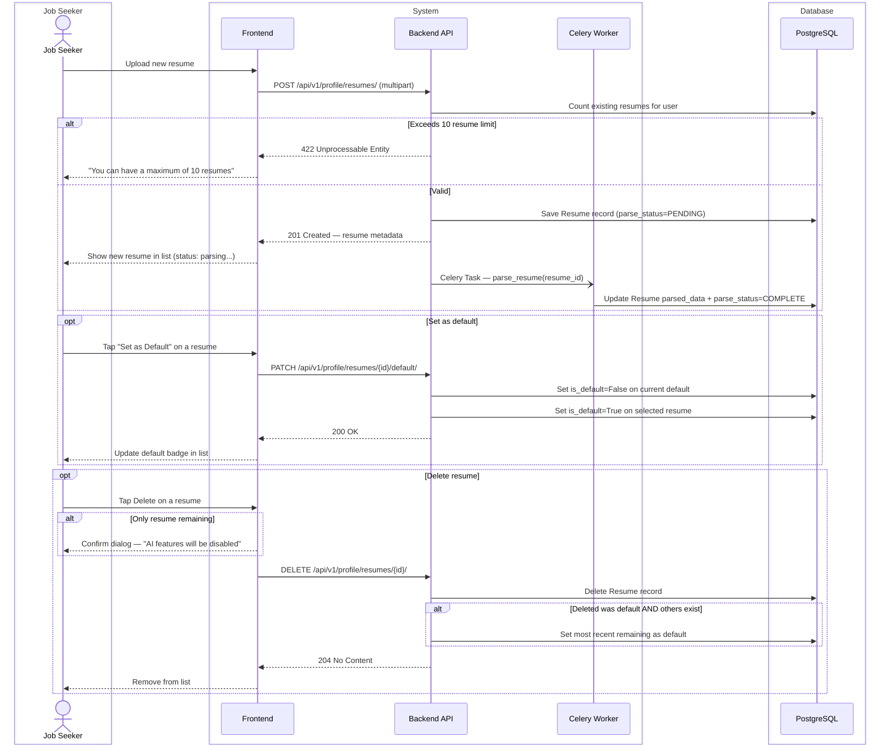
```mermaid
sequenceDiagram
  box Job Seeker
    actor JS as Job Seeker
  end
  box System
    participant FE as Frontend
    participant BE as Backend API
    participant CW as Celery Worker
  end
  box Database
    participant DB as PostgreSQL
  end

  JS->>FE: Upload new resume
  FE->>BE: POST /api/v1/profile/resumes/ (multipart)
  BE->>DB: Count existing resumes for user

  alt Exceeds 10 resume limit
    BE-->>FE: 422 Unprocessable Entity
    FE-->>JS: "You can have a maximum of 10 resumes"
  else Valid
    BE->>DB: Save Resume record (parse_status=PENDING)
    BE-->>FE: 201 Created — resume metadata
    FE-->>JS: Show new resume in list (status: parsing...)
    BE-)CW: Celery Task — parse_resume(resume_id)
    CW->>DB: Update Resume parsed_data + parse_status=COMPLETE
  end

  opt Set as default
    JS->>FE: Tap "Set as Default" on a resume
    FE->>BE: PATCH /api/v1/profile/resumes/{id}/default/
    BE->>DB: Set is_default=False on current default
    BE->>DB: Set is_default=True on selected resume
    BE-->>FE: 200 OK
    FE-->>JS: Update default badge in list
  end

  opt Delete resume
    JS->>FE: Tap Delete on a resume
    alt Only resume remaining
      FE-->>JS: Confirm dialog — "AI features will be disabled"
    end
    FE->>BE: DELETE /api/v1/profile/resumes/{id}/
    BE->>DB: Delete Resume record
    alt Deleted was default AND others exist
      BE->>DB: Set most recent remaining as default
    end
    BE-->>FE: 204 No Content
    FE-->>JS: Remove from list
  end
```

## 2.2 Data Models

### Model: `UserProfile`

**Purpose:** Extended profile data for a job seeker — separate from the auth `User` model  
**Django app:** `accounts`

| Field | Django Field Type | Required | Default | Notes |
|-------|------------------|----------|---------|-------|
| `id` | `UUIDField(primary_key=True)` | Auto | `uuid4` | PK |
| `user` | `OneToOneField(User, on_delete=CASCADE)` | Yes | — | One profile per user |
| `full_name` | `CharField(max_length=100)` | Yes | — | Display name |
| `phone_number` | `CharField(max_length=20, null=True, blank=True)` | No | `null` | E.164 format |
| `position` | `CharField(max_length=100, null=True, blank=True)` | No | `null` | Current or desired job title |
| `country` | `CharField(max_length=100, null=True, blank=True)` | No | `null` | From a validated country list |
| `biography` | `TextField(max_length=2000, null=True, blank=True)` | No | `null` | Supports markdown |
| `profile_image` | `ImageField(upload_to='profiles/', null=True, blank=True)` | No | `null` | Stored in S3 / media |
| `updated_at` | `DateTimeField(auto_now=True)` | Auto | `now` | — |

### Model: `Resume` (referenced from CAREERLY-003)

**Purpose:** Resume files uploaded by a user  
**Django app:** `accounts`

*(Full definition in CAREERLY-003 — reproduced here for completeness)*

| Field | Django Field Type | Required | Default | Notes |
|-------|------------------|----------|---------|-------|
| `id` | `UUIDField(primary_key=True)` | Auto | `uuid4` | PK |
| `user` | `ForeignKey(User, on_delete=CASCADE)` | Yes | — | Owner |
| `file` | `FileField(upload_to='resumes/')` | Yes | — | S3 or local |
| `original_filename` | `CharField(max_length=255)` | Yes | — | Shown in UI |
| `file_size` | `PositiveIntegerField` | Yes | — | Bytes |
| `parsed_data` | `JSONField(null=True, blank=True)` | No | `null` | Extracted: skills, titles, experience |
| `parse_status` | `CharField(choices=PARSE_STATUS, max_length=20)` | Yes | `PENDING` | PENDING, COMPLETE, FAILED |
| `is_default` | `BooleanField` | No | `False` | One default per user |
| `uploaded_at` | `DateTimeField(auto_now_add=True)` | Auto | `now` | — |

## 2.3 Table Relationships & Logic

`UserProfile` has a `OneToOneField` to `User`. It is created automatically via a `post_save` signal on `User` — every user gets a `UserProfile` at creation time with empty optional fields.

`Resume` has a `ForeignKey` to `User`. Multiple resumes per user are allowed (max 10 enforced at the API level). The `is_default` flag has a `UniqueConstraint` filtered on `is_default=True` to enforce one default per user at the DB level.

**Stats computation:**
- Average ATS score: `AISession.objects.filter(user=user, session_type='ATS_CHECK', status='COMPLETE').aggregate(Avg('score'))['score__avg']`
- Average suitability score: `AISession.objects.filter(user=user, session_type='JOB_MATCH', status='COMPLETE').aggregate(Avg('score'))['score__avg']`
- Total jobs viewed: `JobView.objects.filter(user=user).count()`

All three are cached in Redis under `profile_stats:user:{id}` as a single JSON object, TTL 10 minutes. Invalidated when:
- A new `AISession` reaches `COMPLETE` status (via `post_save` signal)
- A new `JobView` is created (via `post_save` signal)

**Viewed jobs list** on profile — paginated, sorted by `viewed_at` desc. Uses `JobView.objects.filter(user=user).select_related('job').order_by('-viewed_at')`.

**Biography markdown** — stored as raw markdown text in the DB. Never pre-rendered on the backend. Rendered exclusively on the frontend. Max 2000 chars validated at the API level.

**Profile image** — strip EXIF metadata server-side using `Pillow` before saving. Resize to max 500×500px to prevent storing unnecessarily large images. Store processed version only.

**Resume default reassignment** — implemented as a `post_delete` signal on `Resume`:
```python
@receiver(post_delete, sender=Resume)
def reassign_default_resume(sender, instance, **kwargs):
    if instance.is_default:
        next_resume = Resume.objects.filter(
            user=instance.user
        ).order_by('-uploaded_at').first()
        if next_resume:
            next_resume.is_default = True
            next_resume.save()
```

## 2.4 API Endpoints

| Method | Endpoint | Auth | Role | Request Body / Params | Response | Description |
|--------|----------|------|------|----------------------|----------|-------------|
| `GET` | `/api/v1/profile/` | Yes | Job Seeker | — | `200` — full profile + stats | View own profile |
| `PATCH` | `/api/v1/profile/` | Yes | Job Seeker | `multipart: {full_name, email, phone, position, country, biography, profile_image}` | `200` — updated profile | Update profile fields |
| `GET` | `/api/v1/profile/resumes/` | Yes | Job Seeker | — | `200` — resume list | List all resumes |
| `POST` | `/api/v1/profile/resumes/` | Yes | Job Seeker | `multipart: {resume_file}` | `201` — resume metadata | Upload new resume |
| `PATCH` | `/api/v1/profile/resumes/{id}/default/` | Yes | Job Seeker | — | `200` | Set resume as default |
| `DELETE` | `/api/v1/profile/resumes/{id}/` | Yes | Job Seeker | — | `204` | Delete a resume |
| `GET` | `/api/v1/profile/viewed-jobs/` | Yes | Job Seeker | `?page=N` | `200` — paginated viewed jobs | List viewed jobs |

## 2.5 Developer Notes

### 🔵 Backend Developer (Django)

- Create `UserProfile` via `post_save` signal on `User` model — use `get_or_create` to be safe.
- `PATCH /api/v1/profile/`: use a partial serializer (`partial=True` in DRF). Only update fields that are present in the request — do not overwrite unspecified fields with null.
- Profile image processing: use `Pillow` to strip EXIF and resize to 500×500 max before saving. Do this in the serializer's `validate_profile_image` method.
- Resume upload: `FileField` with `upload_to='resumes/{user_id}/'` — organize by user ID. Validate MIME type using `python-magic` (not just extension).
- `parse_resume` Celery task: extract text from PDF using `pdfplumber` or `PyMuPDF`. Extract from DOCX using `python-docx`. Send extracted text to AI service for parsing. Store result in `Resume.parsed_data` as JSON.
- Cache invalidation: add `post_save` signal on `AISession` (when `status` changes to `COMPLETE`) to `cache.delete(f'profile_stats:user:{instance.user_id}')`.
- Stats aggregation: use a single DB call that returns all three stats together — avoid three separate queries.
- Viewed jobs endpoint: `JobView.objects.filter(user=user).select_related('job').order_by('-viewed_at')`. Use `only('job__id', 'job__title', 'job__company', 'viewed_at')` to avoid overfetching.

### 🟢 Frontend Developer (React)

- Profile page sections: top card (image, name, position, stats row), bio section (render with `react-markdown`), resumes section (file cards), viewed jobs section (paginated list).
- Stats row: three stat blocks — "Avg ATS Score" (with color-coded score), "Avg Match Score", "Jobs Viewed". Show "—" if no data.
- Edit form: use controlled inputs pre-filled from `GET /api/v1/profile/edit/`. Only send changed fields in the `PATCH` request.
- Biography input: use a markdown-aware textarea (e.g. `react-mde` or `@uiw/react-md-editor`) with a live preview toggle.
- Resume list: each item shows filename, upload date, parse status badge (Parsing... / Ready / Failed), "Set as Default" button (hidden on current default), and "Delete" with confirmation dialog.
- Profile image upload: click-to-upload circle avatar. Show preview before saving.
- Viewed jobs list: `JobCard` components (reuse from Home/Jobs). Paginate with "Load More" button.

### 🟡 Mobile Developer (Flutter)

- Profile screen: `CustomScrollView` with `SliverAppBar` showing the profile image, then `SliverList` for sections.
- Profile image: `CircleAvatar` with `CachedNetworkImage`. On tap, open image picker using `image_picker` package.
- Biography: use `flutter_markdown` for rendering. In edit mode, use a plain `TextField` with a preview toggle.
- Stats row: `Row` of three `StatCard` widgets with color-coded score values.
- Resume list: `ListView` with swipe-to-delete (using `Dismissible` widget) and a "Set as Default" option in a long-press context menu.
- Edit form: same fields as web. Use `TextInputType.phone` for phone number, `TextInputType.emailAddress` for email.
- Navigation: profile tab is one of the bottom nav tabs — use `IndexedStack` to preserve scroll state.

### 🟣 AI Engineer

- Resume parsing Celery task (`parse_resume`):
  - Input: `resume_id` — fetch file from storage, extract text.
  - PDF text extraction: use `pdfplumber` — handles multi-column layouts better than PyPDF2.
  - DOCX text extraction: use `python-docx`.
  - Send extracted text to AI parsing model. Expected output JSON: `{skills: [], job_titles: [], years_experience: int, education_level: str}`.
  - Store in `Resume.parsed_data`. Set `parse_status=COMPLETE`.
  - On failure: set `parse_status=FAILED`, dispatch Django Task to send `RESUME_PARSE_FAILED` notification.
- This parsed data feeds: home page recommendations (CAREERLY-002), AI Match (CAREERLY-003), and ATS Check (CAREERLY-003).
- Keep the parsing model fast — target under 10 seconds. If resume text is very long, truncate to first 5000 tokens before sending.

---

# CAREERLY-006 — Subscription Flow

# PART 1 — ANALYSIS

## 1.1 Flow Title & Metadata

```
Flow Name:     Subscription — Plans & Feature Gating
Flow ID:       CAREERLY-006
Trigger:       User attempts to use a gated feature, or navigates to the subscription/upgrade screen
Entry Point:   Any gated feature CTA, or the Subscription screen in settings
Exit Point:    User is subscribed to a plan and has access to its features
Related Flows: CAREERLY-003 (Jobs — AI features are gated), CAREERLY-001 (Auth — plan assigned at registration)
```

## 1.2 Description

Careerly uses a subscription model to govern access to premium features. Every user is assigned a plan — new users start on the FREE plan by default. Plans define a set of feature flags and usage limits (e.g. number of AI Match sessions per month). The feature configuration is intentionally flexible — limits and flags are stored in the database and can be changed by an admin without a code deployment. This flow covers plan assignment, upgrade, and feature gate enforcement. Payment processing is out of scope for this version — the subscription record is created manually or through a payment integration to be defined later.

## 1.3 Actors / User Roles

| Role | Type | Responsibilities in this flow |
|------|------|-------------------------------|
| Job Seeker | Human | Views plans, upgrades subscription, uses features within limits |
| Admin | Human | Configures plans and feature limits via admin dashboard |
| System | Automated | Enforces feature gates, tracks usage, assigns default plan on registration |

## 1.4 Step-by-Step Bullet Points

### Route 1 — Plan Assignment at Registration

- System — when a new user completes registration and setup, automatically assigns the FREE plan
- System — creates a `UserSubscription` record with `plan=FREE`, `status=ACTIVE`, `start_date=today`

### Route 2 — View Plans & Upgrade

- Job Seeker — navigates to the Subscription screen
- System — fetches all available plans with their features and limits
- Job Seeker — sees the current plan (highlighted) and available upgrade options
- Job Seeker — selects a plan to upgrade to
- System — (payment processing TBD) — for now, records the plan change directly
- System — updates `UserSubscription` with new plan and `start_date=today`
- Job Seeker — immediately has access to the new plan's features

### Route 3 — Feature Gate Enforcement

- Job Seeker — attempts to use a feature (e.g. AI Match)
- System — checks the user's active plan
- System — checks if the feature is enabled for this plan
  ↳ if feature not in plan: blocks action, shows upgrade prompt
- System — checks if the user has remaining usage for this feature (if it has a limit)
  ↳ if usage limit reached: blocks action, shows "You've reached your limit for this month. Upgrade to continue."
  ↳ if within limit: allows action, increments usage counter

## 1.5 Validations

### Business Rule Validations

| Rule | Condition | Behavior |
|------|-----------|----------|
| Default plan | New user registered | Auto-assign FREE plan |
| Feature access | Feature not included in user's plan | Block + show upgrade prompt |
| Usage limit | User has hit monthly limit for a feature | Block + show upgrade prompt with limit details |
| Downgrade | User downgrades to a lower plan | Usage resets at next cycle, existing sessions preserved |

### Security Validations

| Check | Details |
|-------|---------|
| Authentication | JWT required |
| Feature gate checks | Always enforced server-side — never trust client-side gating alone |
| Plan configuration | Only admins can create or modify plans |

### Error Handling

| Scenario | System Response |
|----------|----------------|
| Subscription record missing | Auto-create with FREE plan — do not error |
| Plan config not found | Fall back to most restrictive defaults, alert admin |

# PART 2 — TECHNICAL

## 2.1 Diagrams

### Sequence Diagram — Feature Gate Check

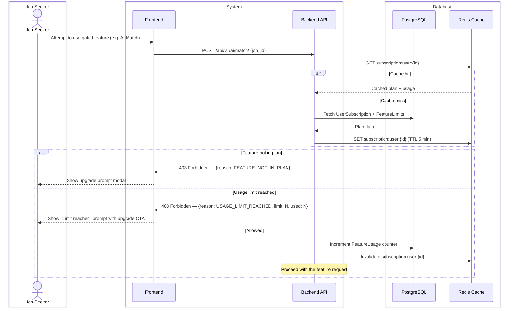
```mermaid
sequenceDiagram
  box Job Seeker
    actor JS as Job Seeker
  end
  box System
    participant FE as Frontend
    participant BE as Backend API
  end
  box Database
    participant DB as PostgreSQL
    participant RD as Redis Cache
  end

  JS->>FE: Attempt to use gated feature (e.g. AI Match)
  FE->>BE: POST /api/v1/ai/match/ {job_id}
  BE->>RD: GET subscription:user:{id}

  alt Cache hit
    RD-->>BE: Cached plan + usage
  else Cache miss
    BE->>DB: Fetch UserSubscription + FeatureLimits
    DB-->>BE: Plan data
    BE->>RD: SET subscription:user:{id} (TTL 5 min)
  end

  alt Feature not in plan
    BE-->>FE: 403 Forbidden — {reason: FEATURE_NOT_IN_PLAN}
    FE-->>JS: Show upgrade prompt modal
  else Usage limit reached
    BE-->>FE: 403 Forbidden — {reason: USAGE_LIMIT_REACHED, limit: N, used: N}
    FE-->>JS: Show "Limit reached" prompt with upgrade CTA
  else Allowed
    BE->>DB: Increment FeatureUsage counter
    BE->>RD: Invalidate subscription:user:{id}
    Note over BE: Proceed with the feature request
  end
```

### State Diagram — Subscription Status

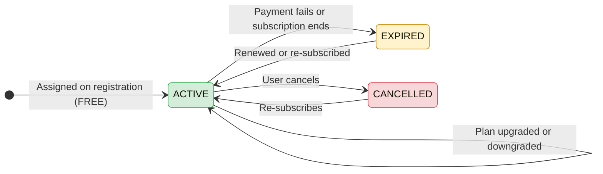
```mermaid
stateDiagram-v2
  direction LR
  [*] --> ACTIVE : Assigned on registration (FREE)

  ACTIVE --> ACTIVE : Plan upgraded or downgraded
  ACTIVE --> EXPIRED : Payment fails or subscription ends
  EXPIRED --> ACTIVE : Renewed or re-subscribed
  ACTIVE --> CANCELLED : User cancels
  CANCELLED --> ACTIVE : Re-subscribes

  style ACTIVE fill:#d4edda,stroke:#28a745
  style EXPIRED fill:#fff3cd,stroke:#cc8800
  style CANCELLED fill:#f8d7da,stroke:#dc3545
```

## 2.2 Data Models

### Model: `Plan`
**Purpose:** Defines a subscription tier and its feature configuration  
**Django app:** `subscriptions`

| Field | Django Field Type | Required | Default | Notes |
|-------|------------------|----------|---------|-------|
| `id` | `UUIDField(primary_key=True)` | Auto | `uuid4` | PK |
| `name` | `CharField(max_length=50, unique=True)` | Yes | — | e.g. FREE, PRO, PREMIUM |
| `display_name` | `CharField(max_length=100)` | Yes | — | Shown in UI |
| `price_monthly` | `DecimalField(max_digits=8, decimal_places=2)` | Yes | `0.00` | 0 for free plan |
| `is_active` | `BooleanField` | No | `True` | Inactive plans are hidden from upgrade screen |
| `created_at` | `DateTimeField(auto_now_add=True)` | Auto | `now` | — |

### Model: `PlanFeature`
**Purpose:** Configurable feature flags and limits per plan — admin-editable  
**Django app:** `subscriptions`

| Field | Django Field Type | Required | Default | Notes |
|-------|------------------|----------|---------|-------|
| `id` | `UUIDField(primary_key=True)` | Auto | `uuid4` | PK |
| `plan` | `ForeignKey(Plan, on_delete=CASCADE)` | Yes | — | Which plan this feature belongs to |
| `feature_key` | `CharField(max_length=100)` | Yes | — | e.g. `ai_match`, `ats_check`, `saved_jobs`. Indexed. |
| `is_enabled` | `BooleanField` | Yes | `True` | Whether the feature is available at all |
| `monthly_limit` | `PositiveIntegerField(null=True, blank=True)` | No | `null` | Null = unlimited. e.g. 5 for AI Match on FREE |

**Unique constraint:** `unique_together = [('plan', 'feature_key')]`

### Model: `UserSubscription`
**Purpose:** The active subscription record for a user  
**Django app:** `subscriptions`

| Field | Django Field Type | Required | Default | Notes |
|-------|------------------|----------|---------|-------|
| `id` | `UUIDField(primary_key=True)` | Auto | `uuid4` | PK |
| `user` | `OneToOneField(User, on_delete=CASCADE)` | Yes | — | One active subscription per user |
| `plan` | `ForeignKey(Plan, on_delete=PROTECT)` | Yes | — | PROTECT — do not delete plans with active subscribers |
| `status` | `CharField(choices=SUB_STATUS, max_length=20)` | Yes | `ACTIVE` | Enum: ACTIVE, EXPIRED, CANCELLED |
| `start_date` | `DateField` | Yes | `today` | When this subscription period started |
| `end_date` | `DateField(null=True, blank=True)` | No | `null` | Null for ongoing; set for fixed-term |
| `created_at` | `DateTimeField(auto_now_add=True)` | Auto | `now` | — |
| `updated_at` | `DateTimeField(auto_now=True)` | Auto | `now` | — |

### Model: `FeatureUsage`
**Purpose:** Tracks monthly usage of limited features per user  
**Django app:** `subscriptions`

| Field | Django Field Type | Required | Default | Notes |
|-------|------------------|----------|---------|-------|
| `id` | `UUIDField(primary_key=True)` | Auto | `uuid4` | PK |
| `user` | `ForeignKey(User, on_delete=CASCADE)` | Yes | — | The user |
| `feature_key` | `CharField(max_length=100)` | Yes | — | Same key as PlanFeature.feature_key |
| `month` | `DateField` | Yes | — | First day of the month — e.g. 2025-06-01. Indexed. |
| `count` | `PositiveIntegerField` | No | `0` | Incremented on each use |

**Unique constraint:** `unique_together = [('user', 'feature_key', 'month')]`

## 2.3 Table Relationships & Logic

`Plan` → `PlanFeature` is one-to-many. Each plan has multiple feature entries. Admin configures these via Django admin.

`UserSubscription` is a `OneToOneField` to `User`. Created automatically when the user completes setup. If the record is missing (e.g. legacy users), auto-create with FREE plan on access.

`FeatureUsage` tracks per-user, per-feature, per-month usage. The `month` field is always the first day of the current month (e.g. `date.today().replace(day=1)`). Use `get_or_create` when incrementing:
```python
usage, _ = FeatureUsage.objects.get_or_create(
    user=user,
    feature_key=feature_key,
    month=date.today().replace(day=1),
    defaults={'count': 0}
)
usage.count = F('count') + 1
usage.save(update_fields=['count'])
```
Using `F('count') + 1` is atomic — prevents race conditions.

**Feature gate check logic** (implemented as a reusable utility):
```python
def can_use_feature(user, feature_key) -> tuple[bool, str]:
    sub = UserSubscription.objects.select_related('plan').get(user=user)
    feature = PlanFeature.objects.get(plan=sub.plan, feature_key=feature_key)
    
    if not feature.is_enabled:
        return False, 'FEATURE_NOT_IN_PLAN'
    
    if feature.monthly_limit is not None:
        month = date.today().replace(day=1)
        usage = FeatureUsage.objects.filter(
            user=user, feature_key=feature_key, month=month
        ).first()
        current_count = usage.count if usage else 0
        if current_count >= feature.monthly_limit:
            return False, 'USAGE_LIMIT_REACHED'
    
    return True, 'ALLOWED'
```

Cache the plan + feature config in Redis per user. Invalidate when subscription or plan config changes.

**Feature keys** (initial set — admin can add more):
| Key | Description |
|---|---|
| `ai_match` | AI Match feature |
| `ats_check` | Check Your Resume / ATS |
| `saved_jobs` | Save jobs for later |
| `job_recommendations` | Personalized recommendations |

## 2.4 API Endpoints

| Method | Endpoint | Auth | Role | Request Body / Params | Response | Description |
|--------|----------|------|------|----------------------|----------|-------------|
| `GET` | `/api/v1/subscriptions/plans/` | No | — | — | `200` — list of active plans with features | Public plans listing |
| `GET` | `/api/v1/subscriptions/me/` | Yes | Job Seeker | — | `200` — current subscription + usage | Get own subscription status |
| `POST` | `/api/v1/subscriptions/upgrade/` | Yes | Job Seeker | `{plan_id}` | `200` — updated subscription | Upgrade plan (payment TBD) |

## 2.5 Developer Notes

### 🔵 Backend Developer (Django)

- Create a reusable `can_use_feature(user, feature_key)` utility in `subscriptions/utils.py`. Use this as a check at the start of any gated API view.
- Create a DRF permission class `HasFeatureAccess(feature_key)` that calls `can_use_feature` — use it as a permission on gated views: `permission_classes = [IsAuthenticated, HasFeatureAccess('ai_match')]`.
- `post_save` signal on `User` (status changes to `ACTIVE`): create `UserSubscription` with FREE plan.
- Use `select_related('plan')` when fetching `UserSubscription` to avoid N+1 on plan lookups.
- Cache `subscription:user:{id}` in Redis as a dict of `{plan_name, features: {key: {is_enabled, monthly_limit, used}}}`. TTL 5 minutes. Invalidate on subscription change.
- Monthly usage reset: Celery Beat task on the 1st of each month — not needed since usage is tracked by `month` field. No reset job required — the `get_or_create` on a new month key naturally starts at 0.
- Admin: register `Plan`, `PlanFeature`, `UserSubscription`, `FeatureUsage` in Django admin. Use `inline` for `PlanFeature` under `Plan` for easy editing.

### 🟢 Frontend Developer (React)

- Subscription screen: plan cards side-by-side. Current plan has "Current Plan" badge. Other plans have "Upgrade" CTA.
- Each plan card: name, price, feature list (checkmarks for included, crossed for excluded), monthly limits shown inline ("5 AI Matches/month").
- When a feature gate is hit (API returns 403 `FEATURE_NOT_IN_PLAN` or `USAGE_LIMIT_REACHED`): show a modal with the reason and an "Upgrade" button that routes to the subscription screen.
- Current usage display: on the subscription page, show a usage bar for limited features ("3 of 5 AI Matches used this month").
- Feature flags: also fetch from `GET /api/v1/subscriptions/me/` on app load and store in global state — use this to conditionally show/hide feature buttons in the UI. This is a UX enhancement only — server-side gating is the enforcement layer.

### 🟡 Mobile Developer (Flutter)

- Subscription screen: `PageView` or `Column` of plan cards with feature comparison.
- Gate enforcement: intercept 403 responses in the global HTTP interceptor — if `reason` is `FEATURE_NOT_IN_PLAN` or `USAGE_LIMIT_REACHED`, show a `BottomSheet` with upgrade prompt.
- Cache the user's plan and feature access in local state after login — refresh on subscription change.
- Usage bars: `LinearProgressIndicator` for each limited feature.

### 🟣 AI Engineer

- AI features (`ai_match`, `ats_check`) are gated by this subscription system.
- Before dispatching an AI Celery task, the backend checks `can_use_feature`. If allowed, it increments usage and then dispatches the task.
- If usage limit is reached mid-session (edge case — user hits limit between check and completion), the session is still completed — do not cancel in-flight AI tasks.
- No AI involvement in the subscription logic itself.

## 2.6 General Notes

- Payment integration details to be added once provider is selected
- Plan names and limits to be finalized with product team

---

# CAREERLY-007 — Monitoring Flow

# PART 1 — ANALYSIS

## 1.1 Flow Title & Metadata

```
Flow Name:     Monitoring — Admin Dashboard & System Analytics
Flow ID:       CAREERLY-007
Trigger:       Admin logs into the admin dashboard and navigates to monitoring
Entry Point:   Django Admin — Monitoring section
Exit Point:    Admin views metrics, takes action if needed
Related Flows: All flows — monitoring reads data from all other flows
```

## 1.2 Description

The monitoring flow provides the admin with a real-time and historical view of Careerly's health and usage. It extends Django's built-in admin with custom views that render area charts, stat cards, and color-coded health indicators. The dashboard covers platform health (scraper success rates), user activity (registrations, active users, jobs viewed), AI usage (resumes checked, ATS scores, match scores), and subscription metrics (conversion rates). Data is aggregated from the existing models — no separate analytics database is needed at this stage. This flow is admin-only and does not affect any user-facing features.

## 1.3 Actors / User Roles

| Role | Type | Responsibilities in this flow |
|------|------|-------------------------------|
| Admin | Human | Views metrics, monitors system health, identifies anomalies |
| System | Automated | Aggregates metrics, caches results, serves dashboard data |
| Celery Beat | Automated | Runs periodic aggregation tasks to pre-compute heavy metrics |

## 1.4 Step-by-Step Bullet Points

### Dashboard Load

- Admin — navigates to the monitoring section in Django admin
- System — loads the custom admin monitoring view
- System — checks Redis cache for pre-computed metrics
  ↳ if cache hit: returns cached metrics immediately
  ↳ if cache miss: computes metrics from DB and caches them
- Admin — sees the dashboard with:
  - Platform health cards (scraper status per platform — green/yellow/red)
  - Key stats row (total users, new users today, total jobs, new jobs today)
  - Area chart: jobs viewed throughout the week (per day)
  - Area chart: new user registrations over time (per day, last 30 days)
  - Area chart: new jobs added per day (last 30 days, per platform)
  - Stat cards: total AI sessions, average ATS score, average match score
  - Area chart: AI sessions over time (last 30 days)
  - Subscription conversion card: free vs paid user ratio
  - Active users per day (last 7 days)
  - Scraper success rate per platform (last 10 cycles)

### Metric Refresh

- Admin — clicks "Refresh" or metrics auto-refresh every 5 minutes
- System — invalidates cache, recomputes metrics, returns updated data

## 1.5 Validations

### Security Validations

| Check | Details |
|-------|---------|
| Authentication | Django admin session required — `is_staff=True` and `is_admin=True` |
| Role-based access | Monitoring views only accessible to admins |
| Read-only | Monitoring views do not mutate data |

### Error Handling

| Scenario | System Response |
|----------|----------------|
| DB aggregation query times out | Show last cached value with "Last updated: X minutes ago" |
| Scraper log missing | Show "No data" for that platform |
| Redis unavailable | Compute directly from DB, warn admin of degraded performance |

# PART 2 — TECHNICAL

## 2.1 Diagrams

### Sequence Diagram — Dashboard Load

```mermaid
sequenceDiagram
  box Admin
    actor AD as Admin
  end
  box System
    participant DA as Django Admin View
    participant BE as Backend Aggregation
    participant CB as Celery Beat
  end
  box Database
    participant DB as PostgreSQL
    participant RD as Redis Cache
  end

  AD->>DA: Navigate to Monitoring Dashboard
  DA->>RD: GET monitoring:dashboard:all_metrics

  alt Cache hit (TTL 5 min)
    RD-->>DA: Cached metrics JSON
    DA-->>AD: Render dashboard with cached data
  else Cache miss
    DA->>BE: Compute all metrics
    BE->>DB: Aggregate users (total, today, per day)
    BE->>DB: Aggregate jobs (total, today, per platform, per day)
    BE->>DB: Aggregate AI sessions (count, avg scores, per day)
    BE->>DB: Aggregate subscriptions (free vs paid)
    BE->>DB: Fetch scraper logs (last 10 cycles per platform)
    BE->>DB: Aggregate JobViews per day (last 7 days)
    DB-->>BE: All aggregated data
    BE->>RD: SET monitoring:dashboard:all_metrics (TTL 5 min)
    BE-->>DA: Metrics JSON
    DA-->>AD: Render dashboard
  end

  CB->>BE: Celery Beat — pre-compute heavy metrics (every 4 min)
  BE->>DB: Run aggregation queries
  BE->>RD: Refresh monitoring cache
```

### Flowchart — Scraper Health Color Code Logic

```mermaid
flowchart TD
    A([Check platform scraper health]) --> B{Last scrape\ncycle status?}

    B -- SUCCESS, < 20 min ago --> C[🟢 GREEN — Healthy]
    B -- PARTIAL, < 20 min ago --> D[🟡 YELLOW — Degraded]
    B -- FAILED OR > 20 min ago --> E[🔴 RED — Down]

    C --> F([Show on dashboard])
    D --> F
    E --> F

    style C fill:#d4edda,stroke:#28a745
    style D fill:#fff3cd,stroke:#cc8800
    style E fill:#f8d7da,stroke:#dc3545
```

## 2.2 Data Models

### Model: `MetricSnapshot` *(optional — for historical trending)*
**Purpose:** Pre-aggregated daily metric snapshots to power fast historical charts without heavy live queries  
**Django app:** `monitoring`

| Field | Django Field Type | Required | Default | Notes |
|-------|------------------|----------|---------|-------|
| `id` | `UUIDField(primary_key=True)` | Auto | `uuid4` | PK |
| `date` | `DateField` | Yes | — | The day this snapshot covers. Indexed. |
| `metric_key` | `CharField(max_length=100)` | Yes | — | e.g. `new_users`, `new_jobs`, `jobs_viewed`, `ai_sessions` |
| `platform` | `CharField(max_length=20, null=True)` | No | `null` | Non-null for per-platform metrics |
| `value` | `FloatField` | Yes | — | The aggregated value for that day |
| `created_at` | `DateTimeField(auto_now_add=True)` | Auto | `now` | — |

**Unique constraint:** `unique_together = [('date', 'metric_key', 'platform')]`

## 2.3 Metrics Reference

All metrics, their source models, and how they are computed:

| Metric | Source | Computation |
|---|---|---|
| Total users | `User` | `User.objects.filter(status='ACTIVE').count()` |
| New users today | `User` | `User.objects.filter(created_at__date=today).count()` |
| New registrations per day (30d) | `User` | `GROUP BY DATE(created_at)` last 30 days |
| Total jobs in system | `Job` | `Job.objects.filter(status='ACTIVE').count()` |
| New jobs today | `Job` | `Job.objects.filter(scraped_at__date=today).count()` |
| New jobs per day per platform (30d) | `Job` | `GROUP BY DATE(scraped_at), platform` |
| Jobs viewed (this week) | `JobView` | `GROUP BY DATE(viewed_at)` last 7 days |
| Total AI sessions | `AISession` | `AISession.objects.count()` |
| AI sessions per day (30d) | `AISession` | `GROUP BY DATE(created_at)` |
| Resumes checked by AI | `AISession` | `AISession.objects.filter(session_type='ATS_CHECK', status='COMPLETE').count()` |
| Avg ATS score (global) | `AISession` | `Avg('score') WHERE session_type='ATS_CHECK'` |
| Avg match score (global) | `AISession` | `Avg('score') WHERE session_type='JOB_MATCH'` |
| Active users per day (7d) | `JobView` or `AISession` | Distinct users with any activity per day |
| Scraper success rate | `ScrapeLog` | Last 10 logs per platform — `SUCCESS / total * 100` |
| Free vs paid users | `UserSubscription` | `GROUP BY plan.name` |
| Subscription conversion rate | `UserSubscription` | `paid_users / total_users * 100` |

## 2.4 API Endpoints

| Method | Endpoint | Auth | Role | Response | Description |
|--------|----------|------|------|----------|-------------|
| `GET` | `/api/v1/admin/monitoring/` | Yes | Admin | `200` — full metrics JSON | All dashboard metrics |
| `GET` | `/api/v1/admin/monitoring/scrapers/` | Yes | Admin | `200` — scraper health per platform | Scraper status + last cycle details |
| `POST` | `/api/v1/admin/monitoring/refresh/` | Yes | Admin | `200` | Force cache refresh |

## 2.5 Developer Notes

### 🔵 Backend Developer (Django)

- Create a `monitoring` Django app.
- Create a custom Django admin view (not a ModelAdmin — a plain `AdminSite` view or a custom `TemplateView` registered in the admin). Use `admin.site.register_view` or override `get_urls()` on a custom `AdminSite`.
- All aggregation queries should be wrapped in `try/except` — return last cached value if a query fails.
- Use Django ORM's `annotate`, `values`, `Count`, `Avg`, `TruncDate` for all aggregations. Example:
  ```python
  from django.db.models.functions import TruncDate
  from django.db.models import Count

  User.objects.annotate(day=TruncDate('created_at')) \
      .values('day') \
      .annotate(count=Count('id')) \
      .order_by('day')
  ```
- Celery Beat task `refresh_monitoring_cache`: runs every 4 minutes, pre-computes all metrics and sets them in Redis under `monitoring:dashboard:all_metrics` with TTL 5 minutes. This ensures the dashboard almost always hits cache.
- `MetricSnapshot` model: populate daily via a Celery Beat task at midnight. Used for charts that need historical data beyond 30 days. For the MVP, direct DB aggregation for the last 30 days is acceptable.
- Scraper health: fetch `ScrapeLog.objects.filter(platform=p).order_by('-started_at')[:10]` for each platform. Compute success rate. Determine health color: GREEN if latest is SUCCESS and `started_at > now - 20min`, YELLOW if PARTIAL, RED if FAILED or stale.
- Protect all monitoring endpoints with a custom permission: `IsAdminUser` (checks `user.is_admin=True`).

### 🟢 Frontend Developer (React)

- Monitoring dashboard is built inside Django admin — use Django's template system with a custom admin template.
- Embed a React-powered chart component via a `<script>` tag in the Django template, or use a pure JS charting library (Chart.js or Recharts via CDN) to avoid a full React build in admin.
- Charts needed:
  - **Area chart** — jobs viewed per day (last 7 days) — `Chart.js` area type
  - **Area chart** — new users per day (last 30 days)
  - **Area chart** — new jobs per day per platform (last 30 days) — multi-series, one per platform
  - **Area chart** — AI sessions per day (last 30 days)
  - **Bar chart** — scraper success rate per platform
  - **Donut chart** — free vs paid users
- Stat cards: simple HTML/CSS cards with large numbers — total users, total jobs, avg ATS score, conversion rate.
- Color-coded scraper health: green/yellow/red dot next to each platform name.
- Auto-refresh: `setInterval` every 5 minutes — re-fetch `/api/v1/admin/monitoring/` and update charts.
- "Refresh" button for manual refresh — calls `POST /api/v1/admin/monitoring/refresh/` then re-fetches.

### 🟡 Mobile Developer (Flutter)

N/A — monitoring dashboard is admin-only and web-based. No mobile implementation needed.

### 🟣 AI Engineer

- Avg ATS score and avg suitability score displayed on the dashboard are computed from `AISession` records — no AI involvement in the monitoring itself.
- Monitoring helps AI engineers track: how many sessions are running, average scores over time (useful for detecting model drift), and session failure rates.
- If the AI session failure rate exceeds a threshold (e.g. >10% in the last 24 hours), the monitoring dashboard should surface this as a RED alert in the AI health section.
- Recommendation: add a `monitoring:ai_health` Redis key that is updated by the AI Celery tasks themselves — increments a success/fail counter that the monitoring endpoint reads. This gives near-real-time AI health without a heavy DB query.

## 2.6 General Notes

- Consider adding email alerts to admin when scraper health goes RED for > 30 minutes